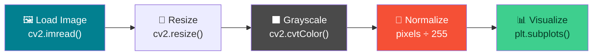
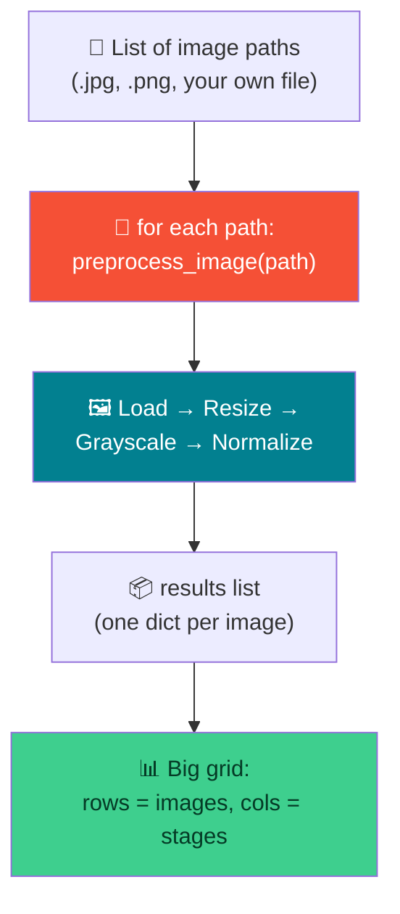

# 🖼️ Image Preprocessing — Week 1 Practical

### *Load → Resize → Grayscale → Normalize → Visualize, using OpenCV + NumPy + Matplotlib (all in Google Colab)*

> **What we're building today:** a small, reusable **image preprocessing pipeline** — the exact first step of almost every computer vision / deep learning project. You'll load a real image, resize it, convert it to grayscale, normalize its pixel values, and lay all four versions side-by-side in a Matplotlib figure.
>
> No servers, no installs. Everything runs inside one **Google Colab** notebook.

**Session plan (2 hours, back-to-back):**

| Time | Practical | Focus |
|------|-----------|-------|
| 🕛 12:00 – 1:00 PM | **Practical 1** | Build the pipeline once, on **one** image |
| 🕐 1:00 – 2:00 PM | **Practical 2** | Turn it into a **function** and repeat it on **2–3 images / formats** |

---

## 🗺️ The Big Picture (Read This First)



**Three tools, three jobs:**

| Tool | Job | Analogy |
|------|-----|---------|
| 🔧 **OpenCV** (`cv2`) | Reads, resizes, and recolors images | The darkroom technician 🎞️ |
| 🔢 **NumPy** | Does the pixel-value math for normalization | The calculator 🧮 |
| 📊 **Matplotlib** | Displays everything on screen | The gallery wall 🖼️ |

> 🔑 **The key gotcha of the day:** OpenCV loads color images as **BGR** (Blue-Green-Red), not RGB. Matplotlib expects **RGB**. Forget to convert, and every photo looks like it's from a horror movie (blue skin, orange sky). We fix this in Step 1.4 — remember it, it trips up *everyone* the first time.

---

## 📋 What You'll Need (all free)

1. A **Google account** (for Colab) — `https://colab.research.google.com`
2. That's it. `cv2`, `numpy`, and `matplotlib` all come **pre-installed** in Colab.

---

# 🕛 PRACTICAL 1 (12:00 – 1:00 PM)

## Load → Resize → Grayscale → Normalize → Visualize — on one image

### 1.1 — Open a fresh Colab notebook

Go to `https://colab.research.google.com` → **New notebook**. Rename it `week1_practical1.ipynb` (click the title at the top).

Work through the cells below **one at a time** (Shift+Enter runs a cell).

### 1.2 — Get a sample image

We'll all use the **same image** first, so everyone's output matches. Paste into the first cell:

```python
!wget -q -O sample.jpg https://raw.githubusercontent.com/opencv/opencv/master/samples/data/lena.jpg
print("✅ Image downloaded")
```

> 💡 `wget -O sample.jpg` downloads the file and saves it under that name in your Colab session. This is the classic "Lena" test image used in image-processing courses worldwide since the 1970s.
>
> 🙋 **Prefer your own photo?** Click the **📁 folder icon** in the left sidebar → **upload icon** → pick a photo from your laptop. Just change `"sample.jpg"` to your filename everywhere below.

### 1.3 — Import the libraries

```python
import cv2
import numpy as np
import matplotlib.pyplot as plt

print("OpenCV version:", cv2.__version__)
```

### 1.4 — Load the image (and fix the BGR → RGB gotcha)

```python
# Load the image — OpenCV reads it as BGR by default
img_bgr = cv2.imread("sample.jpg")

print("Shape (height, width, channels):", img_bgr.shape)
print("Data type:", img_bgr.dtype)

# Convert to RGB so Matplotlib displays the true colors
img_rgb = cv2.cvtColor(img_bgr, cv2.COLOR_BGR2RGB)

plt.imshow(img_rgb)
plt.title("Original Image (RGB)")
plt.axis("off")
plt.show()
```

> ⚠️ **If you skip the `cvtColor` line and plot `img_bgr` directly**, the colors will look wrong (blues and reds swapped). This is the #1 beginner mistake in OpenCV — now you know why it happens.

### 1.5 — Resize the image

```python
resized = cv2.resize(img_rgb, (224, 224))   # (width, height)

print("Original shape:", img_rgb.shape)
print("Resized shape :", resized.shape)

plt.imshow(resized)
plt.title("Resized (224x224)")
plt.axis("off")
plt.show()
```

> 💡 `224x224` isn't a random number — it's the standard input size for many pretrained CNNs (ResNet, VGG, MobileNet). Getting into this habit now will save you confusion later.

### 1.6 — Convert to grayscale

```python
gray = cv2.cvtColor(img_rgb, cv2.COLOR_RGB2GRAY)

print("Grayscale shape:", gray.shape)   # notice: only 2 dimensions now, no channel axis

plt.imshow(gray, cmap="gray")           # cmap="gray" is required, or Matplotlib fakes colors
plt.title("Grayscale")
plt.axis("off")
plt.show()
```

> 🔑 **Why `cmap="gray"`?** A grayscale image has only **one channel** (just brightness, 0–255). Matplotlib doesn't know that's meant to be gray — without `cmap="gray"` it applies its default color map and shows a misleading yellow/purple image.

### 1.7 — Normalize the pixel values

"Normalizing" means rescaling pixel values from the range **0–255** (integers) down to **0.0–1.0** (floats). Almost every deep learning model expects this.

```python
normalized = img_rgb.astype(np.float32) / 255.0

print("Before normalize → min:", img_rgb.min(), "max:", img_rgb.max(), "dtype:", img_rgb.dtype)
print("After normalize  → min:", normalized.min(), "max:", normalized.max(), "dtype:", normalized.dtype)
```

**Expected output:**

```
Before normalize → min: 0 max: 255 dtype: uint8
After normalize  → min: 0.0 max: 1.0 dtype: float32
```

> 🧠 **Note:** the image *looks* identical when you plot it — normalizing doesn't change what you see, only the numbers underneath. That's the whole point: it's a step for the *model*, not for your eyes. Matplotlib is smart enough to display float images in the 0–1 range correctly.

### 1.8 — Put it all together: one figure, four subplots

This is the step that ties the whole pipeline together visually.

```python
fig, axes = plt.subplots(1, 4, figsize=(16, 4))

axes[0].imshow(img_rgb)
axes[0].set_title("1. Original")
axes[0].axis("off")

axes[1].imshow(resized)
axes[1].set_title("2. Resized (224x224)")
axes[1].axis("off")

axes[2].imshow(gray, cmap="gray")
axes[2].set_title("3. Grayscale")
axes[2].axis("off")

axes[3].imshow(normalized)
axes[3].set_title("4. Normalized (0-1)")
axes[3].axis("off")

plt.tight_layout()
plt.show()
```

**Expected result:** one row, four panels — original photo, the resized version, the grayscale version, and the normalized version (visually identical to the original, but the underlying array is now floats between 0 and 1).

🎉 **That's the full pipeline, working end to end, on one image.**

---

## 🛠️ Troubleshooting — Practical 1

| Symptom | Likely cause | Fix |
|---------|-------------|-----|
| `img_bgr` is `None` | Wrong filename / download failed | Re-run the `!wget` cell; check `!ls` shows `sample.jpg` |
| Colors look inverted (blue skin, orange sky) | Forgot `cv2.COLOR_BGR2RGB` | Always convert BGR→RGB before `plt.imshow()` |
| Grayscale image looks yellow/purple | Forgot `cmap="gray"` | Add `cmap="gray"` to `imshow()` for single-channel images |
| `normalized` image looks pure white/black | Divided by wrong number, or dtype still `uint8` | Cast with `.astype(np.float32)` **before** dividing by 255.0 |
| `cv2.resize` shape looks swapped | `resize()` takes `(width, height)`, but `.shape` reports `(height, width, channels)` | Easy to mix up — just remember the order flips |

---

## 🧰 Quick Reference Card — Practical 1

```python
img_bgr     = cv2.imread("sample.jpg")                      # load (BGR!)
img_rgb     = cv2.cvtColor(img_bgr, cv2.COLOR_BGR2RGB)       # fix colors for display
resized     = cv2.resize(img_rgb, (224, 224))                # (width, height)
gray        = cv2.cvtColor(img_rgb, cv2.COLOR_RGB2GRAY)      # 1 channel
normalized  = img_rgb.astype(np.float32) / 255.0             # 0-255 -> 0-1

fig, axes = plt.subplots(1, 4, figsize=(16, 4))
# axes[i].imshow(...); axes[i].set_title(...); axes[i].axis("off")
```

| Concept | One-liner |
|---------|-----------|
| **BGR vs RGB** | OpenCV loads/saves in BGR; everything else (Matplotlib, the real world) expects RGB |
| **Resize** | `cv2.resize(img, (width, height))` — note the order |
| **Grayscale** | Collapses 3 channels → 1; always display with `cmap="gray"` |
| **Normalize** | `array.astype(np.float32) / 255.0` → rescales 0–255 to 0.0–1.0 |
| **Subplots** | `plt.subplots(rows, cols)` returns `(fig, axes)` — index `axes[i]` per image |

---

# 🕐 PRACTICAL 2 (1:00 – 2:00 PM)

## Extension: repeat the pipeline on 2–3 images / formats

**Goal:** don't just run the pipeline once — turn it into a **reusable function**, then run it on **multiple images in different file formats** (`.jpg`, `.png`, and one of your own). This is how you'll actually use preprocessing in real projects: one function, called in a loop over a whole dataset.



### 2.1 — Open a new notebook (or a new section in the same one)

Rename it `week1_practical2.ipynb`, or just add a new section under a `## Practical 2` heading in your existing notebook.

### 2.2 — Get 2–3 images in different formats

```python
# A .jpg (lossy, no transparency) — same as Practical 1
!wget -q -O sample1.jpg https://raw.githubusercontent.com/opencv/opencv/master/samples/data/lena.jpg

# A .png (lossless, supports transparency) — a different format on purpose
!wget -q -O sample2.png https://raw.githubusercontent.com/opencv/opencv/master/samples/data/opencv-logo.png

print("✅ Downloaded sample1.jpg and sample2.png")
```

Now **upload a third image of your own** (any format — `.jpg`, `.png`, `.webp`, a screenshot, a phone photo) using the 📁 folder icon → upload icon in the Colab sidebar. Note down its filename, e.g. `my_photo.jpg`.

```python
image_paths = ["sample1.jpg", "sample2.png", "my_photo.jpg"]   # 👈 edit the third filename
```

> 💡 **Why mix formats on purpose?** `.jpg` is lossy and always 3 channels (no transparency). `.png` is lossless and *can* have a 4th **alpha (transparency) channel**. Real datasets are almost never one clean format — this step trains you to handle that.

### 2.3 — Refactor Practical 1 into a reusable function

```python
def preprocess_image(path, size=(224, 224)):
    """Load an image and run it through the full preprocessing pipeline.

    Args:
        path: file path to the image (any format cv2 can read)
        size: (width, height) to resize to
    Returns:
        A dict with the original, resized, grayscale, and normalized arrays.
    """
    # IMREAD_COLOR forces 3 channels, automatically dropping any alpha
    # channel from PNGs — this avoids a whole category of shape bugs.
    img_bgr = cv2.imread(path, cv2.IMREAD_COLOR)
    if img_bgr is None:
        raise FileNotFoundError(f"Could not read image: {path}")

    img_rgb    = cv2.cvtColor(img_bgr, cv2.COLOR_BGR2RGB)
    resized    = cv2.resize(img_rgb, size)
    gray       = cv2.cvtColor(img_rgb, cv2.COLOR_RGB2GRAY)
    normalized = img_rgb.astype(np.float32) / 255.0

    return {
        "path": path,
        "original": img_rgb,
        "resized": resized,
        "gray": gray,
        "normalized": normalized,
    }

# Quick test on one image
test_result = preprocess_image("sample1.jpg")
print("Keys:", list(test_result.keys()))
print("Original shape:", test_result["original"].shape)
```

> 🔑 **`cv2.IMREAD_COLOR` is the fix for the PNG alpha-channel trap.** A `.png` with transparency loads as **4 channels (RGBA)** by default, which silently breaks `cv2.cvtColor(..., COLOR_RGB2GRAY)` later (it expects 3). Forcing `IMREAD_COLOR` guarantees 3 channels for every format, every time.

### 2.4 — Run the pipeline on every image in the list

```python
results = [preprocess_image(p) for p in image_paths]

for r in results:
    print(f"{r['path']:15s} → original {r['original'].shape}, "
          f"gray {r['gray'].shape}, normalized dtype {r['normalized'].dtype}")
```

**Expected output (shapes will vary based on your own photo):**

```
sample1.jpg     → original (512, 512, 3), gray (512, 512), normalized dtype float32
sample2.png     → original (183, 253, 3), gray (183, 253), normalized dtype float32
my_photo.jpg    → original (960, 1280, 3), gray (960, 1280), normalized dtype float32
```

> 🎯 Notice every image comes out with **3 channels** at the `original`/`resized` stage and **exactly 1** at the `gray` stage — no matter what format or resolution it started as. That consistency is the entire point of a preprocessing pipeline.

### 2.5 — Visualize everything in one big grid

Rows = images, columns = pipeline stages.

```python
n = len(results)
fig, axes = plt.subplots(n, 4, figsize=(16, 4 * n))

stage_titles = ["Original", "Resized (224x224)", "Grayscale", "Normalized"]

for row, r in enumerate(results):
    stage_images = [r["original"], r["resized"], r["gray"], r["normalized"]]

    for col in range(4):
        ax = axes[row, col]
        cmap = "gray" if col == 2 else None       # only the grayscale column needs cmap
        ax.imshow(stage_images[col], cmap=cmap)
        ax.set_title(f"{r['path']} — {stage_titles[col]}", fontsize=9)
        ax.axis("off")

plt.tight_layout()
plt.show()
```

**Expected result:** a grid with **3 rows** (one per image) and **4 columns** (original → resized → grayscale → normalized) — the same pipeline, proven to work consistently across formats.

---

## 🛠️ Troubleshooting — Practical 2

| Symptom | Likely cause | Fix |
|---------|-------------|-----|
| `cv2.cvtColor` crashes on the `.png` with a channel error | PNG loaded with 4 channels (RGBA) | Load with `cv2.imread(path, cv2.IMREAD_COLOR)` to force 3 channels |
| `FileNotFoundError` on your own image | Filename in `image_paths` doesn't match the uploaded file | Check the exact name with `!ls` in a new cell |
| `axes[row, col]` throws an `IndexError` | Only 1 image in the list, so `axes` isn't 2D | With `n=1`, `plt.subplots(1, 4)` returns a 1D array — index it as `axes[col]` instead |
| Your own photo looks huge/slow to process | Very high resolution phone photo | Fine for this pipeline — `cv2.resize` handles it, just expect the "original" panel to take a moment to render |
| Grid looks squished | `figsize` too small for the number of rows | Increase `figsize=(16, 4 * n)` — scale height with the number of images |

---

## 🚀 Extend It (Optional, if you finish early)

1. **Add a blur stage** — insert `cv2.GaussianBlur(resized, (5,5), 0)` into the pipeline and add it as a 5th column.
2. **Add edge detection** — try `cv2.Canny(gray, 100, 200)` as a 6th column; compare edges across your 3 images.
3. **Save the processed images** — use `cv2.imwrite("gray_" + path, cv2.cvtColor(gray, cv2.COLOR_GRAY2BGR))` to write outputs back to disk.
4. **Batch it further** — drop 5 more images (mixed formats) into Colab and re-run the same `preprocess_image` loop with zero code changes. That's the payoff of writing it as a function.


### 2.5 — Gaussian blur

Rows = images, columns = pipeline stages.

```python
import cv2
import numpy as np

def preprocess_image(path, size=(224, 224)):
    img_bgr = cv2.imread(path, cv2.IMREAD_COLOR)
    if img_bgr is None:
        raise FileNotFoundError(f"Could not read image: {path}")

    img_rgb = cv2.cvtColor(img_bgr, cv2.COLOR_BGR2RGB)

    # Resize
    resized = cv2.resize(img_rgb, size)

    # NEW: Gaussian Blur
    blurred = cv2.GaussianBlur(resized, (5, 5), 0)

    # Grayscale
    gray = cv2.cvtColor(img_rgb, cv2.COLOR_RGB2GRAY)

    # Normalize
    normalized = img_rgb.astype(np.float32) / 255.0

    return {
        "path": path,
        "original": img_rgb,
        "resized": resized,
        "blurred": blurred,
        "gray": gray,
        "normalized": normalized,
    }
```

---

## ✅ What You Learned Today

- 🖼️ Loaded real images with **OpenCV**, and learned the **BGR vs RGB** gotcha that catches every beginner once
- 📐 **Resized** images to a standard shape (224×224 — the size most pretrained models expect)
- ⬛ Converted to **grayscale** and understood why `cmap="gray"` matters
- 🔢 **Normalized** pixel values from `0–255` integers to `0.0–1.0` floats
- 📊 Displayed multi-step pipelines cleanly using **Matplotlib subplots**
- 🔁 Refactored one-off code into a **reusable function** and ran it across **multiple images and formats**, handling the PNG-alpha-channel edge case along the way

> 🎓 This is the exact preprocessing pattern used before feeding images into virtually any computer vision or deep learning model. You just built it, end to end, twice — once by hand, once as a reusable pipeline.

---

## 🧰 Quick Reference Card — Full Pipeline

```python
# ── SETUP ──
import cv2, numpy as np, matplotlib.pyplot as plt

# ── REUSABLE FUNCTION ──
def preprocess_image(path, size=(224, 224)):
    img_bgr    = cv2.imread(path, cv2.IMREAD_COLOR)   # forces 3 channels
    img_rgb    = cv2.cvtColor(img_bgr, cv2.COLOR_BGR2RGB)
    resized    = cv2.resize(img_rgb, size)
    gray       = cv2.cvtColor(img_rgb, cv2.COLOR_RGB2GRAY)
    normalized = img_rgb.astype(np.float32) / 255.0
    return {"original": img_rgb, "resized": resized, "gray": gray, "normalized": normalized}

# ── LOOP over multiple images/formats ──
results = [preprocess_image(p) for p in ["a.jpg", "b.png", "c.jpg"]]

# ── VISUALIZE: rows = images, cols = stages ──
fig, axes = plt.subplots(len(results), 4, figsize=(16, 4 * len(results)))
```
```python
image_paths = ["sample1.jpg", "sample2.png", "sample.jpg"]

results = [preprocess_image(p) for p in image_paths]
```
```python
import matplotlib.pyplot as plt

n = len(results)

fig, axes = plt.subplots(n, 5, figsize=(20, 4 * n))

stage_titles = [
    "Original",
    "Resized",
    "Blurred",
    "Grayscale",
    "Normalized"
]

for row, r in enumerate(results):

    stage_images = [
        r["original"],
        r["resized"],
        r["blurred"],
        r["gray"],
        r["normalized"]
    ]

    for col in range(5):
        ax = axes[row, col]

        if col == 3:
            ax.imshow(stage_images[col], cmap="gray")
        else:
            ax.imshow(stage_images[col])

        ax.set_title(f"{r['path']}\n{stage_titles[col]}", fontsize=9)
        ax.axis("off")

plt.tight_layout()
plt.show()
```

| Concept | One-liner |
|---------|-----------|
| **BGR → RGB** | `cv2.cvtColor(img, cv2.COLOR_BGR2RGB)` — always before displaying |
| **Force 3 channels** | `cv2.imread(path, cv2.IMREAD_COLOR)` — drops PNG alpha automatically |
| **Resize** | `cv2.resize(img, (width, height))` |
| **Grayscale** | `cv2.cvtColor(img, cv2.COLOR_RGB2GRAY)` → display with `cmap="gray"` |
| **Normalize** | `img.astype(np.float32) / 255.0` → range becomes 0.0–1.0 |
| **Golden rule** | Write the pipeline as a **function** once — then it works on 1 image or 1,000 |
