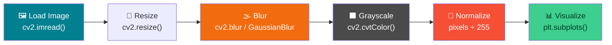
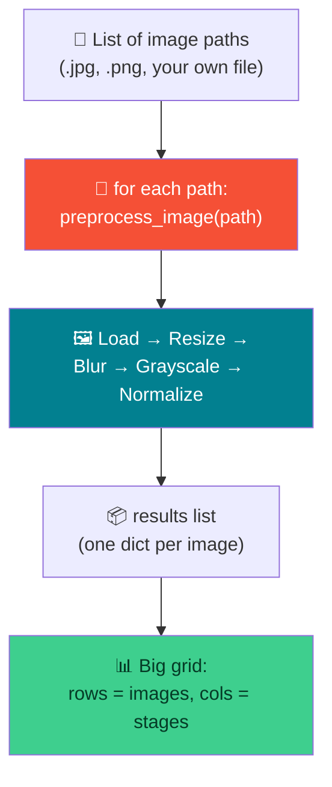

# 🖼️ Image Preprocessing — Week 1 Practical

### *Load → Resize → Grayscale → Normalize → Visualize, using OpenCV + NumPy + Matplotlib (all in Google Colab)*

> **What we're building today:** a small, reusable **image preprocessing pipeline** — the exact first step of almost every computer vision / deep learning project. Along the way you'll open up images and look **inside** them — channel by channel, pixel value by pixel value — so "RGB", "grayscale", and "alpha" stop being buzzwords and become numbers you've actually touched.

> 💻 **Runtime:** Google Colab → `Runtime` → `Change runtime type` → **CPU** (the default). We do **not** need a T4 / GPU for anything today — everything here is plain NumPy + OpenCV array math.

**Session plan (2 hours, back-to-back):**

| Time | Block | Focus |
|------|-------|-------|
| 🕛 12:00 – 12:10 PM | **Warm-Up** | The #1 OpenCV gotcha — BGR vs RGB — demoed on a rose photo |
| 🕧 12:10 – 1:05 PM | **Practical 1** | Build the full pipeline once, and *look inside* the channels |
| 🕐 1:05 – 2:00 PM | **Practical 2** | Turn it into a **function**, run it on multiple images/formats, and explore the PNG alpha channel |

---

## 🗺️ The Big Picture (Read This First)



**Three tools, three jobs:**

| Tool | Job | Analogy |
|------|-----|---------|
| 🔧 **OpenCV** (`cv2`) | Reads, resizes, recolors, and blurs images | The darkroom technician 🎞️ |
| 🔢 **NumPy** | Does the pixel-value math (channels, normalization, alpha) | The calculator 🧮 |
| 📊 **Matplotlib** | Displays everything on screen | The gallery wall 🖼️ |

> 🔑 **The key gotcha of the day:** OpenCV loads color images as **BGR** (Blue-Green-Red), not RGB. Matplotlib expects **RGB**. Forget to convert, and every photo looks off — blue skin, orange skies, blue roses. We prove this in the very next section, before touching anything else.

---

## 📋 What You'll Need (all free)

1. A **Google account** (for Colab) → `https://colab.research.google.com`
2. That's it. `cv2`, `numpy`, and `matplotlib` all come **pre-installed** in Colab.

---

# 🌹 WARM-UP (12:00 – 12:10 PM): The BGR vs RGB Gotcha

Before we build anything, let's see the bug that catches *every single beginner* — with our own eyes.

### W.1 — Open a fresh Colab notebook

Go to `https://colab.research.google.com` → **New notebook**. Rename it `week1_warmup.ipynb`.

### W.2 — Download a red rose photo


> 💡 This uses Wikimedia Commons' `Special:FilePath` link, which always redirects straight to the real image file — perfect for `wget`. It's a public-domain rose photo.
>
> 🙋 **Prefer your own flower photo?** Upload one via the 📁 folder icon in the Colab sidebar, and swap `"rose.jpg"` for your filename below.

### W.3 — Load it and display it — **without** fixing colors

```python
import cv2
import matplotlib.pyplot as plt

# Download a reliable RED ROSE image from Unsplash (No Wikipedia/Wikimedia)
!wget -q -O rose.jpg "https://images.unsplash.com/photo-1518621736915-f3b1c41bfd00?q=80&w=400"

# Load image using OpenCV
rose_bgr = cv2.imread("rose.jpg")

# Quick check to ensure the download succeeded
if rose_bgr is None:
    print("Error: Image not loaded! The download might have failed.")
else:
    print("Shape:", rose_bgr.shape)

    # OpenCV loads BGR, but Matplotlib expects RGB
    # The Red and Blue channels get swapped, making the rose look BLUE
    plt.figure(figsize=(5, 5))
    plt.imshow(rose_bgr)
    plt.title("❌ BGR shown as RGB (Looks Blue)")
    plt.axis("off")
    plt.show()
```

**What you'll see:** the rose looks **blue**, not red. The leaves look off too. Nothing is broken — Matplotlib is just reading the array as if it were RGB, but OpenCV packed it as BGR. Red and Blue got swapped.

### W.4 — Fix it with `cv2.cvtColor`

```python
rose_rgb = cv2.cvtColor(rose_bgr, cv2.COLOR_BGR2RGB)

plt.imshow(rose_rgb)
plt.title("✅ After cv2.cvtColor(BGR2RGB) — the rose is red again")
plt.axis("off")
plt.show()
```

### W.5 — See both side by side

```python
fig, axes = plt.subplots(1, 2, figsize=(10, 5))

axes[0].imshow(rose_bgr)
axes[0].set_title("BGR shown as-is (WRONG)")
axes[0].axis("off")

axes[1].imshow(rose_rgb)
axes[1].set_title("After BGR → RGB (CORRECT)")
axes[1].axis("off")

plt.tight_layout()
plt.show()
```

> 🧠 **Why does this happen at all?** Back when OpenCV was created, BGR was the default byte order used by camera/video hardware at the time, and OpenCV kept it for backward compatibility. Every other Python imaging tool (Matplotlib, PIL, most of the web) uses RGB. So: **every time you load a color image with `cv2.imread()` and plan to display it with Matplotlib (or feed it to a model that expects RGB), convert it first.**

**Remember this one rule for the rest of today's class — everything else builds on top of it.**

---

# 🕧 PRACTICAL 1 (12:10 – 1:05 PM)

## Load → Resize → Blur → Grayscale → Normalize → Visualize — on one image

### 1.1 — Open a fresh Colab notebook

Rename your notebook `week1_practical1.ipynb`. Work through the cells **one at a time** (Shift+Enter runs a cell).

### 1.2 — Get a sample image

We'll all use the **same image** first, so everyone's output matches — a classic OpenCV-Python tutorial test photo of Lionel Messi (`messi5.jpg`), widely used across open-source OpenCV teaching material.

```python
!wget -q -O sample.jpg "https://raw.githubusercontent.com/dsaint31x/OpenCV_Python_Tutorial/master/images/messi5.jpg"
print("✅ Image downloaded")
```

> 🙋 **Prefer your own photo?** Click the **📁 folder icon** in the left sidebar → **upload icon** → pick a photo from your laptop. Just change `"sample.jpg"` to your filename everywhere below.

### 1.3 — Import the libraries

```python
import cv2
import numpy as np
import matplotlib.pyplot as plt

print("OpenCV version:", cv2.__version__)
```

### 1.4 — Load the image (BGR → RGB, same fix as the warm-up)

```python
img_bgr = cv2.imread("sample.jpg")

print("Shape (height, width, channels):", img_bgr.shape)
print("Data type:", img_bgr.dtype)

img_rgb = cv2.cvtColor(img_bgr, cv2.COLOR_BGR2RGB)

plt.imshow(img_rgb)
plt.title("Original Image (RGB)")
plt.axis("off")
plt.show()
```

### 1.5 — Resize the image

```python
resized = cv2.resize(img_rgb, (224, 224))   # (width, height)

print("Original shape:", img_rgb.shape)
print("Resized shape :", resized.shape)

plt.imshow(resized)
plt.title("Resized (224x224)")
plt.axis("off")
plt.show()
```

> 💡 `224x224` isn't a random number — it's the standard input size for many pretrained CNNs (ResNet, VGG, MobileNet).

---

## 🌫️ 1.6 — Blur: Normal (Averaging) vs Gaussian, side by side

Blurring softens an image by mixing each pixel with its neighbors. There are two flavors you'll use constantly:

| Blur type | OpenCV call | How it works |
|-----------|-------------|---------------|
| **Normal / Averaging blur** | `cv2.blur(img, (k, k))` | Every pixel becomes the **plain average** of its `k×k` neighborhood — equal weight for all neighbors |
| **Gaussian blur** | `cv2.GaussianBlur(img, (k, k), 0)` | Neighbors are averaged with a **bell-curve weight** — nearby pixels count more than far ones, so edges look softer and more natural |

```python
normal_blur = cv2.blur(resized, (15, 15))
gaussian_blur = cv2.GaussianBlur(resized, (15, 15), 0)

fig, axes = plt.subplots(1, 3, figsize=(15, 5))

axes[0].imshow(resized)
axes[0].set_title("Original")
axes[0].axis("off")

axes[1].imshow(normal_blur)
axes[1].set_title("Normal Blur (Averaging, 15x15)")
axes[1].axis("off")

axes[2].imshow(gaussian_blur)
axes[2].set_title("Gaussian Blur (15x15)")
axes[2].axis("off")

plt.tight_layout()
plt.show()
```

> 🎯 **What to look for:** the normal blur can look slightly "boxy" or flat, while the Gaussian blur looks smoother, more like a camera out-of-focus effect. Try changing `(15, 15)` to `(3, 3)` or `(31, 31)` and re-run — bigger kernel = stronger blur.

---

## ⬛ 1.7 — Grayscale: what does "1 channel" actually mean?

```python
gray = cv2.cvtColor(img_rgb, cv2.COLOR_RGB2GRAY)

print("RGB shape:      ", img_rgb.shape)   # (H, W, 3) -> 3 channels
print("Grayscale shape:", gray.shape)      # (H, W)    -> NO channel axis at all!

plt.imshow(gray, cmap="gray")              # cmap="gray" is required
plt.title("Grayscale")
plt.axis("off")
plt.show()
```

> 🔑 **Why `cmap="gray"`?** A grayscale image has only **one channel** — just brightness, from 0 (black) to 255 (white). Matplotlib doesn't automatically know that a single number means "shade of gray" — without `cmap="gray"` it applies a false color map instead.

### 1.7a — See the full 0→255 brightness scale in one image

```python
gradient = np.tile(np.linspace(0, 255, 256, dtype=np.uint8), (50, 1))

plt.imshow(gradient, cmap="gray")
plt.title("Grayscale values from 0 (black) → 255 (white)")
plt.axis("off")
plt.show()
```

This is the *entire* range a grayscale pixel can take — every pixel in `gray` is just one number somewhere on this strip.

### 1.7b — Directly edit the single grayscale channel

Because grayscale is just one 2D array of numbers, we can pick any rectangular region and force it to a value — no "channel" to worry about, just numbers.

```python
gray_edited = gray.copy()   # always copy before editing, so the original stays safe

# Paint three horizontal bands with different brightness values
gray_edited[0:80,   :] = 0     # 0   -> pure black band
gray_edited[80:160, :] = 120   # 120 -> mid-gray band
gray_edited[160:224,:] = 255   # 255 -> pure white band

fig, axes = plt.subplots(1, 2, figsize=(10, 5))

axes[0].imshow(gray, cmap="gray")
axes[0].set_title("Original grayscale")
axes[0].axis("off")

axes[1].imshow(gray_edited, cmap="gray")
axes[1].set_title("Edited: bands forced to 0 / 120 / 255")
axes[1].axis("off")

plt.tight_layout()
plt.show()
```

> 🧪 **Try it yourself in class:** change the row ranges (`0:80`, `80:160`, …) and the values (anything from `0` to `255`) to paint your own pattern. Because there's only **one** channel, every value you set directly controls brightness — there's no "color" to accidentally get wrong.

---

## 🔴🟢🔵 1.8 — RGB: what do the 3 channels actually control?

An RGB image is 3 grayscale-like layers stacked together — one for Red intensity, one for Green, one for Blue.

### 1.8a — Split and view each channel separately

```python
r, g, b = cv2.split(resized)   # resized is (224, 224, 3) -> 3 separate (224, 224) arrays

print("Each channel shape:", r.shape, g.shape, b.shape)

fig, axes = plt.subplots(1, 3, figsize=(15, 5))

axes[0].imshow(r, cmap="Reds")
axes[0].set_title("Red channel")
axes[0].axis("off")

axes[1].imshow(g, cmap="Greens")
axes[1].set_title("Green channel")
axes[1].axis("off")

axes[2].imshow(b, cmap="Blues")
axes[2].set_title("Blue channel")
axes[2].axis("off")

plt.tight_layout()
plt.show()
```

### 1.8b — See what each RGB value combination looks like as a color

```python
def swatch(rgb_value, label):
    block = np.zeros((100, 100, 3), dtype=np.uint8)
    block[:, :] = rgb_value
    return block, label

samples = [
    ([255, 0, 0],   "R=255, G=0,   B=0   (Red)"),
    ([0, 255, 0],   "R=0,   G=255, B=0   (Green)"),
    ([0, 0, 255],   "R=0,   G=0,   B=255 (Blue)"),
    ([255, 255, 0], "R=255, G=255, B=0   (Yellow)"),
    ([128, 128, 128], "R=128, G=128, B=128 (Mid-gray)"),
]

fig, axes = plt.subplots(1, len(samples), figsize=(18, 4))
for ax, (rgb_value, label) in zip(axes, samples):
    block, label = swatch(rgb_value, label)
    ax.imshow(block)
    ax.set_title(label, fontsize=9)
    ax.axis("off")

plt.tight_layout()
plt.show()
```

### 1.8c — Directly edit the RGB channels of the real photo

```python
img_edited = resized.copy()

img_edited[:, :, 0] = 255   # force Red channel to max everywhere
img_edited[:, :, 1] = 0     # kill the Green channel everywhere
# Blue channel (index 2) is left untouched

fig, axes = plt.subplots(1, 2, figsize=(10, 5))

axes[0].imshow(resized)
axes[0].set_title("Original")
axes[0].axis("off")

axes[1].imshow(img_edited)
axes[1].set_title("Red channel -> 255, Green channel -> 0")
axes[1].axis("off")

plt.tight_layout()
plt.show()
```

> 🧪 **Try it yourself in class:** change which channel index (`0`=Red, `1`=Green, `2`=Blue) you zero out or max out, and try partial values like `128` instead of `0`/`255`. Notice how every visible color change traces back to one of these three numbers moving.

---

### 1.9 — Normalize the pixel values

"Normalizing" means rescaling pixel values from the range **0–255** (integers) down to **0.0–1.0** (floats). Almost every deep learning model expects this.

```python
normalized = img_rgb.astype(np.float32) / 255.0

print("Before normalize → min:", img_rgb.min(), "max:", img_rgb.max(), "dtype:", img_rgb.dtype)
print("After normalize  → min:", normalized.min(), "max:", normalized.max(), "dtype:", normalized.dtype)
```

**Expected output:**

```
Before normalize → min: 0 max: 255 dtype: uint8
After normalize  → min: 0.0 max: 1.0 dtype: float32
```

> 🧠 **Note:** the image *looks* identical when plotted — normalizing doesn't change what you see, only the numbers underneath. It's a step for the *model*, not for your eyes.

### 1.10 — Put it all together: one figure, six subplots

```python
fig, axes = plt.subplots(1, 6, figsize=(24, 4))

axes[0].imshow(img_rgb);        axes[0].set_title("1. Original");           axes[0].axis("off")
axes[1].imshow(resized);        axes[1].set_title("2. Resized (224x224)");  axes[1].axis("off")
axes[2].imshow(normal_blur);    axes[2].set_title("3. Normal Blur");        axes[2].axis("off")
axes[3].imshow(gaussian_blur);  axes[3].set_title("4. Gaussian Blur");      axes[3].axis("off")
axes[4].imshow(gray, cmap="gray"); axes[4].set_title("5. Grayscale");       axes[4].axis("off")
axes[5].imshow(normalized);     axes[5].set_title("6. Normalized (0-1)");   axes[5].axis("off")

plt.tight_layout()
plt.show()
```

🎉 **That's the full pipeline, working end to end, on one image — and you've seen inside every channel it touches.**

---

## 🛠️ Troubleshooting — Practical 1

| Symptom | Likely cause | Fix |
|---------|-------------|-----|
| `img_bgr` is `None` | Wrong filename / download failed | Re-run the `!wget` cell; check `!ls` shows `sample.jpg` |
| Colors look inverted (blue skin, orange sky) | Forgot `cv2.COLOR_BGR2RGB` | Always convert BGR→RGB before `plt.imshow()` |
| Grayscale image looks yellow/purple | Forgot `cmap="gray"` | Add `cmap="gray"` to `imshow()` for single-channel images |
| `normalized` image looks pure white/black | Divided by wrong number, or dtype still `uint8` | Cast with `.astype(np.float32)` **before** dividing by 255.0 |
| RGB channel edit crashes with a shape error | Editing `resized` instead of a 3-channel array, or indexing `[:,:,3]` | RGB arrays only have indices `0, 1, 2` — there is no channel `3` unless you've added alpha |
| `cv2.resize` shape looks swapped | `resize()` takes `(width, height)`, but `.shape` reports `(height, width, channels)` | Easy to mix up — just remember the order flips |

---

## 🧰 Quick Reference Card — Practical 1

```python
img_bgr       = cv2.imread("sample.jpg")                      # load (BGR!)
img_rgb       = cv2.cvtColor(img_bgr, cv2.COLOR_BGR2RGB)       # fix colors for display
resized       = cv2.resize(img_rgb, (224, 224))                # (width, height)
normal_blur   = cv2.blur(resized, (15, 15))                    # simple average blur
gaussian_blur = cv2.GaussianBlur(resized, (15, 15), 0)         # weighted / smoother blur
gray          = cv2.cvtColor(img_rgb, cv2.COLOR_RGB2GRAY)      # 1 channel
normalized    = img_rgb.astype(np.float32) / 255.0             # 0-255 -> 0-1

r, g, b = cv2.split(resized)   # split RGB into 3 single-channel arrays
```

| Concept | One-liner |
|---------|-----------|
| **BGR vs RGB** | OpenCV loads/saves in BGR; everything else (Matplotlib, the real world) expects RGB |
| **Resize** | `cv2.resize(img, (width, height))` — note the order |
| **Blur** | `cv2.blur` = flat average; `cv2.GaussianBlur` = weighted, smoother |
| **Grayscale** | Collapses 3 channels → 1 (no channel axis at all); always display with `cmap="gray"` |
| **RGB channels** | `img[:,:,0]`=Red, `img[:,:,1]`=Green, `img[:,:,2]`=Blue — edit any one directly |
| **Normalize** | `array.astype(np.float32) / 255.0` → rescales 0–255 to 0.0–1.0 |

---

# 🕐 PRACTICAL 2 (1:05 – 2:00 PM)

## Extension: reusable function, multiple formats, and the PNG alpha channel

**Goal:** turn the pipeline into a **function**, run it on **multiple images in different file formats** (`.jpg`, `.png`, and one of your own), and dig into the one big difference between JPG and PNG: **transparency**.



### 2.1 — Open a new notebook (or a new section in the same one)

Rename it `week1_practical2.ipynb`, or add a new `## Practical 2` section under your existing notebook.

### 2.2 — Get 2–3 images in different formats

```python
# A .jpg (lossy, no transparency support) — same "messi5.jpg" as Practical 1
!wget -q -O sample1.jpg "https://raw.githubusercontent.com/dsaint31x/OpenCV_Python_Tutorial/master/images/messi5.jpg"

# A .png (lossless, CAN support transparency) — a different format on purpose
!wget -q -O sample2.png "https://raw.githubusercontent.com/opencv/opencv/master/samples/data/opencv-logo.png"

print("✅ Downloaded sample1.jpg and sample2.png")
```

Now **upload a third image of your own** (any format — `.jpg`, `.png`, `.webp`, a screenshot, a phone photo) using the 📁 folder icon → upload icon in the Colab sidebar.

```python
image_paths = ["sample1.jpg", "sample2.png", "my_photo.jpg"]   # 👈 edit the third filename
```

> 💡 **Why mix formats on purpose?** `.jpg` is lossy and always 3 channels — it has **no concept of transparency at all**. `.png` is lossless and *can* have a 4th **alpha (transparency) channel**. Real datasets are almost never one clean format — this step trains you to handle that.

### 2.3 — Refactor Practical 1 into a reusable function

```python
def preprocess_image(path, size=(224, 224)):
    """Load an image and run it through the full preprocessing pipeline.

    Args:
        path: file path to the image (any format cv2 can read)
        size: (width, height) to resize to
    Returns:
        A dict with every stage of the pipeline as an array.
    """
    # IMREAD_COLOR forces 3 channels, automatically dropping any alpha
    # channel from PNGs — this avoids a whole category of shape bugs.
    img_bgr = cv2.imread(path, cv2.IMREAD_COLOR)
    if img_bgr is None:
        raise FileNotFoundError(f"Could not read image: {path}")

    img_rgb       = cv2.cvtColor(img_bgr, cv2.COLOR_BGR2RGB)
    resized       = cv2.resize(img_rgb, size)
    normal_blur   = cv2.blur(resized, (11, 11))
    gaussian_blur = cv2.GaussianBlur(resized, (11, 11), 0)
    gray          = cv2.cvtColor(img_rgb, cv2.COLOR_RGB2GRAY)
    normalized    = img_rgb.astype(np.float32) / 255.0

    return {
        "path": path,
        "original": img_rgb,
        "resized": resized,
        "normal_blur": normal_blur,
        "gaussian_blur": gaussian_blur,
        "gray": gray,
        "normalized": normalized,
    }

# Quick test on one image
test_result = preprocess_image("sample1.jpg")
print("Keys:", list(test_result.keys()))
print("Original shape:", test_result["original"].shape)
```

> 🔑 **`cv2.IMREAD_COLOR` is the fix for the PNG alpha-channel trap.** A `.png` with transparency loads as **4 channels (RGBA)** by default, which silently breaks `cv2.cvtColor(..., COLOR_RGB2GRAY)` later (it expects 3). Forcing `IMREAD_COLOR` guarantees 3 channels for every format, every time.

### 2.4 — Run the pipeline on every image in the list

```python
results = [preprocess_image(p) for p in image_paths]

for r in results:
    print(f"{r['path']:15s} → original {r['original'].shape}, "
          f"gray {r['gray'].shape}, normalized dtype {r['normalized'].dtype}")
```

**Expected output (shapes will vary based on your own photo):**

```
sample1.jpg     → original (480, 720, 3), gray (480, 720), normalized dtype float32
sample2.png     → original (240, 300, 3), gray (240, 300), normalized dtype float32
my_photo.jpg    → original (960, 1280, 3), gray (960, 1280), normalized dtype float32
```

### 2.5 — Visualize everything in one big grid

Rows = images, columns = pipeline stages.

```python
n = len(results)
fig, axes = plt.subplots(n, 6, figsize=(24, 4 * n))

stage_keys   = ["original", "resized", "normal_blur", "gaussian_blur", "gray", "normalized"]
stage_titles = ["Original", "Resized", "Normal Blur", "Gaussian Blur", "Grayscale", "Normalized"]

for row, r in enumerate(results):
    for col, (key, title) in enumerate(zip(stage_keys, stage_titles)):
        ax = axes[row, col] if n > 1 else axes[col]   # 1D axes if only 1 image
        cmap = "gray" if key == "gray" else None
        ax.imshow(r[key], cmap=cmap)
        ax.set_title(f"{r['path']} — {title}", fontsize=9)
        ax.axis("off")

plt.tight_layout()
plt.show()
```

---

## 🌫️🔎 2.6 — JPG vs PNG: the alpha channel and transparency

JPG can only ever store **3 channels (R, G, B)**. PNG can optionally store a **4th channel — alpha** — which controls how see-through each pixel is:

| Alpha value | Meaning |
|-------------|---------|
| `255` | Fully **opaque** — you see only the pixel's color |
| `1–254` | **Translucent** — the pixel blends with whatever is behind it |
| `0` | Fully **transparent** — the pixel is invisible; only the background shows |

### 2.6a — Confirm JPG never has alpha, PNG might

```python
jpg_raw = cv2.imread("sample1.jpg", cv2.IMREAD_UNCHANGED)
png_raw = cv2.imread("sample2.png", cv2.IMREAD_UNCHANGED)

print("JPG shape (no alpha possible):", jpg_raw.shape)
print("PNG shape (alpha channel IF present):", png_raw.shape)
```

> `cv2.IMREAD_UNCHANGED` (unlike `IMREAD_COLOR`) loads the file exactly as stored — so if a PNG has 4 channels, you'll see `(H, W, 4)` here.

### 2.6b — Build our own transparency demo: add an alpha channel by hand

We'll take our RGB photo, add a 4th (alpha) channel ourselves, and paint three zones with different transparency — fully opaque, translucent, and fully transparent — so you can *see* what each alpha value does.

```python
img_rgb_small = cv2.resize(img_rgb, (300, 300))

# Convert 3-channel RGB -> 4-channel RGBA (alpha starts at 255 = fully opaque)
img_rgba = cv2.cvtColor(img_rgb_small, cv2.COLOR_RGB2RGBA)
print("Shape after adding alpha:", img_rgba.shape)   # (300, 300, 4)

w = img_rgba.shape[1]

img_rgba[:, 0:w//3]        = img_rgba[:, 0:w//3]        # left third: unchanged
img_rgba[:, 0:w//3, 3]      = 255   # left third   -> fully OPAQUE
img_rgba[:, w//3:2*w//3, 3] = 120   # middle third -> TRANSLUCENT
img_rgba[:, 2*w//3:, 3]     = 0     # right third  -> fully TRANSPARENT

# Save it as an actual PNG so it truly carries transparency on disk
cv2.imwrite("alpha_demo.png", cv2.cvtColor(img_rgba, cv2.COLOR_RGBA2BGRA))
print("✅ Saved alpha_demo.png with 3 transparency zones")
```

### 2.6c — See the transparency effect against two different backgrounds

Matplotlib (and PNG viewers) reveal transparency by blending your image with whatever is *behind* it — so let's composite our alpha image onto a white background and a dark background and compare.

```python
def composite_over(rgba_img, bg_color):
    """Blend an RGBA image onto a solid background color, using its alpha channel."""
    rgb = rgba_img[..., :3].astype(np.float32)
    alpha = rgba_img[..., 3:4].astype(np.float32) / 255.0
    bg = np.ones_like(rgb) * np.array(bg_color, dtype=np.float32)
    blended = rgb * alpha + bg * (1 - alpha)
    return blended.astype(np.uint8)

over_white = composite_over(img_rgba, (255, 255, 255))
over_dark  = composite_over(img_rgba, (30, 30, 30))

fig, axes = plt.subplots(1, 2, figsize=(12, 6))

axes[0].imshow(over_white)
axes[0].set_title("Composited on WHITE background")
axes[0].axis("off")

axes[1].imshow(over_dark)
axes[1].set_title("Composited on DARK background")
axes[1].axis("off")

plt.tight_layout()
plt.show()
```

**What to look for:**
- **Left third (alpha=255):** looks identical on both backgrounds — fully opaque, the background never shows through.
- **Middle third (alpha=120):** you can clearly see the background color bleeding through the photo — that's translucency.
- **Right third (alpha=0):** the photo disappears completely — you're looking at pure background.

> 🧪 **Try it yourself in class:** change `120` to `40` or `200` and re-run — watch the middle band get more or less see-through. This is exactly how transparent logos, stickers, and UI icons are built.

---

## 🛠️ Troubleshooting — Practical 2

| Symptom | Likely cause | Fix |
|---------|-------------|-----|
| `cv2.cvtColor` crashes on the `.png` with a channel error | PNG loaded with 4 channels (RGBA) | Load with `cv2.imread(path, cv2.IMREAD_COLOR)` to force 3 channels |
| `FileNotFoundError` on your own image | Filename in `image_paths` doesn't match the uploaded file | Check the exact name with `!ls` in a new cell |
| `axes[row, col]` throws an `IndexError` | Only 1 image in the list, so `axes` isn't 2D | With `n=1`, index as `axes[col]` instead (handled in the code above) |
| Alpha demo shows no visible transparency difference | Forgot to composite onto a background before viewing, or alpha channel got overwritten by `IMREAD_COLOR` elsewhere | Use `IMREAD_UNCHANGED` when you need to preserve alpha, and always composite with `composite_over()` before calling `imshow` |
| `img_rgba.shape` still shows 3 channels | Used `IMREAD_COLOR` / `COLOR_BGR2RGB` (which drops alpha) instead of `COLOR_RGB2RGBA` | Use `cv2.cvtColor(img, cv2.COLOR_RGB2RGBA)` to explicitly add the 4th channel |
| Your own photo looks huge/slow to process | Very high resolution phone photo | Fine for this pipeline — `cv2.resize` handles it, just expect a short delay |

---

## 🚀 Extend It (Optional, if you finish early)

1. **Add edge detection** — try `cv2.Canny(gray, 100, 200)` as an extra column; compare edges across your 3 images.
2. **Animate the alpha fade** — loop `alpha` from `0` to `255` in steps of `25`, re-run the composite, and watch the image fade in.
3. **Save the processed images** — use `cv2.imwrite("gray_" + path, cv2.cvtColor(gray, cv2.COLOR_GRAY2BGR))` to write outputs back to disk.
4. **Batch it further** — drop 5 more images (mixed formats) into Colab and re-run the same `preprocess_image` loop with zero code changes. That's the payoff of writing it as a function.

---

## ✅ What You Learned Today

- 🌹 Saw the **BGR vs RGB** gotcha happen live on a rose photo, and fixed it with `cv2.cvtColor`
- 🖼️ Loaded real images with **OpenCV** and built the full pipeline on the "messi5.jpg" tutorial image
- 📐 **Resized** images to a standard shape (224×224 — the size most pretrained models expect)
- 🌫️ Compared **normal (averaging) blur** vs **Gaussian blur** side by side
- ⬛ Opened up the **grayscale channel**, saw its full 0–255 brightness range, and edited regions of it directly
- 🔴🟢🔵 Split an image into its **R, G, B channels**, viewed each one individually, and edited them to shift color
- 🔢 **Normalized** pixel values from `0–255` integers to `0.0–1.0` floats
- 🌈 Learned the real difference between **JPG (3 channels)** and **PNG (up to 4 channels)**, and built a working **alpha transparency demo** from scratch
- 🔁 Refactored one-off code into a **reusable function** and ran it across **multiple images and formats**

> 🎓 This is the exact preprocessing pattern used before feeding images into virtually any computer vision or deep learning model — and now you've also looked inside every channel that makes it up.

---

## 🧰 Quick Reference Card — Full Pipeline

```python
# ── SETUP ──
import cv2, numpy as np, matplotlib.pyplot as plt

# ── REUSABLE FUNCTION ──
def preprocess_image(path, size=(224, 224)):
    img_bgr       = cv2.imread(path, cv2.IMREAD_COLOR)   # forces 3 channels
    img_rgb       = cv2.cvtColor(img_bgr, cv2.COLOR_BGR2RGB)
    resized       = cv2.resize(img_rgb, size)
    normal_blur   = cv2.blur(resized, (11, 11))
    gaussian_blur = cv2.GaussianBlur(resized, (11, 11), 0)
    gray          = cv2.cvtColor(img_rgb, cv2.COLOR_RGB2GRAY)
    normalized    = img_rgb.astype(np.float32) / 255.0
    return {
        "original": img_rgb, "resized": resized,
        "normal_blur": normal_blur, "gaussian_blur": gaussian_blur,
        "gray": gray, "normalized": normalized,
    }

# ── LOOP over multiple images/formats ──
results = [preprocess_image(p) for p in ["a.jpg", "b.png", "c.jpg"]]

# ── CHANNEL TOOLS ──
r, g, b = cv2.split(img_rgb)                            # split RGB into 3 arrays
img_rgba = cv2.cvtColor(img_rgb, cv2.COLOR_RGB2RGBA)     # add an alpha channel
img_rgba[:, :, 3] = 128                                  # set alpha (0=invisible, 255=opaque)

# ── VISUALIZE: rows = images, cols = stages ──
fig, axes = plt.subplots(len(results), 6, figsize=(24, 4 * len(results)))
```

| Concept | One-liner |
|---------|-----------|
| **BGR → RGB** | `cv2.cvtColor(img, cv2.COLOR_BGR2RGB)` — always before displaying |
| **Force 3 channels** | `cv2.imread(path, cv2.IMREAD_COLOR)` — drops any PNG alpha automatically |
| **Keep alpha if present** | `cv2.imread(path, cv2.IMREAD_UNCHANGED)` |
| **Resize** | `cv2.resize(img, (width, height))` |
| **Blur** | `cv2.blur` = flat average; `cv2.GaussianBlur` = weighted, smoother |
| **Grayscale** | `cv2.cvtColor(img, cv2.COLOR_RGB2GRAY)` → display with `cmap="gray"` |
| **RGB channels** | `img[:,:,0]`=R, `img[:,:,1]`=G, `img[:,:,2]`=B |
| **Add alpha channel** | `cv2.cvtColor(img, cv2.COLOR_RGB2RGBA)` then edit `img[:,:,3]` (0=transparent, 255=opaque) |
| **Normalize** | `img.astype(np.float32) / 255.0` → range becomes 0.0–1.0 |
| **Golden rule** | Write the pipeline as a **function** once — then it works on 1 image or 1,000 |
