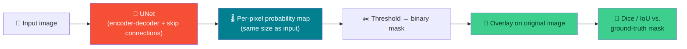
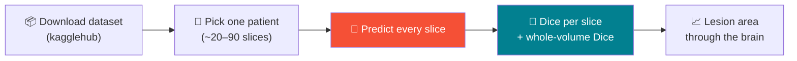
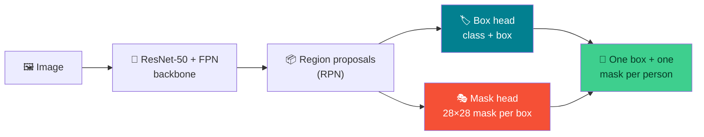

# 🩻 Finishing Detection & First Segmentation — Week 10 Practical

### *Part 1: finish training Faster R-CNN and evaluate it properly — precision, recall, and Average Precision, built from Week 8's IoU tools. Part 2: a real pretrained UNet doing pixel-level segmentation, scored against real ground-truth masks, then compared with two general-purpose segmenters (DeepLabV3 and Mask R-CNN).*

> **What we're doing today:** Part 1 closes the loop on Week 9 — continue training the pedestrian detector, then evaluate it the way real object detectors are actually evaluated, using IoU-based matching to compute precision, recall, and Average Precision (AP). Part 2 is a shift in kind, not just degree: **semantic segmentation**, where the model labels *every pixel*, not just draws a box around an object. You'll open up a pretrained UNet, stress-test it, grade it against real radiologist-drawn masks, and then try two completely different segmentation approaches on the pedestrian images from Part 1.
>
> Runs in **Google Colab**. Keep your **GPU runtime** enabled.

**Session plan (2.5 hours, back-to-back):**

| Time | Part | Focus |
|------|------|-------|
| 🕛 12:00 – 1:00 PM | **Practical 8B** | Faster R-CNN: finish training, evaluate performance |
| 🕐 1:00 – 2:30 PM | **Practical 9** | Pretrained UNet deep-dive, real ground-truth evaluation, semantic vs. instance segmentation |

> 🧭 **The throughline across both hours:** detection asks "where is the object, roughly, as a box?" — segmentation asks "which *exact pixels* belong to it?" Both need a way to score "how much do two regions agree" — IoU for boxes (Week 8), and its close cousin the **Dice coefficient** for pixel masks (Part 2). Same idea, two levels of precision.

---

# 🕛 PRACTICAL 8B (12:00 – 1:00 PM)

## Faster R-CNN: finish training, evaluate performance


### B.1 — Reload everything from Week 9

If continuing in the same notebook, skip to B.2. Starting fresh, rebuild the dataset, model architecture, and load your saved weights:

```python
import os
import numpy as np
from PIL import Image
import torch
import torchvision
from torchvision.models.detection import fasterrcnn_resnet50_fpn
from torchvision.models.detection.faster_rcnn import FastRCNNPredictor
from torch.utils.data import DataLoader
import matplotlib.pyplot as plt

device = torch.device("cuda" if torch.cuda.is_available() else "cpu")

# --- Same PennFudanDataset class from Week 9 ---
class PennFudanDataset(torch.utils.data.Dataset):
    def __init__(self, root):
        self.root = root
        self.imgs = sorted(os.listdir(os.path.join(root, "PNGImages")))
        self.masks = sorted(os.listdir(os.path.join(root, "PedMasks")))

    def __getitem__(self, idx):
        img_path = os.path.join(self.root, "PNGImages", self.imgs[idx])
        mask_path = os.path.join(self.root, "PedMasks", self.masks[idx])
        img = Image.open(img_path).convert("RGB")
        mask = np.array(Image.open(mask_path))
        obj_ids = np.unique(mask)[1:]
        per_object_masks = mask == obj_ids[:, None, None]
        boxes = []
        for i in range(len(obj_ids)):
            pos = np.where(per_object_masks[i])
            xmin, xmax = pos[1].min(), pos[1].max()
            ymin, ymax = pos[0].min(), pos[0].max()
            boxes.append([xmin, ymin, xmax, ymax])
        boxes = torch.as_tensor(boxes, dtype=torch.float32)
        labels = torch.ones((len(obj_ids),), dtype=torch.int64)
        target = {"boxes": boxes, "labels": labels, "image_id": torch.tensor([idx])}
        img = torchvision.transforms.functional.to_tensor(img)
        return img, target

    def __len__(self):
        return len(self.imgs)

def collate_fn(batch):
    return tuple(zip(*batch))

dataset = PennFudanDataset("PennFudanPed")
train_dataset = torch.utils.data.Subset(dataset, range(0, 150))
test_dataset  = torch.utils.data.Subset(dataset, range(150, len(dataset)))
train_loader = DataLoader(train_dataset, batch_size=2, shuffle=True, collate_fn=collate_fn)

# --- Rebuild the architecture, then load YOUR trained weights (not ImageNet ones) ---
model = fasterrcnn_resnet50_fpn(weights=None)
in_features = model.roi_heads.box_predictor.cls_score.in_features
model.roi_heads.box_predictor = FastRCNNPredictor(in_features, num_classes=2)
model.load_state_dict(torch.load("fasterrcnn_pennfudan_checkpoint.pth"))
model = model.to(device)
print("Checkpoint loaded — resuming from Week 9's partially-trained model.")
```

> ⚠️ If `PennFudanPed/` or the checkpoint file isn't present (fresh runtime), re-run Week 9's `wget`/`unzip` cell first — the checkpoint alone isn't enough without the dataset for continued training.

### B.2 — Continue training

```python
def train_one_epoch(model, optimizer, data_loader, device):
    model.train()
    total_loss = 0.0
    for images, targets in data_loader:
        images = [img.to(device) for img in images]
        targets = [{k: v.to(device) for k, v in t.items()} for t in targets]
        loss_dict = model(images, targets)
        losses = sum(loss for loss in loss_dict.values())
        optimizer.zero_grad()
        losses.backward()
        optimizer.step()
        total_loss += losses.item()
    return total_loss / len(data_loader)

params = [p for p in model.parameters() if p.requires_grad]
optimizer = torch.optim.SGD(params, lr=0.005, momentum=0.9, weight_decay=0.0005)

for epoch in range(6):
    avg_loss = train_one_epoch(model, optimizer, train_loader, device)
    print(f"Epoch {epoch+1}/6 — avg loss: {avg_loss:.4f}")

torch.save(model.state_dict(), "fasterrcnn_pennfudan_checkpoint.pth")
print("Updated checkpoint saved.")
```

**Expected pattern:** loss should continue trending downward from wherever Week 9 left off, likely leveling off somewhat by the end — 8 total epochs (2 from last week + 6 today) on 150 images is enough to see real pedestrian detections, though not a fully converged, production-grade model.

### B.3 — Qualitative check: predicted boxes vs. ground truth

```python
from torchvision.utils import draw_bounding_boxes

model.eval()
img, target = test_dataset[0]

with torch.no_grad():
    prediction = model([img.to(device)])[0]

img_uint8 = (img * 255).to(torch.uint8)

keep = prediction["scores"] > 0.5
pred_labels = [f"pedestrian: {s:.2f}" for s in prediction["scores"][keep]]
pred_img = draw_bounding_boxes(img_uint8, prediction["boxes"][keep].cpu(), pred_labels, colors="red", width=3)

gt_img = draw_bounding_boxes(img_uint8, target["boxes"], ["pedestrian"] * len(target["boxes"]), colors="green", width=3)

fig, axes = plt.subplots(1, 2, figsize=(14, 7))
axes[0].imshow(gt_img.permute(1, 2, 0))
axes[0].set_title("Ground truth")
axes[0].axis("off")
axes[1].imshow(pred_img.permute(1, 2, 0))
axes[1].set_title("Model predictions")
axes[1].axis("off")
plt.tight_layout()
plt.show()
```

### B.4 — Quantitative evaluation: IoU-based matching

A prediction only "counts" as correct if it overlaps a real pedestrian by enough — that's exactly Week 8's IoU function, put to real use.

```python
def box_area(box):
    x1, y1, x2, y2 = box
    return max(0, x2 - x1) * max(0, y2 - y1)

def iou(boxA, boxB):
    ax1, ay1, ax2, ay2 = boxA
    bx1, by1, bx2, by2 = boxB
    ix1, iy1 = max(ax1, bx1), max(ay1, by1)
    ix2, iy2 = min(ax2, bx2), min(ay2, by2)
    inter = max(0, ix2 - ix1) * max(0, iy2 - iy1)
    union = box_area(boxA) + box_area(boxB) - inter
    return inter / union if union else 0.0


def evaluate_detections(model, dataset, device, conf_threshold=0.5, iou_threshold=0.5):
    model.eval()
    total_tp = total_fp = total_fn = 0

    with torch.no_grad():
        for img, target in dataset:
            prediction = model([img.to(device)])[0]
            keep = prediction["scores"].cpu().numpy() >= conf_threshold
            pred_boxes = prediction["boxes"].cpu().numpy()[keep]
            gt_boxes = target["boxes"].numpy()

            matched_gt = set()
            tp = fp = 0
            for pred_box in pred_boxes:
                best_iou, best_idx = 0, -1
                for gt_idx, gt_box in enumerate(gt_boxes):
                    if gt_idx in matched_gt:
                        continue
                    current_iou = iou(pred_box.tolist(), gt_box.tolist())
                    if current_iou > best_iou:
                        best_iou, best_idx = current_iou, gt_idx

                if best_iou >= iou_threshold:
                    tp += 1
                    matched_gt.add(best_idx)
                else:
                    fp += 1

            fn = len(gt_boxes) - len(matched_gt)
            total_tp += tp
            total_fp += fp
            total_fn += fn

    precision = total_tp / (total_tp + total_fp) if (total_tp + total_fp) > 0 else 0.0
    recall = total_tp / (total_tp + total_fn) if (total_tp + total_fn) > 0 else 0.0
    return precision, recall, total_tp, total_fp, total_fn


precision, recall, tp, fp, fn = evaluate_detections(model, test_dataset, device, conf_threshold=0.5)
print(f"At confidence >= 0.5, IoU >= 0.5:")
print(f"  TP={tp}  FP={fp}  FN={fn}")
print(f"  Precision: {precision:.3f}")
print(f"  Recall   : {recall:.3f}")
```

> 🔑 **Reading TP/FP/FN for detection:** a **true positive** is a predicted box that overlaps a real pedestrian by IoU ≥ 0.5 and hasn't already been matched to another prediction. A **false positive** is a predicted box that doesn't match anything. A **false negative** is a real pedestrian that no prediction matched. This is the same matching logic behind every modern detection benchmark.

### B.5 — Precision-Recall curve and Average Precision (AP)

A single precision/recall pair only tells you about one confidence threshold. Sweeping the threshold gives the full picture.

```python
thresholds = np.arange(0.1, 1.0, 0.1)
precisions, recalls = [], []

for t in thresholds:
    p, r, *_ = evaluate_detections(model, test_dataset, device, conf_threshold=t)
    precisions.append(p)
    recalls.append(r)

order = np.argsort(recalls)
recalls_sorted = np.array(recalls)[order]
precisions_sorted = np.array(precisions)[order]

AP = np.trapz(precisions_sorted, recalls_sorted)

fig, ax = plt.subplots(figsize=(6, 5))
ax.plot(recalls_sorted, precisions_sorted, marker="o", color="#F55036")
ax.set_xlabel("Recall")
ax.set_ylabel("Precision")
ax.set_title(f"Precision-Recall curve — AP@IoU=0.5 ≈ {AP:.3f}")
ax.set_xlim(0, 1.05)
ax.set_ylim(0, 1.05)
plt.show()

print(f"Average Precision (AP@IoU=0.5): {AP:.3f}")
```

> ⚠️ **With only 20 test images**, expect a noisy, jagged curve — this is a genuinely small evaluation set. The mechanics you just implemented are exactly what COCO's official `mAP` metric does at a larger scale; `pycocotools` (used in most published detection benchmarks) is the standard shortcut for this once your dataset is big enough to warrant it.

### B.6 — Interpret your numbers

- Is **precision** or **recall** lower? A detector with high precision/low recall is "cautious" — misses real pedestrians but rarely cries wolf. High recall/low precision is the opposite.
- Would 8 epochs be considered "done"? Compare your AP to the loss curve from B.2 — is loss still dropping meaningfully, suggesting more training would help?

---

## 🛠️ Troubleshooting — Practical 8B

| Symptom | Likely cause | Fix |
|---------|-------------|-----|
| `load_state_dict` size mismatch error | Rebuilt model without first swapping `box_predictor` to `num_classes=2` | Replace the head *before* calling `load_state_dict`, exactly as in B.1 |
| Precision or recall is exactly `0` | Confidence threshold higher than any prediction's score, or IoU threshold too strict for an under-trained model | Try a lower `conf_threshold`; also expected in early epochs — re-check after more training |
| PR curve isn't monotonic / looks jagged | Normal with only 20 test images — small sample sizes are noisy | Note it explicitly rather than over-reading the shape; more test data would smooth it |
| `evaluate_detections` runs very slowly | Looping per-image in Python is fine at this scale (20 images) but wouldn't scale to a large test set | Acceptable for today — production pipelines use vectorized/batched matching (see `pycocotools`) |
| AP looks suspiciously close to `1.0` or `0.0` | Usually a threshold sweep too narrow, or an evaluation bug (e.g., double-counting a matched GT box) | Confirm `matched_gt` is actually preventing re-matches — print it for one image to check |

---

## 🧰 Quick Reference Card — Practical 8B

```python
# Resume training from a checkpoint:
model.roi_heads.box_predictor = FastRCNNPredictor(in_features, num_classes)  # BEFORE loading
model.load_state_dict(torch.load("checkpoint.pth"))

# IoU-based evaluation (reuses Week 8's iou()):
precision, recall, tp, fp, fn = evaluate_detections(model, test_dataset, device, conf_threshold=0.5)
AP = np.trapz(precisions_sorted, recalls_sorted)   # area under the PR curve
```

| Concept | One-liner |
|---------|-----------|
| **TP / FP / FN for detection** | Matched via IoU ≥ threshold, one-to-one, greedy by confidence |
| **Precision** | Of the boxes you predicted, what fraction were real? |
| **Recall** | Of the real pedestrians, what fraction did you find? |
| **AP (Average Precision)** | Area under the precision-recall curve — a single number summarizing performance across all thresholds |
| **AP@IoU=0.5** | The specific, commonly-reported version: "correct" means IoU ≥ 0.5 with ground truth |

---

# 🕐 PRACTICAL 9 (1:00 – 2:30 PM)

## Segmentation: a pretrained UNet, real ground truth, and two other ways to label pixels

**A shift in kind, not degree:** every model so far has output either one label (classification), or a handful of boxes (detection). A segmentation model outputs **one label per pixel** — a full map the same size as the input image.



| Task | Output | Example |
|------|--------|---------|
| Classification (Weeks 5-7) | One label for the whole image | "cat" |
| Detection (Weeks 9-10) | A box + label per object | `[x1,y1,x2,y2]`, "pedestrian" |
| **Semantic segmentation (today)** | **A class label for every pixel** | This pixel is "person", that one is "background" |
| **Instance segmentation (today)** | **A separate pixel mask per object** | "person #1 is these pixels, person #2 is those pixels" |

**Roadmap for this practical (90 minutes):**

| Time | Section | What you'll do |
|------|---------|----------------|
| 1:00 – 1:35 | **9A — Inside the brain-MRI UNet** | Load it, look inside it, run it correctly, threshold it, turn masks into boxes, and stress-test it |
| 1:35 – 1:55 | **9B — A different image set, with real ground truth** | Run the UNet on a whole patient's scan (every slice) and score it against radiologist-drawn masks |
| 1:55 – 2:15 | **9C — A different approach: general-purpose semantic segmentation** | DeepLabV3 on the pedestrian photos from Practical 8B, scored against their pixel masks |
| 2:15 – 2:30 | **9D — Instance segmentation + wrap-up** | Mask R-CNN (Faster R-CNN's big sibling), per-person mask matching, final scoreboard |

> 💡 Use **one fresh notebook** for all of Practical 9 — later sections reuse helper functions from earlier ones, so run the cells in order.

---

# 🧠 9A — Inside the brain-MRI UNet (1:00 – 1:35)

### 9.1 — Open a fresh Colab notebook and set up

Rename it `week10_practical9.ipynb`.

```python
# ---------------------------------------------------------------
# Imports — everything Practical 9 needs, in one place
# ---------------------------------------------------------------
import os, glob, zipfile, urllib.request      # file handling + downloading
import numpy as np                            # array maths on masks/images
import pandas as pd                           # tidy per-slice / per-image result tables
import torch
import torchvision
from torchvision import transforms
from PIL import Image                         # image loading/resizing
import matplotlib.pyplot as plt
import matplotlib.patches as patches          # for drawing rectangles (boxes) on plots
from scipy import ndimage                     # connected components, rotation, blur
from IPython.display import display           # pretty-print DataFrames in Colab

device = torch.device("cuda" if torch.cuda.is_available() else "cpu")
print("Using device:", device)

# Fix random seeds so that the noise experiments give the same numbers on every run
torch.manual_seed(0)
rng = np.random.default_rng(0)


# ---------------------------------------------------------------
# Helper: draw an image and tint the pixels where mask == 1
# (we'll call this dozens of times, so it's worth writing once)
# ---------------------------------------------------------------
def show_overlay(ax, image, mask, color=(1, 0, 0), alpha=0.4, title=None):
    """
    ax    : the matplotlib axis to draw on
    image : (H, W, 3) uint8 image to show underneath
    mask  : (H, W) array of 0/1 (or False/True) — which pixels to tint
    color : RGB tuple in 0–1, default red
    alpha : opacity of the tint (0 = invisible, 1 = solid)
    """
    ax.imshow(image)
    rgba = np.zeros((*mask.shape, 4))            # (H, W, 4): RGBA layer, fully transparent by default
    rgba[mask.astype(bool)] = [*color, alpha]    # only masked pixels get a colour and some opacity
    ax.imshow(rgba)                              # draw the tint layer on top of the image
    if title:
        ax.set_title(title)
    ax.axis("off")
```

### 9.2 — Load a real pretrained UNet

Today's model is a genuinely pretrained UNet — not a from-scratch architecture — trained for **FLAIR abnormality segmentation in brain MRI scans** (lower-grade glioma patients), published on PyTorch Hub.

```python
model = torch.hub.load(
    "mateuszbuda/brain-segmentation-pytorch",  # GitHub repo that hosts the model code
    "unet",                                     # entry-point name defined in the repo's hubconf.py
    in_channels=3,        # the model reads 3 MRI sequences, stacked like the R, G, B channels of a photo
    out_channels=1,       # 1 output channel = "probability this pixel is abnormal"
    init_features=32,     # number of feature maps in the first encoder block (doubles at every level)
    pretrained=True,      # download the trained weights instead of starting from random ones
    trust_repo=True,      # skip the "do you trust this repo?" prompt
)
model = model.to(device).eval()   # eval(): BatchNorm uses its stored statistics, not the current batch's

total_params = sum(p.numel() for p in model.parameters())   # numel() = number of values in a tensor
print(f"UNet parameters: {total_params:,}")
```

> 🔑 **UNet's defining feature: skip connections between the encoder and decoder.** As the network downsamples (encoder) it loses fine spatial detail; skip connections carry that detail directly across to the matching decoder layer, so the final output can be pixel-precise instead of blurry. This is architecturally similar to ResNet's skip connections (Week 4), but used for a different purpose — preserving spatial detail rather than easing gradient flow. One more difference: ResNet **adds** the skipped features; UNet **concatenates** them (stacks them as extra channels), which you'll see in the shapes below.

### 9.3 — Look inside: watch the "U" shape happen

A UNet is easiest to understand by watching the tensor shapes change as an image flows through it. PyTorch lets you attach a **forward hook** to any layer: a small function that runs every time that layer produces an output. We'll use hooks to record each block's output shape.

```python
feature_shapes = []   # we'll fill this with (layer_name, output_shape) pairs

def make_hook(name):
    """Return a hook function that remembers which layer it belongs to."""
    def hook(module, inputs, output):
        # PyTorch calls this automatically right after `module` runs its forward pass
        feature_shapes.append((name, tuple(output.shape)))
    return hook

# These attribute names come straight from the repo's UNet class
layer_names = ["encoder1", "encoder2", "encoder3", "encoder4", "bottleneck",
               "decoder4", "decoder3", "decoder2", "decoder1", "conv"]

handles = []
for name in layer_names:
    layer = getattr(model, name)                              # e.g. model.encoder1
    handles.append(layer.register_forward_hook(make_hook(name)))

# One dummy forward pass with a blank 256x256 "image" — we only care about the shapes
with torch.no_grad():
    model(torch.zeros(1, 3, 256, 256, device=device))

for h in handles:
    h.remove()   # always remove hooks when finished, or they keep firing on every future call

print(f"{'layer':<12} {'output shape (batch, channels, height, width)'}")
for name, shape in feature_shapes:
    print(f"{name:<12} {shape}")
```

**Expected output (roughly):**

```
encoder1     (1, 32, 256, 256)    ← full resolution, few channels
encoder2     (1, 64, 128, 128)
encoder3     (1, 128, 64, 64)
encoder4     (1, 256, 32, 32)
bottleneck   (1, 512, 16, 16)     ← bottom of the "U": tiny spatial size, many channels
decoder4     (1, 256, 32, 32)
decoder3     (1, 128, 64, 64)
decoder2     (1, 64, 128, 128)
decoder1     (1, 32, 256, 256)    ← back to full resolution
conv         (1, 1, 256, 256)     ← one probability per pixel
```

Now see **where the parameters live**:

```python
def count_params(module):
    return sum(p.numel() for p in module.parameters())

encoder_params    = sum(count_params(getattr(model, f"encoder{i}")) for i in range(1, 5))
bottleneck_params = count_params(model.bottleneck)
# Each decoder level = an up-convolution (upconvN) that doubles the resolution + a conv block (decoderN)
decoder_params    = sum(count_params(getattr(model, f"upconv{i}")) + count_params(getattr(model, f"decoder{i}"))
                        for i in range(1, 5))
head_params       = count_params(model.conv)   # the final 1x1 conv that produces the probability map

for label, n in [("Encoder", encoder_params), ("Bottleneck", bottleneck_params),
                 ("Decoder", decoder_params), ("Output head", head_params)]:
    print(f"{label:<12} {n:>10,} params  ({100 * n / total_params:5.1f}%)")
```

> 🤔 **Checkpoint questions (2 min):**
> 1. The bottleneck is only 16×16 pixels, yet it holds a huge share of the parameters. Why? (Hint: a 3×3 conv has `in_channels × out_channels × 9` weights — look at the channel counts.)
> 2. `decoder4` receives 512 channels as input but outputs 256. Where do the extra 256 input channels come from? (Hint: skip connection + concatenation.)
> 3. The output head has very few parameters. What is a 1×1 convolution actually doing to each pixel?

### 9.4 — Download the example image and look at what the model actually sees

```python
url = "https://github.com/mateuszbuda/brain-segmentation-pytorch/raw/master/assets/TCGA_CS_4944.png"
urllib.request.urlretrieve(url, "brain_mri.png")

input_image = Image.open("brain_mri.png").convert("RGB")   # .convert("RGB") guarantees exactly 3 channels
print("Image size:", input_image.size, "| mode:", input_image.mode)

image_np = np.asarray(input_image)   # (256, 256, 3) uint8 array

# The "colour" in this image isn't real colour: each channel is a DIFFERENT MRI sequence
# that has been dropped into the R, G and B slots so the model can read all three at once.
channel_names = ["Channel 0: pre-contrast", "Channel 1: FLAIR", "Channel 2: post-contrast"]

fig, axes = plt.subplots(1, 4, figsize=(18, 4.5))
axes[0].imshow(image_np)
axes[0].set_title("All 3 channels shown as RGB")
axes[0].axis("off")
for i in range(3):
    axes[i + 1].imshow(image_np[..., i], cmap="gray")   # show one channel at a time in greyscale
    axes[i + 1].set_title(channel_names[i])
    axes[i + 1].axis("off")
plt.tight_layout()
plt.show()
```

> 💡 **Look at the FLAIR channel.** FLAIR suppresses the signal from normal fluid, so abnormal tissue tends to show up **bright** — this is what the model was trained to outline. The other two sequences give it extra context.

### 9.5 — Preprocess exactly as the model expects

This model expects: 3 channels, 256×256, and each channel **z-scored using the image's own mean and standard deviation** (so each channel ends up with mean ≈ 0, std ≈ 1).

```python
def zscore(arr_hwc):
    """Per-channel z-score of an (H, W, 3) float array, using THIS image's own statistics."""
    mean = arr_hwc.mean(axis=(0, 1))           # one mean per channel (averaged over height & width)
    std = arr_hwc.std(axis=(0, 1)) + 1e-8      # +1e-8 prevents division by zero on an all-black image
    return (arr_hwc - mean) / std


def to_batch(arr_hwc):
    """(H, W, 3) numpy array  ->  (1, 3, H, W) float32 torch tensor, the layout PyTorch expects."""
    chw = np.ascontiguousarray(arr_hwc.transpose(2, 0, 1))   # move channels first: HWC -> CHW
    return torch.from_numpy(chw).float().unsqueeze(0)       # add the batch dimension at the front


def preprocess_mri(pil_img, size=256):
    """
    Full preprocessing pipeline for the brain UNet.
    Returns (model-ready tensor of shape (1, 3, size, size), resized uint8 image for plotting).
    """
    img = pil_img.convert("RGB").resize((size, size), Image.BILINEAR)   # 1) force 3 channels + 256x256
    arr = np.asarray(img).astype(np.float32)                            # 2) to float, values still 0–255
    return to_batch(zscore(arr)), np.asarray(img)                       # 3) z-score, 4) to tensor


input_batch, display_image = preprocess_mri(input_image)

print("Tensor shape       :", tuple(input_batch.shape))                         # (1, 3, 256, 256)
print("Per-channel mean   :", input_batch.mean(dim=(0, 2, 3)).numpy().round(3))  # ≈ [0, 0, 0]
print("Per-channel std    :", input_batch.std(dim=(0, 2, 3)).numpy().round(3))   # ≈ [1, 1, 1]
print("Value range        :", round(input_batch.min().item(), 2), "to", round(input_batch.max().item(), 2))
```

> ⚠️ **Why this cell changed from the version on the PyTorch Hub page.** The common copy-paste version computes `m, s` from the raw image (0–255 scale) but then applies them *after* `transforms.ToTensor()`, which has already rescaled pixels to 0–1. The two scales don't match: for this image the "normalized" input ends up squeezed into roughly **−1.01 to −0.95** — an almost perfectly flat, blank input. Our version does the z-score in one consistent scale, so the values land in roughly −1 to +3.3 as intended. You'll *see* the difference this makes in 9.11.

> 💡 **Why per-image normalization at all?** It's a deliberate choice for medical imaging, where scanner calibration varies between hospitals and even between scans. Normalizing to each image's own statistics removes much of that variation before the model ever sees the pixels. (The model's original training code goes a step further and normalizes each *whole 3D scan* at once — you'll try that in 9.18.)

### 9.6 — Run inference and inspect the probability map

```python
@torch.no_grad()   # decorator: no gradient tracking anywhere inside this function (faster, less memory)
def predict_mri(batch):
    """Run the UNet on an (N, 3, 256, 256) batch; return (N, 256, 256) probabilities as numpy."""
    out = model(batch.to(device))     # (N, 1, 256, 256) — this UNet already applies a sigmoid internally
    return out[:, 0].cpu().numpy()    # drop the single channel dimension -> (N, 256, 256)


probability_map = predict_mri(input_batch)[0]   # [0] = the first (and only) image in the batch

print("Probability map shape:", probability_map.shape)
print(f"Min / max probability: {probability_map.min():.4f} / {probability_map.max():.4f}")

# How many pixels is the model genuinely UNSURE about (neither clearly 0 nor clearly 1)?
unsure = ((probability_map > 0.1) & (probability_map < 0.9)).mean() * 100
print(f"Pixels with 0.1 < p < 0.9 (uncertain): {unsure:.2f}%")

fig, axes = plt.subplots(1, 2, figsize=(13, 4.5))

im = axes[0].imshow(probability_map, cmap="hot", vmin=0, vmax=1)   # fix colour scale to [0, 1]
plt.colorbar(im, ax=axes[0], fraction=0.046)
axes[0].set_title("Probability map")
axes[0].axis("off")

axes[1].hist(probability_map.ravel(), bins=50, color="#028090")   # ravel() flattens 256x256 -> 65,536 values
axes[1].set_yscale("log")   # log scale, otherwise the huge "p ≈ 0" bar hides everything else
axes[1].set_xlabel("Predicted probability")
axes[1].set_ylabel("Number of pixels (log scale)")
axes[1].set_title("Distribution of pixel probabilities")

plt.tight_layout()
plt.show()
```

> 🔑 **This is the segmentation equivalent of a confidence score** — but instead of one number per box (Practical 7), you get one number *per pixel*. A well-trained segmenter usually gives a strongly **two-humped** histogram: a giant pile near 0 (background), a smaller pile near 1 (lesion), and only a thin sliver in between — and that sliver lives almost entirely along the *edges* of the lesion.

### 9.7 — Threshold into a binary mask and overlay it

```python
threshold = 0.5
binary_mask = (probability_map > threshold).astype(np.uint8)   # True/False -> 1/0

percent_flagged = 100 * binary_mask.sum() / binary_mask.size
print(f"Pixels flagged as abnormal at threshold {threshold}: {percent_flagged:.2f}%")

fig, axes = plt.subplots(1, 3, figsize=(16, 5))

axes[0].imshow(display_image)
axes[0].set_title("Original")
axes[0].axis("off")

show_overlay(axes[1], display_image, binary_mask, title=f"Filled overlay (threshold={threshold})")

# A contour line is often easier to read than a filled overlay: you can still see the tissue underneath.
# contour() draws lines where the probability map crosses each of the given levels.
axes[2].imshow(display_image)
axes[2].contour(probability_map, levels=[0.3, 0.5, 0.9],
                colors=["yellow", "red", "cyan"], linewidths=1.5)
axes[2].set_title("Contours: yellow=0.3, red=0.5, cyan=0.9")
axes[2].axis("off")

plt.tight_layout()
plt.show()
```

**Expected result:** a red region over the bright area in the FLAIR channel; on the right, three nested outlines. How far apart are they? Close-together contours mean a sharp, confident boundary; widely spaced ones mean a fuzzy, uncertain one.

### 9.8 — Threshold analysis — same trade-off as Practical 7's confidence threshold, now spatial

```python
# --- Part 1: a visual grid at four thresholds ---
thresholds_to_try = [0.3, 0.5, 0.7, 0.9]

fig, axes = plt.subplots(1, len(thresholds_to_try), figsize=(16, 4))
for ax, t in zip(axes, thresholds_to_try):
    mask_at_t = (probability_map > t).astype(np.uint8)
    percent = 100 * mask_at_t.mean()          # mean of a 0/1 array = fraction of 1s
    show_overlay(ax, display_image, mask_at_t, title=f"t={t}\n{percent:.2f}% flagged")
plt.tight_layout()
plt.show()

# --- Part 2: a finer sweep, plotted as a curve ---
sweep = np.linspace(0.05, 0.95, 19)                        # 0.05, 0.10, ..., 0.95
flagged = [100 * (probability_map > t).mean() for t in sweep]

plt.figure(figsize=(7, 4))
plt.plot(sweep, flagged, marker="o", color="#F55036")
plt.xlabel("Threshold")
plt.ylabel("% of image flagged as abnormal")
plt.title("How much the flagged area depends on the threshold")
plt.grid(alpha=0.3)
plt.show()
```

> 🎯 **Same underlying trade-off as Practical 7's confidence threshold** — a lower threshold flags more pixels (higher sensitivity, more false positives), a higher threshold flags fewer (higher specificity, more missed detail). In medical imaging specifically, this threshold choice has real consequences: too high risks missing a genuine abnormality, too low risks flooding a clinician with false alarms.
>
> 🤔 **Read the curve:** a long *flat* stretch means the model is confident (moving the threshold barely changes the answer). A *steep* drop means many pixels sit in the uncertain zone. Which does your curve show, and does it match the histogram from 9.6?

### 9.9 — Dice coefficient: segmentation's version of IoU

Detection compares boxes with **IoU**; segmentation compares pixel masks with the closely related **Dice coefficient**:

```
IoU  = |A ∩ B| / |A ∪ B|
Dice = 2 × |A ∩ B| / (|A| + |B|)
```

They're so closely linked that you can convert one into the other exactly: since `|A ∪ B| = |A| + |B| − |A ∩ B|`, a little algebra gives **Dice = 2·IoU / (1 + IoU)**. Dice is always ≥ IoU (except at 0 and 1, where they're equal), so never compare a Dice score from one paper against an IoU score from another.

```python
def dice_coefficient(maskA, maskB, empty_value=1.0):
    """
    Dice = 2|A∩B| / (|A| + |B|).
    empty_value: what to return when BOTH masks are empty. Two empty masks agree perfectly
    that "nothing is there", so 1.0 is the usual convention — but some code bases use 0.0,
    so always check before comparing numbers.
    """
    A, B = maskA.astype(bool), maskB.astype(bool)
    total = A.sum() + B.sum()
    if total == 0:
        return empty_value
    return 2 * np.logical_and(A, B).sum() / total


def mask_iou(maskA, maskB, empty_value=1.0):
    """IoU for pixel masks = |A∩B| / |A∪B| — the mask version of Week 8's box iou()."""
    A, B = maskA.astype(bool), maskB.astype(bool)
    union = np.logical_or(A, B).sum()
    if union == 0:
        return empty_value
    return np.logical_and(A, B).sum() / union


mask_at_05 = (probability_map > 0.5).astype(np.uint8)
mask_at_03 = (probability_map > 0.3).astype(np.uint8)

d = dice_coefficient(mask_at_05, mask_at_03)
i = mask_iou(mask_at_05, mask_at_03)
print(f"Dice between threshold=0.5 and threshold=0.3 masks: {d:.4f}")
print(f"IoU  between the same two masks                  : {i:.4f}")
print(f"Check the formula: 2*IoU/(1+IoU) = {2 * i / (1 + i):.4f}  (should equal Dice)")

# Plot the Dice-vs-IoU relationship for every possible IoU value
iou_values = np.linspace(0, 1, 101)
plt.figure(figsize=(5, 5))
plt.plot(iou_values, 2 * iou_values / (1 + iou_values), label="Dice = 2·IoU/(1+IoU)", color="#028090")
plt.plot(iou_values, iou_values, "--", color="grey", label="y = x (if they were equal)")
plt.scatter([i], [d], color="#F55036", zorder=5, label="our two masks")
plt.xlabel("IoU")
plt.ylabel("Dice")
plt.legend()
plt.title("Dice is always ≥ IoU")
plt.show()
```

> 💡 **No ground truth yet.** Here we're comparing two of *our own* thresholds, which measures **consistency**, not accuracy. In 9B you'll swap in real radiologist-drawn masks and this same function becomes a genuine accuracy metric.

### 9.10 — From mask to boxes: connected components

A binary mask is just 0s and 1s — it doesn't know how many separate regions it contains. **Connected-component labelling** finds each separate blob and gives it its own ID. That lets you (a) count regions, (b) measure each one, and (c) draw a **bounding box around each** — turning segmentation output into *detection* output.

```python
# ndimage.label gives every separate blob of 1s its own integer id: 1, 2, 3, ...
# (Default = 4-connectivity: pixels touching only diagonally count as separate blobs.)
labeled, num_regions = ndimage.label(binary_mask)
print(f"Separate regions found: {num_regions}")

if num_regions > 0:
    # Pixel count of each region: sum the mask values inside each label id
    region_sizes = np.array(ndimage.sum(binary_mask, labeled, index=list(range(1, num_regions + 1))))

    # find_objects returns, for each label, a (row_slice, col_slice) pair = its bounding box
    region_slices = ndimage.find_objects(labeled)
    boxes = [[sl[1].start, sl[0].start, sl[1].stop, sl[0].stop]    # convert to [x1, y1, x2, y2]
             for sl in region_slices]

    for k, (size, box) in enumerate(zip(region_sizes, boxes), start=1):
        print(f"  region {k}: {int(size):>5} px  box [x1,y1,x2,y2] = {box}")

    # Keep only the LARGEST region. The model's original authors do exactly this
    # before scoring — a simple way to throw away small, isolated false-positive specks.
    largest_id = 1 + int(np.argmax(region_sizes))          # +1 because label ids start at 1
    lcc_mask = (labeled == largest_id).astype(np.uint8)    # "lcc" = largest connected component
else:
    boxes, lcc_mask = [], binary_mask.copy()

fig, axes = plt.subplots(1, 3, figsize=(16, 5))

axes[0].imshow(labeled, cmap="nipy_spectral")   # each region shows up in a different colour
axes[0].set_title(f"Connected components ({num_regions} regions)")
axes[0].axis("off")

axes[1].imshow(display_image)
for (x1, y1, x2, y2) in boxes:
    # Rectangle wants the top-left corner, then width and height
    axes[1].add_patch(patches.Rectangle((x1, y1), x2 - x1, y2 - y1,
                                        fill=False, edgecolor="lime", linewidth=2))
axes[1].set_title("Mask → bounding boxes (segmentation → detection)")
axes[1].axis("off")

show_overlay(axes[2], display_image, lcc_mask, color=(0, 1, 0),
             title=f"Largest component only\nDice vs full mask = {dice_coefficient(lcc_mask, binary_mask):.3f}")

plt.tight_layout()
plt.show()
```

> 🔑 **This only works one way.** A mask can always be converted into a box (just take the min/max of its pixel coordinates — exactly how Week 9's `PennFudanDataset` built its boxes from `PedMasks`!). A box can never be converted back into an exact mask. Segmentation carries strictly more information than detection.

### 9.11 — Stress test #1: how much does normalization matter?

Let's feed the *same* image to the model four ways, and compare each result against our correct prediction from 9.7.

```python
arr255 = display_image.astype(np.float32)                    # (256, 256, 3), values 0–255
m255, s255 = arr255.mean(axis=(0, 1)), arr255.std(axis=(0, 1))

imagenet_mean = np.array([0.485, 0.456, 0.406])
imagenet_std  = np.array([0.229, 0.224, 0.225])

variants = {
    "Correct:\nper-image z-score":                (arr255 - m255) / s255,
    "Scale mismatch:\n0–1 pixels, 0–255 stats":    (arr255 / 255 - m255) / s255,   # the Hub-page bug
    "Wrong stats:\nImageNet mean/std":             (arr255 / 255 - imagenet_mean) / imagenet_std,
    "No normalization:\nraw 0–1 pixels":           arr255 / 255,
}

reference_mask = binary_mask   # our correct prediction from 9.7

fig, axes = plt.subplots(1, len(variants), figsize=(20, 5.5))
for ax, (name, arr) in zip(axes, variants.items()):
    prob = predict_mri(to_batch(arr.astype(np.float32)))[0]   # same model, different input scaling
    mask = prob > 0.5
    ax.imshow(prob, cmap="hot", vmin=0, vmax=1)
    ax.set_title(f"{name}\ninput range [{arr.min():.2f}, {arr.max():.2f}]\n"
                 f"flagged {100 * mask.mean():.2f}% | Dice vs correct {dice_coefficient(mask, reference_mask):.2f}",
                 fontsize=10)
    ax.axis("off")
plt.tight_layout()
plt.show()
```

> 🤔 **Discuss:** the weights are identical in all four panels — only the input *scaling* changed. What does that tell you about how carefully you have to match a pretrained model's preprocessing? Where have you seen this lesson before? (Weeks 6-7 and ImageNet normalization.)

### 9.12 — Stress test #2: brightness, noise, blur, rotation — and a free accuracy boost

A good model should give the *same* answer when the image changes in ways that don't matter. We'll perturb the image, predict again, and measure agreement with the original prediction using Dice. (This measures **stability**, not accuracy — we still have no ground truth for this image.)

```python
def predict_from_array(arr_hwc):
    """(H, W, 3) float array in 0–255 -> (H, W) probability map, using the correct preprocessing."""
    return predict_mri(to_batch(zscore(arr_hwc).astype(np.float32)))[0]


# --- Photometric changes: pixels change, geometry doesn't, so compare directly with reference_mask ---
photometric = {
    "Brighter scanner\n(×1.5 + 20)":    arr255 * 1.5 + 20,
    "Dim, low contrast\n(×0.6)":        arr255 * 0.6,
    "Noise σ=10":                       arr255 + rng.normal(0, 10, arr255.shape),
    "Noise σ=30":                       arr255 + rng.normal(0, 30, arr255.shape),
    "Blur σ=2":                         ndimage.gaussian_filter(arr255, sigma=(2, 2, 0)),  # blur H and W, not channels
}

results = {}
for name, arr in photometric.items():
    results[name] = (arr, predict_from_array(arr) > 0.5, reference_mask)

# --- Geometric changes: the lesion MOVES, so we must move the reference mask the same way ---
for angle in [15, 45]:
    # rotate the image (order=1 = smooth interpolation) and the reference mask (order=0 = keep it 0/1)
    rot_img = ndimage.rotate(arr255, angle, reshape=False, order=1)
    rot_ref = ndimage.rotate(reference_mask, angle, reshape=False, order=0)
    results[f"Rotate {angle}°"] = (rot_img, predict_from_array(rot_img) > 0.5, rot_ref)

# --- Plot every perturbed image with its prediction, plus a bar chart of Dice scores ---
names = list(results.keys())
dices = [dice_coefficient(pred, ref) for (_, pred, ref) in results.values()]

fig, axes = plt.subplots(1, len(names), figsize=(3 * len(names), 3.8))
for ax, name, dice_val in zip(axes, names, dices):
    arr, pred, _ = results[name]
    shown = np.clip(arr, 0, 255).astype(np.uint8)   # clip only for DISPLAY; the model saw unclipped values
    show_overlay(ax, shown, pred, title=f"{name}\nDice {dice_val:.3f}")
plt.tight_layout()
plt.show()

plt.figure(figsize=(10, 3.5))
plt.bar(range(len(names)), dices, color="#028090")
plt.xticks(range(len(names)), [n.replace("\n", " ") for n in names], rotation=30, ha="right")
plt.ylim(0, 1.05)
plt.ylabel("Dice vs original prediction")
plt.title("Prediction stability under perturbations")
plt.show()
```

> 🤔 **Look carefully at the two brightness bars.** They should be essentially perfect (≈ 1.000). Why? Work out what `zscore()` does to an image that has been multiplied by a constant and had a constant added. This is per-image normalization paying off: any global brightness/contrast change is cancelled out *before* the model sees the pixels. Noise and rotation aren't cancelled — so those are the ones that actually test the model.

**Test-time augmentation (TTA):** predict on the original *and* a mirrored copy, flip the second prediction back, and average the two. It costs one extra forward pass and often gives slightly smoother, more reliable masks.

```python
p_original = probability_map
# Predict on the left-right mirrored image, then mirror the PREDICTION back so it lines up again
p_flipped  = np.fliplr(predict_from_array(arr255[:, ::-1, :]))
p_tta      = (p_original + p_flipped) / 2          # simple average of the two views
disagreement = np.abs(p_original - p_flipped)      # where the two views disagree = where the model is unsure

fig, axes = plt.subplots(1, 4, figsize=(18, 4.5))
panels = [(p_original, "Original view"), (p_flipped, "Flipped view (flipped back)"),
          (p_tta, "TTA average"), (disagreement, "|difference| between views")]
for ax, (img, title) in zip(axes, panels):
    im = ax.imshow(img, cmap="hot", vmin=0, vmax=1)
    ax.set_title(title)
    ax.axis("off")
plt.colorbar(im, ax=axes, fraction=0.015)
plt.show()

print(f"Dice(original mask, flipped mask): {dice_coefficient(p_original > 0.5, p_flipped > 0.5):.3f}")
print(f"Dice(original mask, TTA mask)    : {dice_coefficient(p_original > 0.5, p_tta > 0.5):.3f}")
```

> 🔑 **Where is the disagreement map bright?** Almost certainly along the lesion *boundary* — the same place the uncertain pixels lived in 9.6's histogram. Two independent ways of estimating uncertainty, pointing at the same pixels.

---

# 🗂️ 9B — A different image set, with real ground truth (1:35 – 1:55)

So far we've had **one** image and **no** ground truth. Now we'll use the public dataset this UNet was built for — the **LGG MRI Segmentation** dataset: 110 patients, ~3,900 slices, each with a manual FLAIR-abnormality mask drawn by experts. We'll run the model on **every slice of one patient's scan** and grade it properly.



### 9.13 — Download the dataset

```python
!pip install -q kagglehub
import kagglehub

# Public dataset -> normally downloads without a Kaggle login. It's ~700 MB, so give it a minute.
lgg_root = kagglehub.dataset_download("mateuszbuda/lgg-mri-segmentation")
print("Downloaded to:", lgg_root)

# Every slice comes as a pair:  <name>.tif  (the 3-channel MRI)  and  <name>_mask.tif  (the expert mask).
# recursive=True searches all sub-folders ("**" = any depth).
all_mask_paths = glob.glob(os.path.join(lgg_root, "**", "*_mask.tif"), recursive=True)

# The download may contain the same files twice (in two nested folders) — keep one copy per filename
unique = {}
for p in sorted(all_mask_paths):
    unique.setdefault(os.path.basename(p), p)   # setdefault keeps the FIRST path seen for each filename
mask_paths = list(unique.values())

# Each patient has their own folder, e.g. "TCGA_CS_4944_20010208"
patients = sorted({os.path.basename(os.path.dirname(p)) for p in mask_paths})
print(f"{len(mask_paths)} slices from {len(patients)} patients")
```

> ⚠️ If `kagglehub` asks for credentials, either sign in to Kaggle → *Settings* → *Create New Token* and upload the `kaggle.json` it gives you, or skip ahead to **9C** (which doesn't need this dataset) and come back later.

### 9.14 — Load one patient's full scan

```python
# Our demo image in 9A came from patient TCGA_CS_4944 — let's look at the rest of their scan.
# (If that patient isn't found for some reason, fall back to the first patient in the list.)
chosen_patient = next((p for p in patients if p.startswith("TCGA_CS_4944")), patients[0])
print("Patient:", chosen_patient)


def slice_number(path):
    """'TCGA_CS_4944_20010208_12_mask.tif' -> 12  (the second-to-last underscore-separated piece)."""
    return int(os.path.basename(path).split("_")[-2])


# All mask files for this patient, sorted top-of-head -> bottom (by slice number, NOT alphabetically,
# otherwise slice 10 would come before slice 2)
patient_mask_paths = sorted(
    [p for p in mask_paths if os.path.basename(os.path.dirname(p)) == chosen_patient],
    key=slice_number,
)

slice_images, slice_gts = [], []
for mp in patient_mask_paths:
    img = Image.open(mp.replace("_mask.tif", ".tif")).convert("RGB")   # the matching MRI slice
    gt = np.array(Image.open(mp))                                     # mask stored as 0 / 255
    if gt.ndim == 3:                                                  # just in case it was saved with channels
        gt = gt[..., 0]
    slice_images.append(img)
    slice_gts.append((gt > 0).astype(np.uint8))                       # 255 -> 1

gt_volume = np.stack(slice_gts)   # (num_slices, 256, 256) — the whole 3D ground-truth lesion
print(f"{len(slice_images)} slices | slices containing lesion: {int((gt_volume.sum(axis=(1, 2)) > 0).sum())}")

# Quick montage: every 3rd slice with the expert outline drawn in green
show_idx = list(range(0, len(slice_images), 3))[:12]
fig, axes = plt.subplots(2, 6, figsize=(18, 6.5))
for ax, k in zip(axes.ravel(), show_idx):
    ax.imshow(slice_images[k])
    if slice_gts[k].any():
        ax.contour(slice_gts[k], levels=[0.5], colors="lime", linewidths=1.2)   # outline of the GT mask
    ax.set_title(f"slice {slice_number(patient_mask_paths[k])}")
    ax.axis("off")
for ax in axes.ravel()[len(show_idx):]:
    ax.axis("off")   # hide unused panels
plt.suptitle("Expert ground truth (green outline)")
plt.tight_layout()
plt.show()
```

### 9.15 — Predict every slice and grade each one

```python
# Preprocess every slice (same per-image z-score as 9.5) and stack into one big batch
batch = torch.cat([preprocess_mri(img)[0] for img in slice_images])   # (num_slices, 3, 256, 256)

# Predict in chunks of 16 slices so we never run out of GPU memory
probs = np.concatenate([predict_mri(batch[i:i + 16]) for i in range(0, len(batch), 16)])
preds = (probs > 0.5).astype(np.uint8)                                # (num_slices, 256, 256)

rows = []
for k in range(len(preds)):
    gt_px, pred_px = int(slice_gts[k].sum()), int(preds[k].sum())
    rows.append({
        "slice": slice_number(patient_mask_paths[k]),
        "gt_pixels": gt_px,
        "pred_pixels": pred_px,
        # Dice only makes sense on slices that actually contain a lesion — NaN (blank) otherwise
        "dice": dice_coefficient(preds[k], slice_gts[k]) if gt_px > 0 else np.nan,
    })
results_df = pd.DataFrame(rows)

lesion_slices = results_df[results_df.gt_pixels > 0]
empty_slices  = results_df[results_df.gt_pixels == 0]

volume_dice = dice_coefficient(preds, gt_volume)   # treat the whole 3D scan as one big mask

print(f"Mean Dice over {len(lesion_slices)} lesion slices : {lesion_slices.dice.mean():.3f}")
print(f"Whole-volume (3D) Dice                    : {volume_dice:.3f}")
print(f"False-alarm slices (no lesion, but pixels predicted): "
      f"{int((empty_slices.pred_pixels > 0).sum())} of {len(empty_slices)}")

display(lesion_slices.sort_values("dice").round(3))
```

> 🔑 **Two ways to average, two different answers.** *Mean per-slice Dice* treats every lesion slice equally, so one tiny slice where the model scores 0.2 drags the average down a lot. *Whole-volume Dice* pools all pixels first, so big slices dominate. Neither is "right" — but papers must say which they use.

### 9.16 — Follow the lesion through the brain

```python
plt.figure(figsize=(10, 4))
plt.plot(results_df["slice"], results_df.gt_pixels,   marker="o", label="Ground truth", color="#3ECF8E")
plt.plot(results_df["slice"], results_df.pred_pixels, marker="x", label="UNet prediction", color="#F55036")
plt.xlabel("Slice number (top of head → bottom)")
plt.ylabel("Lesion area (pixels)")
plt.title(f"Lesion area per slice — {chosen_patient}")
plt.legend()
plt.grid(alpha=0.3)
plt.show()

print(f"Total lesion volume — ground truth: {int(gt_volume.sum()):,} voxels | "
      f"predicted: {int(preds.sum()):,} voxels "
      f"({100 * (preds.sum() - gt_volume.sum()) / max(gt_volume.sum(), 1):+.1f}%)")

# Is Dice harder to get right on small lesions?
plt.figure(figsize=(5, 4))
plt.scatter(lesion_slices.gt_pixels, lesion_slices.dice, color="#028090")
plt.xlabel("True lesion size (pixels)")
plt.ylabel("Dice")
plt.title("Dice vs lesion size")
plt.grid(alpha=0.3)
plt.show()
```

> 💡 **A clinical use case in one plot:** radiologists track whether a tumour is growing between scans. Summing predicted pixels across slices gives an automatic **volume estimate** (in voxels; multiply by the scan's voxel size in mm³ for a real volume). Dice also tends to punish small lesions harder — being off by a 5-pixel border is a disaster for a 40-pixel lesion, and barely noticeable on a 2,000-pixel one.

### 9.17 — Error maps: *where* does the model go wrong?

A single number hides *where* mistakes happen. An **error map** colours every pixel by outcome: **green = true positive**, **red = false positive**, **blue = false negative**.

```python
def show_error_map(ax, image, pred, gt, title=None):
    """Colour-code agreement between a predicted mask and a ground-truth mask."""
    pred, gt = pred.astype(bool), gt.astype(bool)
    ax.imshow(image)
    rgba = np.zeros((*gt.shape, 4))
    rgba[pred & gt]  = [0.0, 1.0, 0.0, 0.5]   # TP: predicted AND really there   -> green
    rgba[pred & ~gt] = [1.0, 0.0, 0.0, 0.5]   # FP: predicted but NOT really there -> red
    rgba[~pred & gt] = [0.0, 0.4, 1.0, 0.5]   # FN: really there but NOT predicted -> blue
    ax.imshow(rgba)
    if title:
        ax.set_title(title)
    ax.axis("off")


ranked = lesion_slices.sort_values("dice")                  # worst first
picks = {"Worst": ranked.index[0],
         "Median": ranked.index[len(ranked) // 2],
         "Best": ranked.index[-1]}                          # DataFrame index = position k in our lists

fig, axes = plt.subplots(1, 3, figsize=(16, 5.5))
for ax, (label, k) in zip(axes, picks.items()):
    img_k = np.asarray(slice_images[k].resize((256, 256)))
    show_error_map(ax, img_k, preds[k], slice_gts[k],
                   title=f"{label}: slice {results_df['slice'][k]} | Dice {results_df.dice[k]:.3f}")
plt.suptitle("Green = TP   Red = FP   Blue = FN")
plt.tight_layout()
plt.show()
```

> 🤔 **Discuss:** are the errors mostly thin rims along the boundary (the model and the expert disagree slightly on where the edge is — arguably not a big deal), or whole missed/invented blobs (a real problem)?
>
> ⚠️ **Data leakage warning:** this public dataset is the one the model was **trained on**. We don't know which patients were held out for validation, so this patient may have been in the training set — meaning these scores could be optimistic. A trustworthy evaluation needs patients the model has *never* seen. Keep this in mind whenever you evaluate someone else's pretrained model on a public dataset.

### 9.18 — Your turn: per-slice vs per-volume normalization

The model's original training code normalized each *whole scan* with one set of statistics, rather than each slice separately. Does matching that make a difference?

```python
# Stack all slices into one volume: (num_slices, 256, 256, 3), still 0–255
volume = np.stack([np.asarray(img.resize((256, 256))).astype(np.float32) for img in slice_images])

# ONE mean/std per channel, computed across every slice of the scan
vol_mean = volume.mean(axis=(0, 1, 2))
vol_std  = volume.std(axis=(0, 1, 2)) + 1e-8
volume_z = (volume - vol_mean) / vol_std

# (S, H, W, C) -> (S, C, H, W) for PyTorch
vol_batch = torch.from_numpy(np.ascontiguousarray(volume_z.transpose(0, 3, 1, 2))).float()
probs_vol = np.concatenate([predict_mri(vol_batch[i:i + 16]) for i in range(0, len(vol_batch), 16)])
preds_vol = (probs_vol > 0.5).astype(np.uint8)

lesion_idx = lesion_slices.index                             # positions of slices that contain lesion
dice_slice_norm  = lesion_slices.dice.mean()
dice_volume_norm = np.mean([dice_coefficient(preds_vol[k], slice_gts[k]) for k in lesion_idx])
false_alarms_vol = sum(int(preds_vol[k].sum() > 0) for k in empty_slices.index)

print(f"Per-SLICE normalization : mean lesion Dice {dice_slice_norm:.3f} | "
      f"false-alarm slices {int((empty_slices.pred_pixels > 0).sum())}")
print(f"Per-VOLUME normalization: mean lesion Dice {dice_volume_norm:.3f} | "
      f"false-alarm slices {false_alarms_vol}")
```

> 🤔 **Think about the edge slices** at the very top and bottom of the head, which are mostly black. Per-slice z-scoring stretches whatever faint signal they have up to std = 1 — could that invent "bright" regions that look like lesions? Does your false-alarm count support that idea? Try another patient (change `chosen_patient`) and see whether the conclusion holds.

---

# 🚶 9C — A different approach: general-purpose semantic segmentation (1:55 – 2:15)

The brain UNet is a **specialist**: one domain, one class. Now let's try a **generalist** — **DeepLabV3**, pretrained on everyday photos with 21 classes (20 Pascal VOC object classes + background). And we'll test it on the **pedestrian images from Practical 8B**, whose `PedMasks` folder turns out to be a perfect pixel-level ground truth.

### 9.19 — Get the pedestrian data, and first: what does the brain model make of a street?

```python
# Re-download PennFudan only if it isn't already in this runtime (same data as Week 9 / Practical 8B)
if not os.path.exists("PennFudanPed"):
    urllib.request.urlretrieve("https://www.cis.upenn.edu/~jshi/ped_html/PennFudanPed.zip", "PennFudanPed.zip")
    with zipfile.ZipFile("PennFudanPed.zip") as zf:
        zf.extractall(".")

pf_images = sorted(glob.glob("PennFudanPed/PNGImages/*.png"))
pf_masks  = sorted(glob.glob("PennFudanPed/PedMasks/*.png"))   # same sort order -> image i matches mask i
test_idx  = list(range(150, len(pf_images)))                    # the SAME 20 test images as Practical 8B
print(f"{len(pf_images)} images | test images: {len(test_idx)}")

# --- Out-of-domain test: feed a street photo to the BRAIN model ---
street = Image.open(pf_images[test_idx[0]]).convert("RGB")
street_batch, street_small = preprocess_mri(street)    # note: this squashes it to 256x256
street_prob = predict_mri(street_batch)[0]

fig, axes = plt.subplots(1, 2, figsize=(10, 5))
axes[0].imshow(street_small)
axes[0].set_title("Street photo (squashed to 256×256)")
axes[0].axis("off")
axes[1].imshow(street_prob, cmap="hot", vmin=0, vmax=1)
axes[1].set_title(f"Brain UNet output — {100 * (street_prob > 0.5).mean():.1f}% flagged")
axes[1].axis("off")
plt.show()
```

> ⚠️ **A note on scope:** the brain model was trained only on brain MRI. Whatever it flags on this photo is meaningless — it has no concept of a "person", only of "brighter-than-surroundings tissue in a FLAIR channel". Unlike the general-purpose ImageNet backbones from Weeks 6-7, this is a **domain-specific** pretrained model. That specificity is exactly what makes it accurate within its domain — and useless outside it.

### 9.20 — DeepLabV3: one class label for every pixel

```python
from torchvision.models.segmentation import deeplabv3_resnet50, DeepLabV3_ResNet50_Weights

seg_weights = DeepLabV3_ResNet50_Weights.DEFAULT           # pretrained weights (21 Pascal VOC classes)
seg_model = deeplabv3_resnet50(weights=seg_weights).to(device).eval()

VOC_CLASSES = seg_weights.meta["categories"]               # ['__background__', 'aeroplane', ..., 'person', ...]
PERSON_ID = VOC_CLASSES.index("person")
print(f"{len(VOC_CLASSES)} classes; 'person' is class #{PERSON_ID}")

# Unlike the brain UNet, DeepLabV3 has an ImageNet backbone -> it expects the FIXED ImageNet statistics
IMAGENET_NORM = transforms.Normalize(mean=[0.485, 0.456, 0.406], std=[0.229, 0.224, 0.225])


@torch.no_grad()
def deeplab_probs(pil_img):
    """Return (21, H, W) per-class probabilities at the image's ORIGINAL size."""
    x = transforms.functional.to_tensor(pil_img)        # (3, H, W), values 0–1
    x = IMAGENET_NORM(x).unsqueeze(0).to(device)        # normalize, add batch dim
    logits = seg_model(x)["out"][0]                     # (21, H, W) raw scores; output is resized to input size
    return logits.softmax(dim=0).cpu().numpy()          # softmax ACROSS classes -> each pixel's 21 probs sum to 1


probs = deeplab_probs(street)
class_map = probs.argmax(axis=0)                        # (H, W): the single most likely class at each pixel

# Which classes did it find, and how much of the image does each cover?
for c in np.unique(class_map):
    print(f"  {VOC_CLASSES[c]:<16} {100 * (class_map == c).mean():5.1f}% of pixels")

# Colour each class differently: build a 21-colour palette, then look up each pixel's colour
palette = plt.colormaps["tab20"](np.linspace(0, 1, len(VOC_CLASSES)))[:, :3]   # (21, 3) RGB colours
colour_map = palette[class_map]                                                # (H, W, 3)

fig, axes = plt.subplots(1, 3, figsize=(18, 6))
axes[0].imshow(street)
axes[0].set_title("Input")
axes[0].axis("off")

axes[1].imshow(colour_map)
legend = [patches.Patch(color=palette[c], label=VOC_CLASSES[c]) for c in np.unique(class_map)]
axes[1].legend(handles=legend, loc="lower right", fontsize=9)
axes[1].set_title("Full class map (argmax over 21 classes)")
axes[1].axis("off")

im = axes[2].imshow(probs[PERSON_ID], cmap="hot", vmin=0, vmax=1)
plt.colorbar(im, ax=axes[2], fraction=0.046)
axes[2].set_title("P(person) for every pixel")
axes[2].axis("off")
plt.tight_layout()
plt.show()
```

> 🔑 **Binary vs multi-class segmentation.** The brain UNet had *one* output channel + a **sigmoid** (each pixel: "abnormal or not?"). DeepLabV3 has *21* output channels + a **softmax** across them (each pixel: "which of these 21 things am I?"). The brain model is simply the one-class special case of the same idea.

### 9.21 — Score DeepLabV3 against the real pedestrian masks

`PedMasks` stores `0` for background and `1, 2, 3...` for each individual pedestrian. For **semantic** segmentation we don't care *which* pedestrian a pixel belongs to — just "pedestrian or not" — so we collapse it with `mask > 0`.

```python
deeplab_rows = []
deeplab_cache = {}   # keep images + masks for plotting later: idx -> (image, pred, gt)

for idx in test_idx:
    img = Image.open(pf_images[idx]).convert("RGB")
    gt_instances = np.array(Image.open(pf_masks[idx]))    # 0 = background, 1..N = individual pedestrians
    gt = (gt_instances > 0).astype(np.uint8)              # semantic GT: any pedestrian -> 1

    pred = (deeplab_probs(img).argmax(axis=0) == PERSON_ID).astype(np.uint8)   # "person" pixels -> 1

    deeplab_rows.append({
        "image": os.path.basename(pf_images[idx]),
        "gt_%": round(100 * gt.mean(), 1),               # how much of the image is pedestrian
        "pred_%": round(100 * pred.mean(), 1),
        "dice": dice_coefficient(pred, gt),
        "iou": mask_iou(pred, gt),
    })
    deeplab_cache[idx] = (np.array(img), pred, gt)

deeplab_df = pd.DataFrame(deeplab_rows)
deeplab_mean_dice = deeplab_df.dice.mean()
deeplab_mean_iou  = deeplab_df.iou.mean()
print(f"DeepLabV3 on {len(deeplab_df)} test images — mean Dice {deeplab_mean_dice:.3f} | "
      f"mean IoU {deeplab_mean_iou:.3f}")
display(deeplab_df.sort_values("dice").round(3))
```

### 9.22 — Error maps for the pedestrians

```python
order = deeplab_df.sort_values("dice").index                 # row positions, worst -> best
picks = {"Worst": order[0], "Median": order[len(order) // 2], "Best": order[-1]}

fig, axes = plt.subplots(1, 3, figsize=(18, 6))
for ax, (label, row) in zip(axes, picks.items()):
    idx = test_idx[row]                                      # row position -> dataset index
    img_np, pred, gt = deeplab_cache[idx]
    show_error_map(ax, img_np, pred, gt, title=f"{label}: Dice {deeplab_df.dice[row]:.3f}")
plt.suptitle("DeepLabV3 — Green = TP   Red = FP   Blue = FN")
plt.tight_layout()
plt.show()
```

> 🤔 **Check the red (false positive) regions carefully.** Some of them may be **real people who simply weren't annotated** — PennFudan only labels the main, clearly-visible pedestrians, not everyone in the background. The model is "wrong" according to the labels but right according to reality. Ground truth is only as good as the people who drew it — always look at your errors before trusting a metric.
>
> Also notice: DeepLabV3 was **never trained on PennFudan** — it's a zero-shot result. Compare that with the effort you needed in Practical 8B to get a working pedestrian detector.

---

# 👥 9D — Instance segmentation with Mask R-CNN + wrap-up (2:15 – 2:30)

DeepLabV3 tells you *which pixels are person* — but if two people overlap, it paints them as one merged blob and can't tell you there are two. **Instance segmentation** gives a separate mask *per person*. The classic model is **Mask R-CNN**: literally the Faster R-CNN you trained this morning, plus one extra small head that predicts a mask inside each detected box.



### 9.23 — Load Mask R-CNN and find the "extra" head

```python
from torchvision.models.detection import maskrcnn_resnet50_fpn, MaskRCNN_ResNet50_FPN_Weights
from torchvision.utils import draw_segmentation_masks, draw_bounding_boxes

mr_weights = MaskRCNN_ResNet50_FPN_Weights.DEFAULT        # pretrained on COCO (80 object classes)
mrcnn = maskrcnn_resnet50_fpn(weights=mr_weights).to(device).eval()

COCO_CLASSES = mr_weights.meta["categories"]
PERSON_COCO = COCO_CLASSES.index("person")                 # class #1 in COCO

# The box head is the same kind of module you replaced in Practical 8B...
print("Box predictor :", mrcnn.roi_heads.box_predictor)
# ...and this is the new part: it outputs a small mask for EACH class inside EACH detected box
print("Mask predictor:", mrcnn.roi_heads.mask_predictor)
```

### 9.24 — One mask per person

```python
@torch.no_grad()
def maskrcnn_people(pil_img, score_thresh=0.5, mask_thresh=0.5):
    """
    Return (masks, boxes, scores) for every detected PERSON.
      masks : (N, H, W) bool — one full-size mask per person
      boxes : (N, 4) tensor [x1, y1, x2, y2]
      scores: (N,) numpy confidence scores, highest first
    """
    x = transforms.functional.to_tensor(pil_img).to(device)   # 0–1 tensor; Mask R-CNN normalizes internally
    out = mrcnn([x])[0]                                        # detection models take a LIST of images

    keep = (out["labels"] == PERSON_COCO) & (out["scores"] >= score_thresh)   # people only, confident only
    scores = out["scores"][keep].cpu().numpy()
    boxes  = out["boxes"][keep].cpu()
    # out["masks"] is (N, 1, H, W) with SOFT values 0–1; threshold them into hard masks
    masks  = (out["masks"][keep, 0] > mask_thresh).cpu().numpy()

    order = np.argsort(-scores)                                # make sure highest-confidence comes first
    return masks[order], boxes[order], scores[order]


inst_masks, inst_boxes, inst_scores = maskrcnn_people(street)
print(f"People found: {len(inst_masks)} | scores: {np.round(inst_scores, 2)}")

street_np = np.array(street)                                   # (H, W, 3) uint8
img_chw = torch.from_numpy(street_np).permute(2, 0, 1)         # torchvision drawing utils want (3, H, W)

colour_cycle = ["red", "lime", "blue", "yellow", "magenta", "cyan", "orange", "purple"]
colours = [colour_cycle[i % len(colour_cycle)] for i in range(len(inst_masks))]   # one colour per person

vis = img_chw
if len(inst_masks) > 0:
    vis = draw_segmentation_masks(vis, torch.from_numpy(inst_masks), alpha=0.5, colors=colours)
    vis = draw_bounding_boxes(vis, inst_boxes, labels=[f"person {s:.2f}" for s in inst_scores],
                              colors=colours, width=2)

# Ground-truth instances for the same image, each pedestrian id in its own colour
gt_instances = np.array(Image.open(pf_masks[test_idx[0]]))
_, street_semantic_pred, _ = deeplab_cache[test_idx[0]]

fig, axes = plt.subplots(1, 3, figsize=(18, 6))
show_overlay(axes[0], street_np, street_semantic_pred, title="DeepLabV3: semantic (one blob of 'person')")
axes[1].imshow(vis.permute(1, 2, 0))
axes[1].set_title("Mask R-CNN: instance (one mask per person)")
axes[1].axis("off")
axes[2].imshow(street_np)
# masked_equal hides the background (0) so only the pedestrians get coloured
axes[2].imshow(np.ma.masked_equal(gt_instances, 0), cmap="tab10", alpha=0.6, interpolation="nearest")
axes[2].set_title(f"Ground truth: {len(np.unique(gt_instances)) - 1} annotated pedestrians")
axes[2].axis("off")
plt.tight_layout()
plt.show()
```

### 9.25 — Instance-level evaluation: Practical 8B's matching, with masks instead of boxes

This is the same greedy one-to-one matching you wrote in B.4 — the only change is that "overlap" is now measured with **mask IoU** instead of box IoU.

```python
def match_instances(pred_masks, gt_masks, iou_threshold=0.5):
    """Greedy one-to-one matching, highest-confidence prediction first (same logic as B.4)."""
    matched_gt = set()
    tp = fp = 0
    for pm in pred_masks:                              # already sorted by confidence
        best_iou, best_j = 0.0, -1
        for j, gm in enumerate(gt_masks):
            if j in matched_gt:                        # each real person can only be matched once
                continue
            v = mask_iou(pm, gm, empty_value=0.0)
            if v > best_iou:
                best_iou, best_j = v, j
        if best_iou >= iou_threshold:
            tp += 1
            matched_gt.add(best_j)
        else:
            fp += 1
    fn = len(gt_masks) - len(matched_gt)
    return tp, fp, fn


# Run Mask R-CNN once per test image and cache everything, so the IoU sweep below is instant
mr_cache = {}
for idx in test_idx:
    img = Image.open(pf_images[idx]).convert("RGB")
    gt_inst = np.array(Image.open(pf_masks[idx]))
    ids = np.unique(gt_inst)[1:]                                   # pedestrian ids, skipping 0 (background)
    gt_masks = [(gt_inst == i) for i in ids]                       # one boolean mask per real pedestrian
    pred_masks, _, _ = maskrcnn_people(img)
    mr_cache[idx] = (pred_masks, gt_masks, (gt_inst > 0))

# Sweep the IoU threshold: how strict can we be about "a correct mask" before results fall apart?
sweep_rows = []
for thr in [0.5, 0.6, 0.7, 0.8, 0.9]:
    TP = FP = FN = 0
    for pred_masks, gt_masks, _ in mr_cache.values():
        tp, fp, fn = match_instances(pred_masks, gt_masks, iou_threshold=thr)
        TP, FP, FN = TP + tp, FP + fp, FN + fn
    sweep_rows.append({"mask IoU ≥": thr, "TP": TP, "FP": FP, "FN": FN,
                       "precision": TP / max(TP + FP, 1), "recall": TP / max(TP + FN, 1)})
display(pd.DataFrame(sweep_rows).round(3))

# Semantic view of Mask R-CNN: merge all person masks into one, then score like DeepLabV3
mr_dices, mr_ious = [], []
for pred_masks, _, gt_semantic in mr_cache.values():
    merged = np.any(pred_masks, axis=0) if len(pred_masks) else np.zeros_like(gt_semantic)
    mr_dices.append(dice_coefficient(merged, gt_semantic))
    mr_ious.append(mask_iou(merged, gt_semantic))
maskrcnn_mean_dice, maskrcnn_mean_iou = np.mean(mr_dices), np.mean(mr_ious)
```

> 🔑 **This is exactly how COCO scores instance segmentation:** mask AP is averaged over IoU thresholds from 0.50 to 0.95. Watch how quickly precision and recall fall as you demand tighter masks — getting a mask *roughly* right is easy; getting every boundary pixel right is hard.

### 9.26 — Final scoreboard

```python
scoreboard = pd.DataFrame([
    {"Model": "Brain UNet (specialist)", "Task": "Binary semantic",
     "Data": f"LGG MRI, patient {chosen_patient}", "Mean Dice": lesion_slices.dice.mean(),
     "Needs fine-tuning?": "No (but may have seen this data)", "Counts objects?": "No"},
    {"Model": "DeepLabV3 (generalist)", "Task": "21-class semantic",
     "Data": "PennFudan test (20 imgs)", "Mean Dice": deeplab_mean_dice,
     "Needs fine-tuning?": "No (zero-shot)", "Counts objects?": "No"},
    {"Model": "Mask R-CNN (generalist)", "Task": "Instance",
     "Data": "PennFudan test (20 imgs)", "Mean Dice": maskrcnn_mean_dice,
     "Needs fine-tuning?": "No (zero-shot)", "Counts objects?": "Yes"},
])
display(scoreboard.round(3))
```

> ⚠️ **Don't compare the brain row with the pedestrian rows directly** — different data, different difficulty. The fair head-to-head is **DeepLabV3 vs Mask R-CNN**, same 20 images, same ground truth.

### 🤔 Reflection questions (answer in a markdown cell at the end of your notebook)

1. In 9.11, which normalization mistake hurt the most? Explain it in terms of what the input values looked like.
2. In 9.12, why were brightness changes "free" but noise and rotation weren't?
3. In 9B, which slices had the worst Dice — small lesions, lesion edges, or the top/bottom of the head? What does that suggest about how you'd report results to a clinician?
4. DeepLabV3 vs Mask R-CNN: which scored better on semantic Dice? Which would you choose for (a) counting pedestrians crossing a road, (b) blurring every person out of a street-view photo? Why?
5. Give one reason a Dice score on a public dataset might be *misleadingly high*, and one reason it might be *misleadingly low*.

---

## 🛠️ Troubleshooting — Practical 9

| Symptom | Likely cause | Fix |
|---------|-------------|-----|
| `torch.hub.load` fails or hangs | First-time download of both the repo code and weights — can take a moment | Let it finish once; it's cached for the rest of the session |
| Brain output is almost entirely black (nothing flagged) or looks random | Preprocessing scale mismatch — e.g. using `ToTensor()` (0–1) with mean/std computed on 0–255 pixels | Use `preprocess_mri()` from 9.5; confirm the printed per-channel mean ≈ 0 and std ≈ 1 |
| Shapes mismatch error in the UNet | Input isn't 256×256, or isn't 3 channels | `preprocess_mri()` resizes and `.convert("RGB")`s for you — use it for every image |
| Overlay doesn't show up on the image | Alpha is 0 wherever `mask == 0` — that's expected; only flagged pixels tint | If nothing shows at all, check `binary_mask.sum()` isn't `0` |
| `kagglehub` asks for credentials or fails | Network hiccup or Kaggle requiring sign-in | Upload a `kaggle.json` API token, retry, or skip to 9C and return to 9B later |
| Only a handful of slices found, or images and masks don't pair up | Glob picked up an unexpected folder layout | Print `lgg_root` and `mask_paths[:5]`; check that `mp.replace("_mask.tif", ".tif")` exists with `os.path.exists` |
| Dice shows `NaN` in the 9B table | Intentional — Dice is only computed on slices that contain lesion | Use `lesion_slices`, and look at false-alarm counts for the empty slices |
| PennFudan download is slow / fails | The UPenn server can be slow | Retry, or copy the `PennFudanPed/` folder from your Practical 8B notebook's runtime / Google Drive |
| `CUDA out of memory` in 9C/9D | Three models on the GPU at once | Run `del model; torch.cuda.empty_cache()` before 9C (you no longer need the brain UNet), or restart and run only 9C–9D |
| `draw_segmentation_masks` error about dtype/shape | Masks must be a **bool** tensor of shape `(N, H, W)` | Keep the `> mask_thresh` step in `maskrcnn_people()`; don't pass the raw `(N, 1, H, W)` soft masks |
| Trying the brain model on a random photo gives nonsense | Expected — domain-specific model | That's the teaching point of 9.19 |

---

## 🚀 Extend It (Optional, if you finish early)

1. **Evaluate more patients in 9B.** Wrap 9.14–9.15 in a function, run it on 10 patients, and plot the distribution of per-patient Dice. Is our demo patient typical?
2. **Largest-component post-processing in 3D.** Apply `ndimage.label` to the whole predicted *volume* (`preds`) instead of each slice, keep only the largest 3D blob, and see whether whole-volume Dice improves — this is what the model's original authors did.
3. **Tune the threshold on real ground truth.** Sweep thresholds 0.1–0.9 on the LGG patient and plot mean Dice vs threshold. Is 0.5 actually the best choice?
4. **Try `fcn_resnet50`** (`torchvision.models.segmentation`) in place of DeepLabV3 and add a row to the scoreboard.
5. **Fine-tune Mask R-CNN on PennFudan** — swap its box *and* mask predictors for 2-class versions (exactly like B.1, plus `MaskRCNNPredictor`) and train for a few epochs using the masks you already have. Does fine-tuning beat the zero-shot scores?
6. **Boundary-aware metrics.** Dice barely notices a thin rim of error. Look up the **Hausdorff distance** (`scipy.spatial.distance.directed_hausdorff`), which measures the *worst* boundary error, and compute it for your best and worst slices.

---

## ✅ What You Learned Today

- 🔁 **Finished training** a real detector from a saved checkpoint and confirmed the loss continued improving
- 📏 Built a full **IoU-based evaluation pipeline** — TP/FP/FN matching, precision, recall, and a precision-recall curve — directly reusing Week 8's `iou()` function
- 📊 Computed **Average Precision (AP@IoU=0.5)**, the standard single-number summary used throughout the object detection literature
- 🧠 Looked **inside a UNet** with forward hooks and saw the encoder → bottleneck → decoder "U" and its concatenating skip connections
- 🩻 Ran a genuinely **pretrained, domain-specific UNet** — and saw how badly it breaks when preprocessing doesn't match what it was trained with
- 🎨 Read and produced **probability maps**, thresholded them, drew overlays and contours, and turned masks into **bounding boxes** with connected components
- 🧪 **Stress-tested** a model (brightness, noise, blur, rotation) and used **test-time augmentation** to find its uncertain pixels
- 🗂️ Scored segmentation against **real expert masks** — per-slice Dice, whole-volume Dice, error maps, lesion-volume estimates — and learned to watch for **data leakage**
- ⚖️ Recognized the **threshold trade-off** shows up identically in detection (confidence) and segmentation (per-pixel probability)
- ➗ Met the **Dice coefficient**, proved its exact relationship to IoU, and used both
- 👥 Compared **semantic** (DeepLabV3) and **instance** (Mask R-CNN) segmentation on the same pedestrians, reusing Practical 8B's matching logic with mask IoU

> 🎓 You've now built or evaluated all three major computer vision task types — classification, detection, and segmentation (both semantic and instance) — and can name precisely what output format and evaluation metric each one needs.

---

## 🧰 Quick Reference Card — Full Session

```python
# ── Practical 8B: detection evaluation ──
precision, recall, tp, fp, fn = evaluate_detections(model, test_dataset, device, conf_threshold=0.5)
AP = np.trapz(precisions_sorted, recalls_sorted)

# ── Practical 9A: brain UNet ──
model = torch.hub.load("mateuszbuda/brain-segmentation-pytorch", "unet",
                       in_channels=3, out_channels=1, init_features=32, pretrained=True)
batch, shown = preprocess_mri(pil_img)           # resize to 256 + per-image, per-channel z-score
probability_map = predict_mri(batch)[0]          # per-pixel probabilities, same size as input
binary_mask = probability_map > 0.5              # threshold to get a hard mask
labeled, n = ndimage.label(binary_mask)          # separate blobs -> count / measure / box them

# ── Metrics ──
dice = dice_coefficient(pred, gt)                # 2|A∩B| / (|A| + |B|)
iou  = mask_iou(pred, gt)                        # |A∩B| / |A∪B|
# dice == 2 * iou / (1 + iou)  — always true

# ── Practical 9C/9D: general-purpose segmenters ──
deeplabv3_resnet50(weights=DeepLabV3_ResNet50_Weights.DEFAULT)      # semantic: out["out"] -> (21, H, W)
maskrcnn_resnet50_fpn(weights=MaskRCNN_ResNet50_FPN_Weights.DEFAULT) # instance: out["masks"] -> (N, 1, H, W)
```

| Concept | One-liner |
|---------|-----------|
| **AP (Average Precision)** | Area under the precision-recall curve — detection's standard summary metric |
| **UNet** | Encoder-decoder with concatenating skip connections — output is the same spatial size as the input |
| **Forward hook** | A function PyTorch runs after a layer's forward pass — great for inspecting shapes and activations |
| **Probability map** | Segmentation's per-pixel confidence — the spatial version of a detection confidence score |
| **Dice coefficient** | `2×intersection / (sizeA + sizeB)` — segmentation's IoU-equivalent; `Dice = 2·IoU/(1+IoU)` |
| **Connected components** | Splits a mask into separate blobs — the bridge from segmentation back to detection |
| **Test-time augmentation** | Predict on flipped/rotated copies, undo the transform, average — cheap robustness + an uncertainty map |
| **Per-slice vs whole-volume Dice** | Average of slice scores vs one score on all pixels pooled — they can differ a lot |
| **Error map** | Green TP / red FP / blue FN per pixel — shows *where* a model fails, not just how much |
| **Semantic vs instance** | "Which pixels are person?" vs "which pixels are person #1, #2, #3?" |
| **Domain-specific pretrained models** | Powerful within their training domain, meaningless outside it — unlike general ImageNet backbones |
