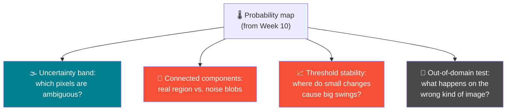
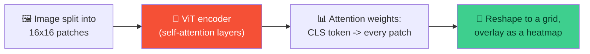

# 🔍 Segmentation Failure Analysis & ViT Attention — Week 11 Practical

### *Part 1 (Buffer): dig deeper into where and why segmentation models fail. Part 2 (Optional): visualize what a Vision Transformer is actually looking at.*

> **What today is:** Part 1 has no new dataset or model to build — it revisits Week 10's UNet output and asks harder questions of it: where is the model *uncertain*, not just wrong or right? What does a "failure" actually look like at the pixel level? Part 2 is optional, tied to this week's ViT lecture — a short, self-contained demo of **attention-map visualization**, showing what a Vision Transformer is attending to when it makes a prediction.
>
> Runs in **Google Colab**.

**Session plan (2 hours, back-to-back):**

| Time | Part | Focus |
|------|------|-------|
| 🕛 12:00 – 1:00 PM | **Part 1 (Buffer)** | Deeper analysis of segmentation outputs / failure cases |
| 🕐 1:00 – 2:00 PM | **Part 2 (Optional)** | Simple attention-map visualization — ties to the ViT lecture |

---

# 🕛 PART 1 — BUFFER (12:00 – 1:00 PM)

## Deeper analysis of segmentation outputs / failure cases

**The shift from Week 10:** last week you thresholded a probability map and looked at the result. Today you interrogate *why* the model produced what it did — where it's confident, where it's genuinely unsure, which flagged regions are probably noise, and what it does when handed an image completely outside its training domain.



### 1.1 — Reload Week 10's UNet pipeline

```python
import torch
import numpy as np
from PIL import Image
from torchvision import transforms
import matplotlib.pyplot as plt
import urllib.request
from scipy import ndimage

device = torch.device("cuda" if torch.cuda.is_available() else "cpu")

model = torch.hub.load(
    "mateuszbuda/brain-segmentation-pytorch", "unet",
    in_channels=3, out_channels=1, init_features=32, pretrained=True
)
model = model.to(device).eval()

url = "https://github.com/mateuszbuda/brain-segmentation-pytorch/raw/master/assets/TCGA_CS_4944.png"
urllib.request.urlretrieve(url, "brain_mri.png")
input_image = Image.open("brain_mri.png")

m, s = np.mean(input_image, axis=(0, 1)), np.std(input_image, axis=(0, 1))
preprocess = transforms.Compose([
    transforms.Resize((256, 256)),
    transforms.ToTensor(),
    transforms.Normalize(mean=m, std=s),
])
input_tensor = preprocess(input_image).unsqueeze(0).to(device)

with torch.no_grad():
    output = model(input_tensor)

probability_map = output[0, 0].cpu().numpy()
display_image = np.array(input_image.resize((256, 256)))

print("Probability map ready:", probability_map.shape)
```

### 1.2 — The uncertainty band: where is the model genuinely unsure?

A pixel at probability `0.95` and a pixel at `0.51` both get labeled "abnormal" at `threshold=0.5` — but the model is clearly far more confident about the first one. Split the map into three zones instead of two.

```python
confident_background = probability_map < 0.3
uncertain             = (probability_map >= 0.3) & (probability_map <= 0.7)
confident_foreground  = probability_map > 0.7

print(f"Confident background: {100*confident_background.mean():.1f}% of pixels")
print(f"Uncertain zone       : {100*uncertain.mean():.1f}% of pixels")
print(f"Confident foreground : {100*confident_foreground.mean():.1f}% of pixels")

three_zone_map = np.zeros((*probability_map.shape, 3))
three_zone_map[confident_background] = [0, 0, 0.3]     # dark blue
three_zone_map[uncertain]             = [1, 1, 0]        # yellow — the zone worth scrutinizing
three_zone_map[confident_foreground]  = [1, 0, 0]         # red

fig, axes = plt.subplots(1, 2, figsize=(11, 5))
axes[0].imshow(display_image)
axes[0].set_title("Original")
axes[0].axis("off")
axes[1].imshow(three_zone_map)
axes[1].set_title("Confident background / Uncertain / Confident foreground")
axes[1].axis("off")
plt.tight_layout()
plt.show()
```

> 🔑 **The yellow "uncertain" band is where a human reviewer should actually spend their attention.** Confident predictions (dark blue, red) are unlikely to change even under scrutiny — the pixels sitting near `0.5` are where a slightly different model, threshold, or input could flip the answer. In a clinical or safety-critical context, this band — not the confident regions — is what a second opinion should focus on.

### 1.3 — Connected components: is a flagged region one real blob, or scattered noise?

A model can flag the *right total number of pixels* while getting the *shape* completely wrong — a handful of scattered single-pixel false alarms instead of one coherent region. Connected-component analysis separates the two.

```python
binary_mask = (probability_map > 0.5).astype(np.uint8)

labeled_array, num_components = ndimage.label(binary_mask)
component_sizes = ndimage.sum(binary_mask, labeled_array, range(1, num_components + 1))

print(f"Number of separate regions found: {num_components}")
print(f"Region sizes (pixels): {sorted(component_sizes, reverse=True)}")
```

**Expected pattern:** typically one large "main" region plus, often, a handful of much smaller ones — the small ones are usually noise, not real findings.

```python
# Filter out small components — a common, real post-processing step
min_size = 20   # pixels — tune based on what's meaningful for your task
cleaned_mask = np.zeros_like(binary_mask)

for component_id in range(1, num_components + 1):
    if component_sizes[component_id - 1] >= min_size:
        cleaned_mask[labeled_array == component_id] = 1

percent_before = 100 * binary_mask.sum() / binary_mask.size
percent_after  = 100 * cleaned_mask.sum() / cleaned_mask.size

fig, axes = plt.subplots(1, 2, figsize=(11, 5))
axes[0].imshow(display_image); axes[0].imshow(np.ma.masked_where(binary_mask==0, binary_mask), cmap="Reds", alpha=0.5)
axes[0].set_title(f"Before cleanup: {percent_before:.2f}% flagged, {num_components} regions")
axes[0].axis("off")
axes[1].imshow(display_image); axes[1].imshow(np.ma.masked_where(cleaned_mask==0, cleaned_mask), cmap="Reds", alpha=0.5)
axes[1].set_title(f"After cleanup: {percent_after:.2f}% flagged")
axes[1].axis("off")
plt.tight_layout()
plt.show()
```

> 💡 **This is a real technique, not just a teaching exercise** — filtering small connected components is a standard post-processing step in production segmentation pipelines, precisely because isolated single-pixel or few-pixel "detections" are far more likely to be noise than genuine findings.

### 1.4 — Threshold stability: where does a small change cause a big swing?

Week 10 tried a few thresholds. Today, sweep finely and look for **cliffs** — points where a tiny threshold change causes a disproportionate change in flagged area. Cliffs indicate an unstable, poorly-defined boundary; flat stretches indicate a robust one.

```python
fine_thresholds = np.arange(0.05, 0.95, 0.02)
flagged_areas = [100 * (probability_map > t).sum() / probability_map.size for t in fine_thresholds]

fig, ax = plt.subplots(figsize=(8, 5))
ax.plot(fine_thresholds, flagged_areas, color="#F55036")
ax.set_xlabel("Threshold")
ax.set_ylabel("% of pixels flagged")
ax.set_title("Threshold sensitivity — steep sections = unstable boundary")
ax.axvline(0.5, color="gray", linestyle="--", alpha=0.5, label="Typical default (0.5)")
ax.legend()
plt.show()
```

> 🎯 **Read the slope, not just the curve's shape.** A steep drop means many pixels sit right at that probability value — the model is "on the fence" about a large chunk of the image simultaneously, and the exact threshold you pick matters a lot there. A flat stretch means the result is robust to your exact threshold choice within that range.

### 1.5 — A genuine failure case: run it outside its training domain

Every failure mode so far has been about *this model, on the kind of image it was trained for*. The most dramatic failure mode is using it on the **wrong kind of image entirely**.

```python
!wget -q -O not_a_brain.jpg https://raw.githubusercontent.com/opencv/opencv/master/samples/data/lena.jpg

wrong_domain_image = Image.open("not_a_brain.jpg").convert("RGB")
m2, s2 = np.mean(wrong_domain_image, axis=(0, 1)), np.std(wrong_domain_image, axis=(0, 1))
wrong_preprocess = transforms.Compose([
    transforms.Resize((256, 256)),
    transforms.ToTensor(),
    transforms.Normalize(mean=m2, std=s2),
])
wrong_tensor = wrong_preprocess(wrong_domain_image).unsqueeze(0).to(device)

with torch.no_grad():
    wrong_output = model(wrong_tensor)
wrong_probability_map = wrong_output[0, 0].cpu().numpy()

fig, axes = plt.subplots(1, 2, figsize=(10, 5))
axes[0].imshow(wrong_domain_image.resize((256, 256)))
axes[0].set_title("A photo the model was never trained on")
axes[0].axis("off")
axes[1].imshow(wrong_probability_map, cmap="hot", vmin=0, vmax=1)
axes[1].set_title("Its 'segmentation' output")
axes[1].axis("off")
plt.tight_layout()
plt.show()

print(f"Percent flagged as 'abnormal': {100*(wrong_probability_map > 0.5).mean():.2f}%")
```

> 🔑 **Whatever the model outputs here is meaningless — and that's exactly the point.** The model has no built-in way to say "I don't recognize this kind of input at all." It will produce *some* probability map regardless, confident-looking or not. This is a core limitation of standard deep learning models worth internalizing: **a model's output format doesn't include an "I don't know what this is" signal by default** — that has to be engineered in separately (e.g., out-of-distribution detection), or enforced by controlling what inputs the system is ever allowed to receive.

### 1.6 — Failure mode taxonomy — for discussion

Use this as a discussion prompt, or to categorize whatever you found in your own outputs today:

| Failure mode | What it looks like | What today's tools reveal it |
|---|---|---|
| **Over-segmentation** | Flags more than the true region — false positives | High flagged-area % at low thresholds (1.4) |
| **Under-segmentation** | Misses part or all of a true region — false negatives | Would need ground truth to confirm directly; low-confidence pixels near a true boundary (1.2) hint at it |
| **Boundary imprecision** | Roughly right region, fuzzy/wrong edges | Wide uncertain band (1.2), steep threshold sensitivity near the boundary (1.4) |
| **Spurious noise regions** | Small, scattered, disconnected flagged pixels | Connected-component analysis (1.3) |
| **Out-of-domain failure** | Confident-looking but meaningless output on the wrong input type | Direct demonstration (1.5) |

### 1.7 — Discussion prompts

- If you were deploying this model in a real clinical support tool, which failure mode from 1.6 would worry you most — and why might that be different for a *screening* tool (catch everything, review later) vs. a *diagnostic* tool (must be precise)?
- The connected-component cleanup in 1.3 used `min_size = 20` — how would you actually choose that number for a real application, rather than picking it arbitrarily?
- Given 1.5's result, what's one concrete thing a real deployed system could do to guard against being fed the wrong kind of input?

---

## 🛠️ Troubleshooting — Part 1

| Symptom | Likely cause | Fix |
|---------|-------------|-----|
| `ndimage.label` reports only 1 component when you expected more | The mask genuinely is one connected blob — not an error | Try a lower confidence threshold (`0.3` instead of `0.5`) to see if it fragments |
| Uncertainty band (1.2) is nearly the whole image | Model output might not be well-calibrated for this particular image, or bounds (`0.3`/`0.7`) too wide | Try narrowing to `0.4`/`0.6` and compare |
| Cleaned mask (1.3) removed everything | `min_size` set larger than the main region itself | Print `component_sizes` first and pick a threshold below the largest value |
| Out-of-domain test (1.5) somehow looks "reasonable" | Coincidence — the model has no real understanding of the new image, regardless of how the output looks | Don't over-interpret it — this is exactly the point: the output looks plausible-ish without being meaningful |
| `scipy` import fails | Rare in Colab, but possible on an unusual runtime | `!pip install -q scipy` and re-run |

---

## 🧰 Quick Reference Card — Part 1

```python
from scipy import ndimage

# Uncertainty band
uncertain = (probability_map >= 0.3) & (probability_map <= 0.7)

# Connected components
labeled_array, num_components = ndimage.label(binary_mask)
component_sizes = ndimage.sum(binary_mask, labeled_array, range(1, num_components + 1))

# Threshold sensitivity
areas = [100 * (probability_map > t).sum() / probability_map.size for t in thresholds]
```

| Concept | One-liner |
|---------|-----------|
| **Uncertainty band** | Pixels near `0.5` probability — where the model is genuinely unsure, not just wrong |
| **Connected components** | Groups touching flagged pixels into distinct regions — separates real findings from scattered noise |
| **Threshold stability** | Steep sections of the area-vs-threshold curve mean many pixels are "on the fence" together |
| **Out-of-domain failure** | A model will confidently output *something* even on inputs it has no business processing |

---

# 🕐 PART 2 — OPTIONAL (1:00 – 2:00 PM)

## Simple attention-map visualization demo (ties to ViT lecture content)

**Optional, and lighter than a normal hour** — run this if time and interest allow after Part 1. It's a self-contained companion to this week's Vision Transformer lecture: seeing what a ViT actually attends to when it classifies an image.



### 2.1 — Setup

```python
!pip install -q transformers

from transformers import ViTImageProcessor, ViTForImageClassification
from PIL import Image
import requests
import torch
import numpy as np
import matplotlib.pyplot as plt

device = torch.device("cuda" if torch.cuda.is_available() else "cpu")
```

### 2.2 — Load a pretrained ViT

```python
processor = ViTImageProcessor.from_pretrained("google/vit-base-patch16-224")
model = ViTForImageClassification.from_pretrained("google/vit-base-patch16-224").to(device).eval()

print("Patch size:", model.config.patch_size)
print("Image size:", model.config.image_size)
print("Number of patches per side:", model.config.image_size // model.config.patch_size)
```

**Expected output:**

```
Patch size: 16
Image size: 224
Number of patches per side: 14
```

> 🔑 **This is the "16×16 words" idea from the lecture, made concrete.** A `224×224` image becomes a `14×14` grid of `16×16` patches — `196` patches total, each treated like a "word" fed into a standard transformer encoder, plus one extra `[CLS]` token used for the final classification decision.

### 2.3 — Load an image and run inference, capturing attention

```python
url = "http://images.cocodataset.org/val2017/000000039769.jpg"   # two cats — a standard demo image
image = Image.open(requests.get(url, stream=True).raw)

inputs = processor(images=image, return_tensors="pt").to(device)

with torch.no_grad():
    outputs = model(**inputs, output_attentions=True)

predicted_class = outputs.logits.argmax(-1).item()
print("Predicted class:", model.config.id2label[predicted_class])
print("Number of attention layers returned:", len(outputs.attentions))
print("Attention tensor shape (one layer):", outputs.attentions[0].shape)
```

**Expected output:**

```
Predicted class: Egyptian cat  (or similar cat breed)
Number of attention layers returned: 12
Attention tensor shape (one layer): torch.Size([1, 12, 197, 197])
```

> 💡 That shape is `(batch, num_heads, seq_len, seq_len)` — `197 = 196 patches + 1 [CLS] token`. Every one of the 12 attention heads, in every one of the 12 layers, computed how much every token should attend to every other token.

### 2.4 — Extract the CLS token's attention to every patch

The `[CLS]` token is what the final classification decision is based on — so its attention weights show which patches most influenced that decision.

```python
last_layer_attention = outputs.attentions[-1][0]        # last layer, drop batch dim -> (heads, 197, 197)
avg_attention = last_layer_attention.mean(dim=0)          # average across the 12 heads -> (197, 197)

cls_to_patches = avg_attention[0, 1:]                      # CLS token's row, excluding itself -> (196,)
attention_grid = cls_to_patches.reshape(14, 14).cpu().numpy()

print("Attention grid shape:", attention_grid.shape)
print("Sum of attention weights:", cls_to_patches.sum().item(), "(should be close to 1.0 — it's a softmax output)")
```

> 🔑 **That sum being close to `1.0` isn't a coincidence** — attention weights are a softmax output, meaning the CLS token distributes a fixed "budget" of attention across all 196 patches. A patch with high attention isn't just "noticed" — it's winning attention *at the direct expense* of other patches.

### 2.5 — Overlay the attention map on the original image

```python
import cv2

attention_resized = cv2.resize(attention_grid, (224, 224), interpolation=cv2.INTER_CUBIC)
attention_resized = (attention_resized - attention_resized.min()) / (attention_resized.max() - attention_resized.min())

display_image = np.array(image.resize((224, 224)))

fig, axes = plt.subplots(1, 3, figsize=(15, 5))

axes[0].imshow(display_image)
axes[0].set_title(f"Original\nPredicted: {model.config.id2label[predicted_class]}")
axes[0].axis("off")

axes[1].imshow(attention_resized, cmap="hot")
axes[1].set_title("Attention map (CLS -> patches)")
axes[1].axis("off")

axes[2].imshow(display_image)
axes[2].imshow(attention_resized, cmap="hot", alpha=0.5)
axes[2].set_title("Overlay")
axes[2].axis("off")

plt.tight_layout()
plt.show()
```

**Expected result:** the brightest regions of the attention map should roughly align with the cats themselves, not the background — evidence that the CLS token's classification decision is genuinely driven by the relevant part of the image, not spurious background detail.

> 🎯 **This is a form of built-in interpretability that CNNs don't have for free.** A CNN needs a separate technique (like Grad-CAM) bolted on afterward to produce something like this. A transformer's attention weights are a direct, inherent part of its computation — you're not approximating an explanation, you're reading out an actual internal signal the model used.

### 2.6 — Compare an early layer to the last layer

```python
early_layer_attention = outputs.attentions[0][0].mean(dim=0)   # layer 0 instead of layer -1
early_cls_to_patches = early_layer_attention[0, 1:].reshape(14, 14).cpu().numpy()
early_resized = cv2.resize(early_cls_to_patches, (224, 224), interpolation=cv2.INTER_CUBIC)
early_resized = (early_resized - early_resized.min()) / (early_resized.max() - early_resized.min())

fig, axes = plt.subplots(1, 2, figsize=(10, 5))
axes[0].imshow(display_image); axes[0].imshow(early_resized, cmap="hot", alpha=0.5)
axes[0].set_title("Layer 1 attention")
axes[0].axis("off")
axes[1].imshow(display_image); axes[1].imshow(attention_resized, cmap="hot", alpha=0.5)
axes[1].set_title("Layer 12 (last) attention")
axes[1].axis("off")
plt.tight_layout()
plt.show()
```

> 💡 **Expect the early layer to look more diffuse/scattered, and the last layer to look more focused on the actual subject.** This mirrors what the lecture likely covered conceptually: early transformer layers tend to mix broad, relatively local information, while later layers have had enough rounds of self-attention to concentrate on the specific content that matters for the final decision.

---

## 🛠️ Troubleshooting — Part 2

| Symptom | Likely cause | Fix |
|---------|-------------|-----|
| `outputs.attentions` is `None` | `output_attentions=True` wasn't passed to the model call | Must be passed to `model(**inputs, output_attentions=True)`, not just at `from_pretrained(...)` |
| Attention map looks like random noise, not aligned with the subject | Normal for some images/classes — attention isn't guaranteed to be humanly-intuitive every time | Try a clearer, more centrally-framed subject image and compare |
| Shape errors reshaping to `(14, 14)` | Used a different ViT checkpoint with a different patch/image size | Recompute the grid size as `model.config.image_size // model.config.patch_size` rather than hardcoding `14` |
| Heatmap overlay looks blocky | Expected at the patch level — `cv2.INTER_CUBIC` smooths it somewhat, but 196 patches is inherently coarser than per-pixel | This is a real resolution limit of patch-based attention, not a bug |

---

## 🚀 Extend It (Optional, if you finish early)

1. **Try attention rollout** — instead of just the last layer, multiply attention matrices across all 12 layers together (accounting for the residual/skip connections) for a more complete picture of how information actually flows to the CLS token.
2. **Visualize a single attention head instead of the average** — do different heads in the same layer attend to different parts of the image?
3. **Try a harder image** — a cluttered scene with multiple objects — and see whether attention cleanly picks out the predicted class's object or spreads across everything.
4. **Compare to a CNN saliency method** — if time allows, try a simple Grad-CAM-style visualization on one of Week 5's trained classifiers, and compare how "free" the ViT's interpretability felt by comparison.

---

## ✅ What You Learned Today

- 🌫️ Learned to read a segmentation model's **uncertainty**, not just its final thresholded output
- 🔵 Used **connected-component analysis** to separate real findings from scattered noise — a genuine production technique
- 📈 Identified **threshold-sensitive regions** by sweeping finely and watching for sharp changes in flagged area
- 🚫 Saw directly that a model **produces confident-looking output even on inputs it has no business processing** — and why that matters for real deployments
- 🧠 *(Optional)* Extracted and visualized a **Vision Transformer's attention weights**, connecting the "image as 16×16 patches" idea from lecture to real, runnable code
- 🎨 *(Optional)* Compared attention across layers and saw it sharpen from diffuse to subject-focused deeper into the network

---

## 🧰 Quick Reference Card — Full Session

```python
# ── Part 1: failure analysis ──
uncertain = (probability_map >= 0.3) & (probability_map <= 0.7)
labeled_array, num_components = ndimage.label(binary_mask)

# ── Part 2 (optional): ViT attention ──
outputs = model(**inputs, output_attentions=True)
last_layer_attention = outputs.attentions[-1][0].mean(dim=0)   # avg over heads
cls_to_patches = last_layer_attention[0, 1:].reshape(14, 14)   # CLS -> patch grid
```

| Concept | One-liner |
|---------|-----------|
| **Uncertainty band** | Probabilities near 0.5 — genuinely ambiguous, not just "wrong" |
| **Connected components** | Separates one real region from many small noise blobs |
| **Out-of-domain failure** | Models don't know what they don't know — they output *something* regardless |
| **ViT attention** | Softmax weights showing which patches the CLS token drew on for its decision |
| **Attention vs. Grad-CAM** | Attention is a native model output; CNN saliency methods approximate an explanation after the fact |
