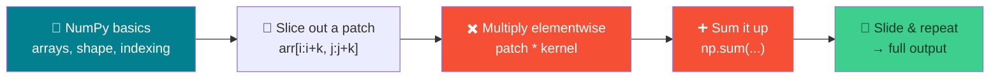
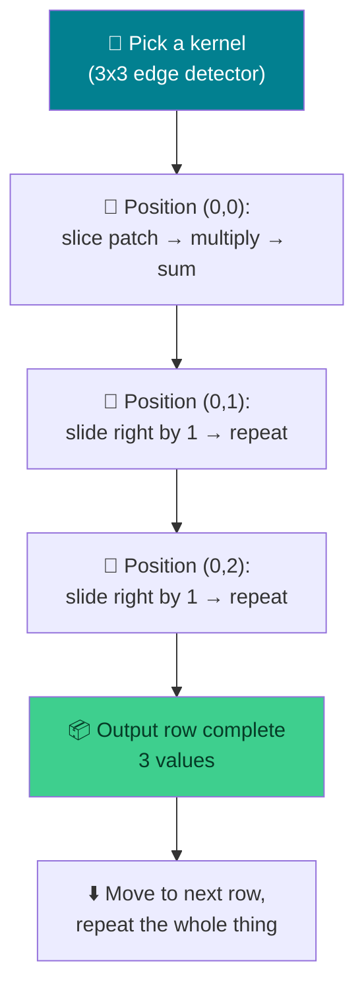

# 🔢 NumPy Warmup & Convolution Math — Week 2 Practical

### *Buffer sessions: get fluent with array slicing, then walk through convolution by hand before writing a single line of "real" convolution code*

> **What we're building today:** nothing you'll submit as a deliverable — today is about **muscle memory and intuition**. Practical 1 makes you fast and comfortable with the exact NumPy operations (slicing, patches, elementwise multiply, sum, padding) that manual convolution is built from. Practical 2 uses those skills to compute a convolution **by hand, one output pixel at a time**, so that when we write the general-purpose `convolve()` function next week, you already know exactly what it's supposed to compute.
>
> No servers, no installs. Everything runs inside one **Google Colab** notebook.

**Session plan (2 hours, back-to-back):**

| Time | Practical | Focus |
|------|-----------|-------|
| 🕛 12:00 – 1:00 PM | **Practical 1 (Buffer)** | NumPy array manipulation warmup — slicing, patches, elementwise ops |
| 🕐 1:00 – 2:00 PM | **Practical 2 (Buffer)** | Walk through the **math** of convolution by hand, using those skills |

> 🧭 **Why two "buffer" sessions?** Convolution trips people up not because the code is hard, but because it's easy to write a loop that runs *without* understanding what number it's actually producing. These two hours remove that risk — by the time we write the real function next week, you'll have already computed its output by hand.

---

## 🗺️ The Big Picture (Read This First)



**The one-sentence version of convolution:** *place the kernel over a patch of the image, multiply matching numbers together, add them all up — that's one output pixel. Slide the kernel one step, repeat.*

| Piece | Job | Analogy |
|-------|-----|---------|
| 🖼️ **Input array** | The "image" (numbers in a grid) | A spreadsheet of pixel brightness |
| 🎯 **Kernel / filter** | A small grid of weights | A stencil you lay on top |
| 🔁 **Sliding window** | Moves the kernel across the input | Reading a page with a magnifying glass, left to right, top to bottom |
| ➕ **Multiply + sum** | Combines the patch and kernel into one number | The "score" for that position |

---

## 📋 What You'll Need (all free)

1. A **Google account** (for Colab) — `https://colab.research.google.com`
2. That's it. `numpy` and `matplotlib` come **pre-installed** in Colab — no `!pip install` needed.

---

# 🕛 PRACTICAL 1 (12:00 – 1:00 PM)

## NumPy / array manipulation warmup for manual convolution

Every one of these exercises is a skill you will use directly in Practical 2 and in next week's convolution function. Don't skip past them — type them out.

### 1.1 — Open a fresh Colab notebook

Go to `https://colab.research.google.com` → **New notebook**. Rename it `week2_practical1.ipynb`.

### 1.2 — Import NumPy

```python
import numpy as np
import matplotlib.pyplot as plt

print("NumPy version:", np.__version__)
```

### 1.3 — Creating arrays

```python
# From a plain Python list
a = np.array([1, 2, 3, 4, 5])
print("1D array:", a)

# A 2D array (this is what an image looks like — rows x columns)
grid = np.array([
    [1, 2, 3],
    [4, 5, 6],
    [7, 8, 9],
])
print("2D array:\n", grid)

# Quick ways to build arrays without typing every number
zeros = np.zeros((3, 3))
ones  = np.ones((3, 3))
ramp  = np.arange(1, 26).reshape(5, 5)   # 1..25 reshaped into a 5x5 grid

print("\nZeros:\n", zeros)
print("\nOnes:\n", ones)
print("\nRamp (5x5):\n", ramp)
```

> 💡 `np.arange(1, 26).reshape(5, 5)` is a handy trick for this whole practical: it builds a predictable 5×5 grid where you can always tell which number is where — perfect for checking your slicing is correct.

### 1.4 — Inspecting an array

```python
print("shape:", ramp.shape)   # (rows, columns)
print("ndim :", ramp.ndim)    # how many dimensions
print("dtype:", ramp.dtype)   # data type of the values
print("size :", ramp.size)    # total number of elements
```

**Expected output:**

```
shape: (5, 5)
ndim : 2
dtype: int64
size : 25
```

> 🔑 This is exactly what you printed for real images last week (`img.shape`, `img.dtype`) — a grayscale image *is* just a 2D NumPy array like `ramp`, only bigger and with pixel values instead of 1–25.

### 1.5 — Indexing and slicing basics

```python
print("Single element (row 0, col 0):", ramp[0, 0])
print("Single element (row 2, col 3):", ramp[2, 3])

print("\nEntire first row:", ramp[0, :])
print("Entire first column:", ramp[:, 0])

print("\nRows 1 to 2 (exclusive of 3):\n", ramp[1:3, :])
print("\nColumns 1 to 2:\n", ramp[:, 1:3])
```

> 🧠 **The rule that matters most today:** `arr[row_start:row_end, col_start:col_end]` — the end index is **exclusive**. `ramp[1:3, :]` gives you rows 1 and 2, *not* row 3.

### 1.6 — Slicing out a "patch" (the core convolution skill)

This is the single most important skill for today. A convolution kernel doesn't look at the whole image — it looks at a small **sub-block** at a time.

```python
# Extract a 3x3 patch starting at row=0, col=0
patch = ramp[0:3, 0:3]
print("Patch at (0,0):\n", patch)

# Extract a 3x3 patch starting at row=1, col=2
patch2 = ramp[1:4, 2:5]
print("\nPatch at (1,2):\n", patch2)
```

**Expected output:**

```
Patch at (0,0):
 [[ 1  2  3]
 [ 6  7  8]
 [11 12 13]]

Patch at (1,2):
 [[ 8  9 10]
 [13 14 15]
 [18 19 20]]
```

> 💡 Notice the pattern: to grab a `3x3` patch starting at position `(i, j)`, you slice `ramp[i:i+3, j:j+3]`. Memorize that formula — you'll write it again in about 45 minutes.

### 1.7 — Elementwise multiply and sum (literally what convolution does)

```python
kernel = np.array([
    [1, 0, -1],
    [1, 0, -1],
    [1, 0, -1],
])

patch = ramp[0:3, 0:3]

product = patch * kernel        # elementwise multiply — NOT matrix multiplication
total   = np.sum(product)       # add every number in the product together

print("Patch:\n", patch)
print("\nKernel:\n", kernel)
print("\nElementwise product:\n", product)
print("\nSum (this is ONE output value):", total)
```

**Expected output:**

```
Sum (this is ONE output value): -18
```

> ⚠️ **`patch * kernel` is elementwise multiplication** (each cell times the cell in the same position), **not** `patch @ kernel` (matrix multiplication, a completely different operation). This mistake is the #1 convolution bug — get comfortable with `*` vs `@` right now.

### 1.8 — Padding an array

Padding adds a border of extra values (usually zeros) around an array — we'll see exactly why it matters in Practical 2.

```python
small = np.array([
    [1, 2],
    [3, 4],
])

padded = np.pad(small, pad_width=1, mode="constant", constant_values=0)
print("Original:\n", small)
print("\nPadded with a 1-pixel zero border:\n", padded)
print("\nOriginal shape:", small.shape, "→ Padded shape:", padded.shape)
```

**Expected output:**

```
Padded with a 1-pixel zero border:
 [[0 0 0 0]
 [0 1 2 0]
 [0 3 4 0]
 [0 0 0 0]]

Original shape: (2, 2) → Padded shape: (4, 4)
```

### 1.9 — Sneak preview: sliding across two positions

Let's use every skill above to compute **two** output values by sliding the kernel one step to the right. This is exactly what Practical 2 dives into properly.

```python
kernel = np.array([
    [1, 0, -1],
    [1, 0, -1],
    [1, 0, -1],
])

output_positions = []
for j in [0, 1]:   # slide across 2 starting columns
    patch = ramp[0:3, j:j+3]
    value = np.sum(patch * kernel)
    output_positions.append(value)
    print(f"Patch at column {j}:\n{patch}\n→ output value: {value}\n")

print("Two output values so far:", output_positions)
```

> 🎯 You just computed two real convolution outputs — one step-by-step "slide" at a time. That's the whole algorithm. Practical 2 makes it precise.

---

## 🛠️ Troubleshooting — Practical 1

| Symptom | Likely cause | Fix |
|---------|-------------|-----|
| `IndexError: too many indices` | Treating a 1D array like a 2D one | Check `.ndim` and `.shape` before slicing |
| Slice looks "off by one" | Forgetting the end index is **exclusive** | `ramp[1:3, :]` gives rows 1–2, not 1–3 |
| `product = patch @ kernel` gives a weird shape or wrong numbers | Used matrix multiply `@` instead of elementwise `*` | Convolution needs `patch * kernel` then `np.sum(...)` |
| `np.pad` output shape looks wrong | `pad_width` adds to **both** sides of each dimension | A `2x2` array padded by 1 becomes `4x4`, not `3x3` |
| Patch slicing throws an `IndexError` near the edges | Patch would extend past the array boundary | This is *exactly* why padding exists — more in Practical 2 |

---

## 🧰 Quick Reference Card — Practical 1

```python
import numpy as np

ramp = np.arange(1, 26).reshape(5, 5)      # build a predictable test grid

ramp.shape, ramp.ndim, ramp.dtype           # inspect an array

patch = ramp[i:i+k, j:j+k]                  # slice out a k x k patch at (i, j)

product = patch * kernel                    # elementwise multiply (NOT @)
value   = np.sum(product)                   # collapse to one output number

padded = np.pad(arr, pad_width=1, mode="constant", constant_values=0)
```

| Concept | One-liner |
|---------|-----------|
| **2D array = image** | Rows × columns of numbers, same shape idea as `img.shape` |
| **Patch slicing** | `arr[i:i+k, j:j+k]` extracts a `k×k` window starting at `(i, j)` |
| **Elementwise `*`** | Multiplies matching positions — different from matrix multiply `@` |
| **`np.sum()`** | Collapses a 2D product into a single number — one convolution output |
| **`np.pad()`** | Adds a border around an array, useful for edge positions |

---

# 🕐 PRACTICAL 2 (1:00 – 2:00 PM)

## Walkthrough of convolution math — before we code it properly

**Goal:** using only the skills from Practical 1 (slicing, elementwise multiply, sum, padding), compute a full convolution **by hand**, position by position, so the math is fully transparent before we generalize it into a function next week.



### 2.1 — Meet a few real kernels first

```python
identity = np.array([
    [0, 0, 0],
    [0, 1, 0],
    [0, 0, 0],
])

edge_vertical = np.array([
    [1, 0, -1],
    [1, 0, -1],
    [1, 0, -1],
])

box_blur = np.array([
    [1, 1, 1],
    [1, 1, 1],
    [1, 1, 1],
]) / 9

print("Identity kernel — output equals the center pixel, unchanged")
print("Vertical edge kernel — reacts to left/right brightness differences")
print("Box blur kernel — averages a neighborhood (note the /9)")
```

> 🔑 A kernel is just **a small grid of weights that says how much each neighboring pixel should count** toward the output at that position. Different weights → different effects. Same sliding-multiply-sum operation every time.

### 2.2 — Build an input with a real "edge" in it

Instead of a random grid, let's build something with an obvious feature — a vertical edge — so the kernel's output actually *means* something we can sanity-check.

```python
input_arr = np.array([
    [10, 10, 50, 50, 50],
    [10, 10, 50, 50, 50],
    [10, 10, 50, 50, 50],
    [10, 10, 50, 50, 50],
    [10, 10, 50, 50, 50],
])

plt.imshow(input_arr, cmap="gray")
plt.title("Input: dark region (10) meets bright region (50)")
plt.colorbar()
plt.show()

print(input_arr)
```

There's a clean vertical edge between column 1 (value 10) and column 2 (value 50). A good edge detector should light up right at that boundary and stay quiet everywhere else.

### 2.3 — Compute output position (0, 0) — fully by hand

```python
kernel = edge_vertical   # from 2.1

# Step 1: slice the patch
patch = input_arr[0:3, 0:3]
print("Step 1 — Patch:\n", patch)

# Step 2: multiply elementwise
product = patch * kernel
print("\nStep 2 — Elementwise product:\n", product)

# Step 3: sum it all up → ONE output number
output_00 = np.sum(product)
print("\nStep 3 — Sum → output[0,0] =", output_00)
```

**Expected output:**

```
Step 3 — Sum → output[0,0] = -120
```

> 🧠 Walk through why: each row of the patch is `[10, 10, 50]`. The kernel row `[1, 0, -1]` computes `10*1 + 10*0 + 50*(-1) = -40` per row. Three identical rows → `-40 × 3 = -120`. The kernel is measuring "right side minus left side" — a strong **negative** number means "bright region is to the right," which matches our image exactly.

### 2.4 — Compute two more positions, sliding right

```python
positions = [0, 1, 2]   # column start positions we'll slide across
row_output = []

for j in positions:
    patch   = input_arr[0:3, j:j+3]
    product = patch * kernel
    value   = np.sum(product)
    row_output.append(value)
    print(f"Position (0,{j}) → patch:\n{patch}\n→ output = {value}\n")

print("Full output row:", row_output)
```

**Expected output:**

```
Full output row: [-120, -120, 0]
```

> 🎯 **Read what this means.** The edge sits between columns 1 and 2. Positions `(0,0)` and `(0,1)` both still "see" the edge inside their 3×3 window, so they respond strongly (`-120`). Position `(0,2)` has slid past the edge entirely — its whole patch is uniform `50`s, so the kernel finds *no* left-right difference and outputs `0`. **That's edge detection working correctly**, computed with nothing but slicing, multiplying, and summing.

### 2.5 — The output size formula

We had a `5×5` input, a `3×3` kernel, no padding, and got `3` output positions per row. That's not a coincidence:

```
output_size = (input_size − kernel_size) / stride + 1
```

```python
input_size, kernel_size, stride, padding = 5, 3, 1, 0

output_size = (input_size - kernel_size + 2 * padding) // stride + 1
print("Expected output size:", output_size)   # should match what we just computed: 3
```

**Expected output:**

```
Expected output size: 3
```

### 2.6 — Why padding exists: preserving size at the borders

Without padding, the output **shrinks** every time you convolve (5×5 in, 3×3 out above). Padding fixes that.

```python
padded_input = np.pad(input_arr, pad_width=1, mode="constant", constant_values=0)
print("Padded shape:", padded_input.shape)   # 5x5 -> 7x7

output_size_padded = (7 - 3 + 2 * 0) // 1 + 1
print("Output size after padding once:", output_size_padded)   # back to 5
```

**Expected output:**

```
Padded shape: (7, 7)
Output size after padding once: 5
```

> 💡 Pad by 1 on every side, and a `3×3` kernel produces an output **the same size as the original input**. This is exactly the "same" vs "valid" convolution distinction you'll see in every CNN framework.

### 2.7 — Why stride matters: skipping positions

Stride controls how far the kernel jumps between positions. So far we used stride 1 (move one column at a time). Let's try stride 2:

```python
stride = 2
row_output_stride2 = []

for j in range(0, input_arr.shape[1] - kernel.shape[1] + 1, stride):
    patch = input_arr[0:3, j:j+3]
    value = np.sum(patch * kernel)
    row_output_stride2.append(value)

print("Output row with stride=2:", row_output_stride2)

expected_size = (5 - 3 + 2 * 0) // stride + 1
print("Formula says output size should be:", expected_size)
```

**Expected output:**

```
Output row with stride=2: [-120, 0]
Formula says output size should be: 2
```

> 🔑 Stride 2 skips column 1 entirely, jumping straight from position `0` to position `2`. Fewer positions visited → fewer output values → smaller output, exactly as the formula predicts.

### 2.8 — Visualize input vs. kernel side by side

```python
fig, axes = plt.subplots(1, 2, figsize=(8, 4))

axes[0].imshow(input_arr, cmap="gray")
axes[0].set_title("Input (5x5)")
for (r, c), val in np.ndenumerate(input_arr):
    axes[0].text(c, r, val, ha="center", va="center", color="red", fontsize=8)

axes[1].imshow(kernel, cmap="coolwarm")
axes[1].set_title("Kernel (3x3)")
for (r, c), val in np.ndenumerate(kernel):
    axes[1].text(c, r, val, ha="center", va="center", color="black", fontsize=10)

plt.tight_layout()
plt.show()
```

Seeing the actual numbers annotated on top of the heatmap makes the "slide, multiply, sum" story click for a lot of people — worth pausing on this figure.

---

## 🛠️ Troubleshooting — Practical 2

| Symptom | Likely cause | Fix |
|---------|-------------|-----|
| Output values don't match the expected `-120` | Used `@` instead of `*`, or sliced the wrong patch | Print the `patch` and `product` separately before summing — check them against the walkthrough |
| Output row is longer/shorter than expected | Loop range doesn't match the formula | Recompute with `(input_size - kernel_size + 2*padding) // stride + 1` and compare |
| Padded shape isn't what you expected | `pad_width=1` pads **every** side by 1 (adds 2 to each dimension) | `5x5` padded by 1 → `7x7`, not `6x6` |
| Stride loop skips the last valid position | `range(start, stop, step)` stop value excludes the last index | Use `input_size - kernel_size + 1` as the stop bound, exactly as in 2.7 |
| Heatmap numbers overlap or are unreadable | Font too big for a small array, or `figsize` too small | Increase `figsize`, reduce `fontsize`, or shrink the array for the demo |

---

## 🚀 Extend It (Optional, if you finish early)

1. **Try the box blur kernel** from 2.1 on the same `input_arr` — compute output position `(0,0)` by hand and compare it to the edge kernel's result. Which one "smooths" the transition instead of highlighting it?
2. **Add padding=1 to the edge-detector walkthrough** and recompute the *first* output position — does it still equal `-120`, or does the zero-padding change it? (Hint: think about what's now sitting to the left of column 0.)
3. **Try a `5×5` kernel** instead of `3×3` on a `9×9` input — use the formula from 2.5 to predict the output size *before* running any code, then verify it.
4. **Compute an entire `3×3` output grid by hand** (not just one row) — slide down to row 1 and row 2 as well, using the same patch → multiply → sum steps.

---

## ✅ What You Learned Today

- 🔢 Got fluent with the **NumPy operations** manual convolution is built from: array creation, shape/dtype inspection, and slicing
- 🔲 Learned to **slice out a k×k patch** at any position — `arr[i:i+k, j:j+k]` — the single most-used line of code in convolution
- ✖️ Told apart **elementwise multiply (`*`)** from matrix multiply (`@`) — and why convolution needs the former
- ➕ Reduced a patch × kernel product to **one output number** with `np.sum()`
- 🧮 Computed a **real edge-detection convolution by hand**, position by position, and confirmed the output made physical sense (strong response at the edge, zero elsewhere)
- 📐 Derived and verified the **output size formula**, and saw exactly what **padding** and **stride** do to it
- 📊 Visualized both an array and a kernel as annotated heatmaps

> 🎓 You now know, from first principles, exactly what a convolution operation computes and why. Next week we turn today's hand-worked steps into one general-purpose `convolve()` function that works on any image, any kernel, any stride, any padding.

---

## 🧰 Quick Reference Card — Convolution Math

```python
import numpy as np

# The whole operation, for ONE output position:
patch   = input_arr[i:i+k, j:j+k]     # 1. slice a k x k patch
product = patch * kernel               # 2. multiply elementwise (NOT @)
value   = np.sum(product)              # 3. sum → one output number

# Output size formula:
# output_size = (input_size - kernel_size + 2*padding) // stride + 1

# Padding (adds a zero border):
padded = np.pad(arr, pad_width=1, mode="constant", constant_values=0)
```

| Concept | One-liner |
|---------|-----------|
| **Kernel** | A small grid of weights describing how neighbors combine into one output value |
| **Patch** | The k×k window of the input currently under the kernel |
| **Convolution step** | `np.sum(patch * kernel)` — one multiply-and-sum per output position |
| **Sliding** | Move the patch's start index by `stride` and repeat |
| **Padding** | Extra zero border added so the output can match the input size |
| **Output size** | `(input_size − kernel_size + 2·padding) / stride + 1` |
