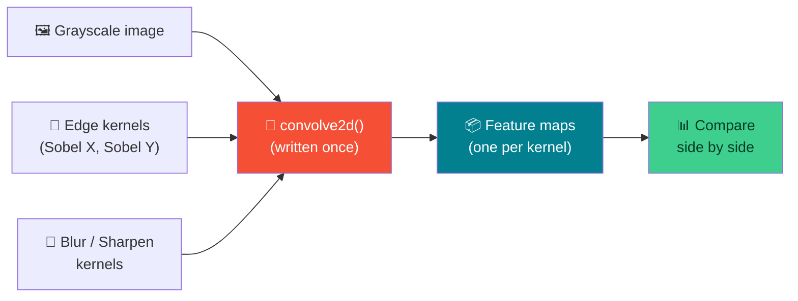
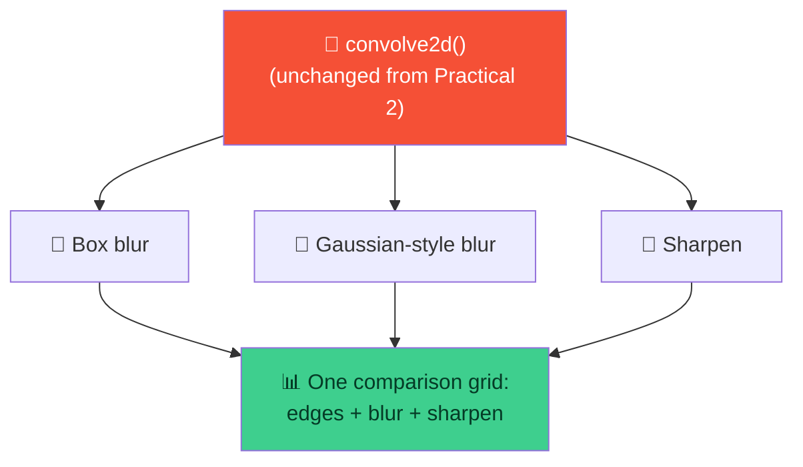

# 🧩 Manual 2D Convolution — Week 3 Practical

### *Practical 2 & 3: turn last week's hand-worked math into one real `convolve2d()` function, then put it to work with edge, blur, and sharpen filters*

> **What we're building today:** a general-purpose `convolve2d(image, kernel, stride, padding)` function — written from scratch with NumPy, no shortcuts — and then a set of **feature maps**: the outputs you get when you run a real image through different filters. Practical 2 uses that function for **edge detection**. Practical 3 reuses the exact same function for **blur and sharpen**, then compares all the filters side by side.
>
> No servers, no installs. Everything runs inside one **Google Colab** notebook.

**Session plan (2 hours, back-to-back):**

| Time | Practical | Focus |
|------|-----------|-------|
| 🕛 12:00 – 1:00 PM | **Practical 2** | Write `convolve2d()`, apply **edge-detection** kernels, visualize feature maps |
| 🕐 1:00 – 2:00 PM | **Practical 3** | Reuse `convolve2d()` for **blur/sharpen** kernels, compare feature maps across all filters |

> 🧭 **Where we left off:** Week 2 computed a convolution output **by hand**, one position at a time, and derived the output-size formula. Today we write the loop that does that automatically — for *any* image, *any* kernel, *any* stride, *any* padding.

---

## 🗺️ The Big Picture (Read This First)



**The idea for today in one sentence:** *the function doesn't change — only the kernel you hand it does. Same `convolve2d()`, six different personalities.*

| Piece | Job | Analogy |
|-------|-----|---------|
| 🔧 **`convolve2d()`** | Slides any kernel over any image, returns the result | A universal stencil-tracing machine |
| 🎯 **Kernel** | A small grid of weights that defines *what* the filter looks for | The stencil you feed the machine |
| 🗺️ **Feature map** | The output image after convolving — what the filter "saw" | The traced pattern left behind |

---

## 📋 What You'll Need (all free)

1. A **Google account** (for Colab) — `https://colab.research.google.com`
2. That's it. `cv2`, `numpy`, and `matplotlib` all come **pre-installed** in Colab.

---

# 🕛 PRACTICAL 2 (12:00 – 1:00 PM)

## Manual 2D convolution (NumPy), edge-detection filters, visualize feature maps

### 2.1 — Open a fresh Colab notebook

Go to `https://colab.research.google.com` → **New notebook**. Rename it `week3_practical2.ipynb`.

```python
import cv2
import numpy as np
import matplotlib.pyplot as plt
```

### 2.2 — Write `convolve2d()` — this is today's main deliverable

This function does exactly what you did by hand in Week 2: pad (if needed), slide a patch across the image, multiply by the kernel, sum, store — repeat for every position.

```python
def convolve2d(image, kernel, stride=1, padding=0):
    """Manually convolve a 2D image with a 2D kernel.

    Args:
        image: 2D NumPy array (grayscale image)
        kernel: 2D NumPy array (the filter)
        stride: how many pixels to move the kernel each step
        padding: how many zero-pixels to add around the border
    Returns:
        2D NumPy array — the feature map
    """
    if padding > 0:
        image = np.pad(image, pad_width=padding, mode="constant", constant_values=0)

    img_h, img_w = image.shape
    k_h, k_w = kernel.shape

    # Same formula from Week 2:
    out_h = (img_h - k_h) // stride + 1
    out_w = (img_w - k_w) // stride + 1

    output = np.zeros((out_h, out_w), dtype=np.float32)

    for i in range(out_h):
        for j in range(out_w):
            row_start = i * stride
            col_start = j * stride
            patch = image[row_start:row_start + k_h, col_start:col_start + k_w]
            output[i, j] = np.sum(patch * kernel)

    return output
```

> 🔑 **Every line here is a Week 2 skill you already have:** `np.pad` (1.8), the output-size formula (2.5), `arr[i:i+k, j:j+k]` slicing (1.6), and `np.sum(patch * kernel)` (1.7/2.3). Today's "new" work is just wrapping them in a loop.

### 2.3 — Sanity-check it against Week 2's hand-worked answer

Before trusting this function on a real image, prove it reproduces the exact numbers you computed by hand last week.

```python
test_input = np.array([
    [10, 10, 50, 50, 50],
    [10, 10, 50, 50, 50],
    [10, 10, 50, 50, 50],
    [10, 10, 50, 50, 50],
    [10, 10, 50, 50, 50],
], dtype=np.float32)

edge_vertical = np.array([
    [1, 0, -1],
    [1, 0, -1],
    [1, 0, -1],
])

test_output = convolve2d(test_input, edge_vertical)
print(test_output)
```

**Expected output (every row should match Week 2's hand calculation):**

```
[[-120. -120.    0.]
 [-120. -120.    0.]
 [-120. -120.    0.]
 [-120. -120.    0.]
 [-120. -120.    0.]]
```

> ✅ **If this matches, your function is correct** — trust it for everything below. If it doesn't, stop here and debug before moving on; nothing after this point will make sense on top of a broken `convolve2d()`.

### 2.4 — Load a real image and shrink it for speed

```python
!wget -q -O sample.jpg https://raw.githubusercontent.com/opencv/opencv/master/samples/data/lena.jpg

img_bgr = cv2.imread("sample.jpg", cv2.IMREAD_COLOR)
img_rgb = cv2.cvtColor(img_bgr, cv2.COLOR_BGR2RGB)
gray = cv2.cvtColor(img_rgb, cv2.COLOR_RGB2GRAY)

# Pure-Python nested loops are slow on full-resolution images —
# a 512x512 image means 260,000+ loop iterations PER kernel.
# Shrink to 64x64 so today's demo runs in a second, not minutes.
small_gray = cv2.resize(gray, (64, 64)).astype(np.float32)

plt.imshow(small_gray, cmap="gray")
plt.title("Today's input: 64x64 grayscale")
plt.axis("off")
plt.show()
```

> 💡 **Why not normalize to 0–1 like Week 1?** For feeding a real model, you would. But for *looking at* filter outputs today, keeping pixel values in the familiar 0–255 range makes the numbers in the feature maps easier to reason about. We're back to normalizing once we're building models, not inspecting filters.

### 2.5 — Define two classic edge-detection kernels

```python
sobel_x = np.array([
    [-1, 0, 1],
    [-2, 0, 2],
    [-1, 0, 1],
])   # reacts to LEFT-RIGHT brightness changes → highlights VERTICAL edges

sobel_y = np.array([
    [-1, -2, -1],
    [ 0,  0,  0],
    [ 1,  2,  1],
])   # reacts to TOP-BOTTOM brightness changes → highlights HORIZONTAL edges
```

> 🧠 This is the same idea as the `edge_vertical` kernel from Week 2, just with extra weight (`2` instead of `1`) down the center row/column — that extra weighting is what makes it a proper **Sobel** kernel instead of our simplified teaching version.

### 2.6 — Run the convolution and get feature maps

```python
edges_x = convolve2d(small_gray, sobel_x, stride=1, padding=1)
edges_y = convolve2d(small_gray, sobel_y, stride=1, padding=1)

print("Input shape :", small_gray.shape)
print("edges_x shape:", edges_x.shape)   # padding=1 keeps the size the same
print("edges_y shape:", edges_y.shape)

print("edges_x range:", edges_x.min(), "to", edges_x.max())
```

> 🔑 Notice the outputs are the **same size** as the input (`64x64`) — that's `padding=1` doing exactly what the Week 2 formula predicted. Also notice the values go **negative** — a convolution output isn't a normal image anymore, it's a map of "how much change did the kernel detect here."

### 2.7 — Visualize the feature maps

```python
edge_magnitude = np.sqrt(edges_x**2 + edges_y**2)

fig, axes = plt.subplots(1, 4, figsize=(16, 4))

axes[0].imshow(small_gray, cmap="gray")
axes[0].set_title("Original")
axes[0].axis("off")

axes[1].imshow(edges_x, cmap="gray")
axes[1].set_title("Sobel X\n(vertical edges)")
axes[1].axis("off")

axes[2].imshow(edges_y, cmap="gray")
axes[2].set_title("Sobel Y\n(horizontal edges)")
axes[2].axis("off")

axes[3].imshow(edge_magnitude, cmap="gray")
axes[3].set_title("Combined magnitude\n√(x² + y²)")
axes[3].axis("off")

plt.tight_layout()
plt.show()
```

**Expected result:** Sobel X should light up **vertical** lines/edges in the photo, Sobel Y should light up **horizontal** ones, and the combined magnitude map should show *all* strong edges regardless of direction — this is the same idea you verified by hand in Week 2, now running on a real photo.

> 💡 `plt.imshow` auto-scales float data to its own min/max by default, which is why the negative values in `edges_x`/`edges_y` still display as a sensible grayscale image — you don't need to clip or rescale them manually for viewing.

---

## 🛠️ Troubleshooting — Practical 2

| Symptom | Likely cause | Fix |
|---------|-------------|-----|
| Sanity-check output doesn't match `-120` | Bug in the patch slicing or the multiply/sum step | Print `patch` and `product` inside the loop for `(i,j)=(0,0)` and compare to Week 2 by hand |
| `convolve2d` runs for a very long time / notebook seems frozen | Ran it on the full-size image instead of `small_gray` | Always resize down to `64x64` (or similar) before manual convolution demos |
| Output shape doesn't match input shape | Forgot `padding=1`, or used the wrong kernel size | Re-check with the formula: `(64 - 3 + 2*1)//1 + 1 = 64` |
| Feature map looks like solid gray with no visible edges | Kernel and image data types mismatched, or image was all-zero after a bad slice | Print `edges_x.min()`, `.max()` — if both are `0.0`, something upstream is wrong |
| `ValueError: operands could not be broadcast together` | Patch and kernel aren't the same shape | This happens right at the border if the output-size formula wasn't respected — check `padding` |

---

## 🧰 Quick Reference Card — Practical 2

```python
def convolve2d(image, kernel, stride=1, padding=0):
    if padding > 0:
        image = np.pad(image, pad_width=padding, mode="constant", constant_values=0)
    img_h, img_w = image.shape
    k_h, k_w = kernel.shape
    out_h = (img_h - k_h) // stride + 1
    out_w = (img_w - k_w) // stride + 1
    output = np.zeros((out_h, out_w), dtype=np.float32)
    for i in range(out_h):
        for j in range(out_w):
            r, c = i * stride, j * stride
            output[i, j] = np.sum(image[r:r+k_h, c:c+k_w] * kernel)
    return output

sobel_x = np.array([[-1,0,1],[-2,0,2],[-1,0,1]])   # vertical edges
sobel_y = np.array([[-1,-2,-1],[0,0,0],[1,2,1]])   # horizontal edges
```

| Concept | One-liner |
|---------|-----------|
| **`convolve2d()`** | The Week 2 by-hand steps, wrapped in a loop over every output position |
| **Sanity check** | Always test a new function against a known hand-computed answer first |
| **Sobel X** | Detects **vertical** edges (left-right brightness change) |
| **Sobel Y** | Detects **horizontal** edges (top-bottom brightness change) |
| **Edge magnitude** | `√(x² + y²)` combines both directions into one "edge strength" map |
| **Feature map** | The output of running an image through a kernel — not meant to look "pretty," meant to reveal a pattern |

---

# 🕐 PRACTICAL 3 (1:00 – 2:00 PM)

## Manual 2D convolution (NumPy), blur/sharpen filters, compare feature maps across filters

**Goal:** the exact same `convolve2d()` function from Practical 2 — zero changes — now fed **blur** and **sharpen** kernels instead of edge kernels. By the end, you'll have one big grid comparing every filter from today side by side.



### 3.1 — Open a new notebook (or a new section in the same one)

Rename it `week3_practical3.ipynb`, or continue in `week3_practical2.ipynb` under a new `## Practical 3` heading — either works, since you're reusing `convolve2d()`, `small_gray`, and everything else from Practical 2.

If you're in a fresh notebook, re-run the setup + `convolve2d()` + image-loading cells from Practical 2 (2.1, 2.2, 2.4) first.

### 3.2 — Define the blur and sharpen kernels

```python
box_blur = np.ones((3, 3), dtype=np.float32) / 9

gaussian_blur = np.array([
    [1, 2, 1],
    [2, 4, 2],
    [1, 2, 1],
], dtype=np.float32) / 16

sharpen = np.array([
    [ 0, -1,  0],
    [-1,  5, -1],
    [ 0, -1,  0],
], dtype=np.float32)

print("Box blur:\n", box_blur)
print("\nGaussian-style blur:\n", gaussian_blur)
print("\nSharpen:\n", sharpen)
```

> 🔑 **Box blur** treats every neighbor equally (`1/9` each). **Gaussian-style blur** weights the center pixel more heavily than the corners, which produces a smoother, more natural-looking blur. **Sharpen** boosts the center pixel while subtracting its neighbors — the opposite of blurring.

### 3.3 — Run all three through `convolve2d()`

```python
blurred_box      = convolve2d(small_gray, box_blur,      stride=1, padding=1)
blurred_gaussian = convolve2d(small_gray, gaussian_blur,  stride=1, padding=1)
sharpened        = convolve2d(small_gray, sharpen,        stride=1, padding=1)

print("All outputs same shape as input?",
      blurred_box.shape == blurred_gaussian.shape == sharpened.shape == small_gray.shape)
```

**Expected output:**

```
All outputs same shape as input? True
```

### 3.4 — Why the kernel's sum matters

Add up the numbers inside a kernel and you can predict its effect before ever running it.

```python
print("Box blur sum     :", box_blur.sum())
print("Gaussian blur sum:", gaussian_blur.sum())
print("Sharpen sum      :", sharpen.sum())
print("Sobel X sum      :", sobel_x.sum())   # from Practical 2
```

**Expected output:**

```
Box blur sum     : 1.0
Gaussian blur sum: 1.0
Sharpen sum      : 1.0
Sobel X sum      : 0
```

> 🧠 **This is the pattern to remember:** kernels that sum to **1** preserve overall brightness (blur and sharpen just redistribute it differently). Kernels that sum to **0** (like the Sobel edge kernels) cancel out completely in flat regions — that's *why* edge detectors output near-zero everywhere except at actual edges.

### 3.5 — Visualize blur vs sharpen

```python
fig, axes = plt.subplots(1, 4, figsize=(16, 4))

axes[0].imshow(small_gray, cmap="gray")
axes[0].set_title("Original")
axes[0].axis("off")

axes[1].imshow(blurred_box, cmap="gray")
axes[1].set_title("Box blur")
axes[1].axis("off")

axes[2].imshow(blurred_gaussian, cmap="gray")
axes[2].set_title("Gaussian-style blur")
axes[2].axis("off")

axes[3].imshow(sharpened, cmap="gray")
axes[3].set_title("Sharpen")
axes[3].axis("off")

plt.tight_layout()
plt.show()
```

**Expected result:** the two blur outputs should look softer/smoother than the original (Gaussian slightly smoother and more natural than box blur), while the sharpened version should show more pronounced edges and finer detail than the original.

### 3.6 — The full comparison: every filter from today, one grid

```python
filters_to_compare = {
    "Original": small_gray,
    "Sobel X (edges)": edges_x,
    "Sobel Y (edges)": edges_y,
    "Box blur": blurred_box,
    "Gaussian blur": blurred_gaussian,
    "Sharpen": sharpened,
}

fig, axes = plt.subplots(1, len(filters_to_compare), figsize=(20, 4))

for ax, (title, feature_map) in zip(axes, filters_to_compare.items()):
    ax.imshow(feature_map, cmap="gray")
    ax.set_title(title, fontsize=10)
    ax.axis("off")

plt.tight_layout()
plt.show()
```

**Expected result:** one row of six panels — the same `64x64` face, reinterpreted six different ways by six different kernels, all produced by the **same** `convolve2d()` function.

### 3.7 — Summarize what each kernel does

```python
summary = [
    ("Sobel X",       sobel_x.sum(),       "Highlights vertical edges"),
    ("Sobel Y",       sobel_y.sum(),       "Highlights horizontal edges"),
    ("Box blur",      box_blur.sum(),      "Smooths evenly, can look blocky"),
    ("Gaussian blur",  gaussian_blur.sum(), "Smooths naturally, center-weighted"),
    ("Sharpen",       sharpen.sum(),       "Boosts edges and fine detail"),
]

print(f"{'Kernel':<15}{'Sum':<8}{'Effect'}")
for name, k_sum, effect in summary:
    print(f"{name:<15}{k_sum:<8}{effect}")
```

---

## 🛠️ Troubleshooting — Practical 3

| Symptom | Likely cause | Fix |
|---------|-------------|-----|
| Blur output looks identical to the original | Kernel values don't actually sum close to 1, or wrong kernel was passed in | Print `kernel.sum()` and double-check which variable you passed to `convolve2d` |
| Sharpened image looks noisy/harsh | Expected — sharpening amplifies high-frequency detail, including noise | Try it on a less "already sharp" region, or compare against the Gaussian-blurred version first |
| `NameError: sobel_x is not defined` in Practical 3 | Started a fresh notebook without re-running Practical 2's cells | Re-run 2.1, 2.2, 2.4, and 2.5 first, or continue in the same notebook |
| Comparison grid panels look inconsistent in brightness | Each `imshow` auto-scales to its own min/max by default | Expected behavior for today — mention it if discussing as a class, don't "fix" it by force-normalizing yet |
| `ZeroDivisionError` or kernel sums to `0` unexpectedly | Typed the kernel values wrong, or forgot `.astype(np.float32)` before dividing | Recheck kernel values against 3.2, print the kernel before using it |

---

## 🚀 Extend It (Optional, if you finish early)

1. **Build a 5×5 Gaussian-style blur** — look up the classic `[1,4,6,4,1]` row (outer product with itself, then divide by the total) and compare its smoothness to the `3×3` version.
2. **Try `stride=2` on the sharpen kernel** — how does the output shape change, and does the image still look sharpened, just smaller?
3. **Design your own kernel** — pick any `3×3` grid of numbers, predict its effect from the kernel sum *before* running it, then check if you were right.
4. **Apply a filter to a color image, channel by channel** — split `img_rgb` into R, G, B with slicing, run `convolve2d` on each channel separately with the same kernel, then stack the results back together with `np.stack`.

---

## ✅ What You Learned Today

- 🔧 Wrote **one general-purpose `convolve2d()` function** from scratch — pad, slide, multiply, sum, repeat — built entirely from Week 2 skills
- ✅ Learned to **sanity-check new code against a known hand-computed answer** before trusting it on real data
- 🎯 Applied **Sobel X / Sobel Y edge kernels** and understood why one lights up vertical edges and the other horizontal
- 🗺️ Produced and visualized real **feature maps**, and saw why their pixel values can go negative
- 🌫️ Applied **box blur, Gaussian-style blur, and sharpen** kernels using the exact same function — no new code needed
- ➕ Learned to **read a kernel's effect from its sum** (sums to 1 → preserves brightness; sums to 0 → cancels flat regions, only edges survive)
- 📊 Built one **side-by-side comparison grid** of every filter tried today

> 🎓 You now have a working, from-scratch convolution engine and a real intuition for what different kernels do. This is the exact operation — scaled up, automated, and learned rather than hand-designed — that sits at the core of every convolutional neural network.

---

## 🧰 Quick Reference Card — Full Day

```python
# ── THE FUNCTION (write once, reuse for every kernel) ──
def convolve2d(image, kernel, stride=1, padding=0):
    if padding > 0:
        image = np.pad(image, pad_width=padding, mode="constant", constant_values=0)
    img_h, img_w = image.shape
    k_h, k_w = kernel.shape
    out_h = (img_h - k_h) // stride + 1
    out_w = (img_w - k_w) // stride + 1
    output = np.zeros((out_h, out_w), dtype=np.float32)
    for i in range(out_h):
        for j in range(out_w):
            r, c = i * stride, j * stride
            output[i, j] = np.sum(image[r:r+k_h, c:c+k_w] * kernel)
    return output

# ── KERNELS TRIED TODAY ──
sobel_x       = np.array([[-1,0,1],[-2,0,2],[-1,0,1]])          # sum = 0 → vertical edges
sobel_y       = np.array([[-1,-2,-1],[0,0,0],[1,2,1]])          # sum = 0 → horizontal edges
box_blur      = np.ones((3,3)) / 9                               # sum = 1 → even smoothing
gaussian_blur = np.array([[1,2,1],[2,4,2],[1,2,1]]) / 16         # sum = 1 → natural smoothing
sharpen       = np.array([[0,-1,0],[-1,5,-1],[0,-1,0]])          # sum = 1 → boosts detail
```

| Concept | One-liner |
|---------|-----------|
| **Kernel sum = 0** | Cancels out in flat regions → pure edge/change detector |
| **Kernel sum = 1** | Preserves overall brightness → blur or sharpen, not edge detection |
| **Same function, many filters** | The kernel defines the *behavior*; `convolve2d()` never changes |
| **Feature map** | A kernel's output on a real image — visualize with `cmap="gray"`, values may be negative |
| **Speed tip** | Manual nested-loop convolution is for learning, not production — shrink images (`64x64`) for live demos |
