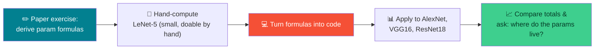
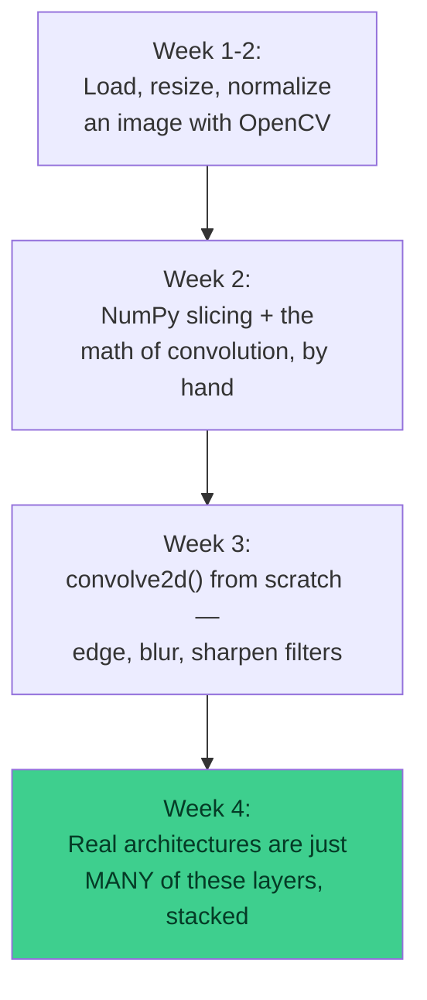

# 🧮 CNN Architecture Parameter Counting & Doubt-Clearing — Week 4 Practical

### *Part 1: derive the parameter-count formulas on paper, then use them to compare LeNet, AlexNet, VGG16, and ResNet18 in code. Part 2: open floor for questions on everything covered so far.*

> **What we're doing today:** no new "build from scratch" pipeline — today is about **stepping back and reasoning about architectures as a whole**. Part 1 answers a question every CNN course eventually asks: *"why does one network have 60 thousand parameters and another has 138 million?"* You'll derive the formula on paper first, then write a small amount of code to apply it across four famous architectures. Part 2 is a **buffer hour** — no fixed script, just time to clear doubts from Weeks 1–4.
>
> No servers, no installs. Everything runs inside one **Google Colab** notebook.

**Session plan (2 hours, back-to-back):**

| Time | Part | Focus |
|------|------|-------|
| 🕛 12:00 – 1:00 PM | **Part 1 — Consolidation** | Paper exercise → code: parameter counts across LeNet / AlexNet / VGG16 / ResNet18 |
| 🕐 1:00 – 2:00 PM | **Part 2 — Buffer** | Open doubt-clearing on CNN architectures (discussion-led, not code-led) |

---

## 🗺️ The Big Picture (Read This First)



**The question today answers:** a network's *depth* (number of layers) and its *parameter count* are **not** the same thing. ResNet18 is deeper than AlexNet but has ~5× fewer parameters. By the end of the hour you'll know exactly why, using nothing but arithmetic.

| Layer type | Has learnable parameters? | Formula |
|------------|---------------------------|---------|
| 🔲 **Convolutional** | Yes — the kernel weights + one bias per filter | `(kernel_h × kernel_w × in_channels + 1) × out_channels` |
| ⬇️ **Pooling (max/avg)** | No — it just picks/averages existing values | `0` |
| 🔗 **Fully connected (FC / Dense)** | Yes — one weight per input-output pair + one bias per output | `(in_features + 1) × out_features` |

---

## 📋 What You'll Need (all free)

1. A **Google account** (for Colab) — `https://colab.research.google.com`
2. `numpy` and `matplotlib` — pre-installed. `torch`/`torchvision` are also pre-installed in Colab, used only for an **optional** cross-check at the end of Part 1.

---

# 🕛 PART 1 — CONSOLIDATION (12:00 – 1:00 PM)

## Paper exercise → code: comparing parameter counts across LeNet / AlexNet / VGG16 / ResNet18

### 1.1 — ✏️ Paper exercise: derive the formulas yourself first

**Before opening Colab**, work this out on paper.

**Convolutional layer.** A kernel of size `kH × kW` is applied across every input channel, and there are `out_channels` separate kernels (one per output feature map), each with its own bias:

```
conv_params = (kH × kW × in_channels + 1) × out_channels
                                       ↑
                                  +1 for the bias term
```

**Fully connected layer.** Every input unit connects to every output unit, plus one bias per output unit:

```
fc_params = (in_features + 1) × out_features
```

**Pooling layer.** Max-pooling and average-pooling have **no learnable weights** — they just pick or average existing numbers:

```
pool_params = 0
```

> ✅ **Check your derivation:** a `3×3` conv layer going from `3` input channels to `16` output channels should give `(3×3×3 + 1) × 16 = (27+1) × 16 = 448`. Work that out by hand right now — if you get `448`, your formula is correct.

### 1.2 — ✏️ Paper exercise: hand-compute LeNet-5

LeNet-5 is small enough to fully compute by hand — do this on paper before touching code.

| Layer | Type | Config | Your calculation |
|-------|------|--------|-------------------|
| C1 | Conv | 5×5, 1→6 | `(5×5×1+1)×6 = ?` |
| S2 | Pool | — | `0` |
| C3 | Conv | 5×5, 6→16 | `(5×5×6+1)×16 = ?` |
| S4 | Pool | — | `0` |
| C5 | Conv (acts like FC) | 5×5, 16→120 | `(5×5×16+1)×120 = ?` |
| F6 | FC | 120→84 | `(120+1)×84 = ?` |
| Output | FC | 84→10 | `(84+1)×10 = ?` |

Add up all seven rows to get LeNet-5's total parameter count. Keep your paper total handy — you'll verify it against code in the next step.

### 1.3 — Open Colab and turn the formulas into functions

```python
import numpy as np
import matplotlib.pyplot as plt

def conv_params(kernel_size, in_channels, out_channels):
    kh, kw = kernel_size
    return (kh * kw * in_channels + 1) * out_channels

def fc_params(in_features, out_features):
    return (in_features + 1) * out_features

# Same sanity check as 1.1 — should print 448
print("Sanity check:", conv_params((3, 3), 3, 16))
```

### 1.4 — Encode LeNet-5 and check it against your paper answer

```python
lenet5 = [
    ("C1 (conv 5x5, 1->6)",   conv_params((5,5), 1, 6)),
    ("S2 (pool)",              0),
    ("C3 (conv 5x5, 6->16)",  conv_params((5,5), 6, 16)),
    ("S4 (pool)",              0),
    ("C5 (conv 5x5, 16->120)", conv_params((5,5), 16, 120)),
    ("F6 (fc 120->84)",        fc_params(120, 84)),
    ("Output (fc 84->10)",     fc_params(84, 10)),
]

def summarize(name, layers):
    total = sum(p for _, p in layers)
    print(f"\n{name} — total parameters: {total:,}")
    for layer_name, p in layers:
        pct = (100 * p / total) if total else 0
        print(f"  {layer_name:<28}{p:>10,}  ({pct:5.1f}%)")
    return total

lenet5_total = summarize("LeNet-5", lenet5)
```

**Expected output:**

```
LeNet-5 — total parameters: 61,706
  C1 (conv 5x5, 1->6)               156  ( 0.3%)
  S2 (pool)                           0  ( 0.0%)
  C3 (conv 5x5, 6->16)            2,416  ( 3.9%)
  S4 (pool)                           0  ( 0.0%)
  C5 (conv 5x5, 16->120)         48,120  (78.0%)
  F6 (fc 120->84)                10,164  (16.5%)
  Output (fc 84->10)                850  ( 1.4%)
```

> 🎯 **Does `61,706` match what you got on paper in 1.2?** If yes — your formula and your arithmetic are both confirmed correct, and you can trust the same functions for the much bigger networks below.

### 1.5 — Encode AlexNet (too big to fully hand-compute in an hour — this is where code takes over)

```python
alexnet = [
    ("Conv1 (11x11, 3->96)",   conv_params((11,11), 3, 96)),
    ("Conv2 (5x5, 96->256)",   conv_params((5,5), 96, 256)),
    ("Conv3 (3x3, 256->384)",  conv_params((3,3), 256, 384)),
    ("Conv4 (3x3, 384->384)",  conv_params((3,3), 384, 384)),
    ("Conv5 (3x3, 384->256)",  conv_params((3,3), 384, 256)),
    ("FC6 (9216->4096)",       fc_params(9216, 4096)),
    ("FC7 (4096->4096)",       fc_params(4096, 4096)),
    ("FC8 (4096->1000)",       fc_params(4096, 1000)),
]

alexnet_total = summarize("AlexNet", alexnet)
```

**Expected output (totals should land close to these — exact figures vary slightly by implementation):**

```
AlexNet — total parameters: 62,378,344
  ...
  FC6 (9216->4096)          37,752,832  (60.5%)
  FC7 (4096->4096)          16,781,312  (26.9%)
  FC8 (4096->1000)           4,097,000  ( 6.6%)
```

> 🔑 **Look at those three percentages.** The three fully-connected layers alone account for roughly **94% of AlexNet's entire parameter count** — all five convolutional layers combined make up the other 6%. Keep that number in mind; it's the whole story of today's session.

### 1.6 — Encode VGG16 — build it from its repeating pattern instead of typing 16 layers by hand

VGG16's convolutional stack is just `3×3` convs repeated in blocks, doubling channels after each max-pool. Instead of typing every layer, build it from the same compact `cfg` list style used in most VGG implementations:

```python
# Numbers = output channels for a 3x3 conv; 'M' = max-pool (0 params)
vgg16_cfg = [64, 64, 'M', 128, 128, 'M', 256, 256, 256, 'M',
             512, 512, 512, 'M', 512, 512, 512, 'M']

vgg16 = []
in_channels = 3
for v in vgg16_cfg:
    if v == 'M':
        vgg16.append(("Pool", 0))
    else:
        vgg16.append((f"Conv 3x3, {in_channels}->{v}", conv_params((3,3), in_channels, v)))
        in_channels = v

# After the conv stack: 512 channels x 7x7 feature map -> flatten -> FC layers
vgg16 += [
    ("FC1 (25088->4096)", fc_params(512*7*7, 4096)),
    ("FC2 (4096->4096)",  fc_params(4096, 4096)),
    ("FC3 (4096->1000)",  fc_params(4096, 1000)),
]

vgg16_total = summarize("VGG16", vgg16)
```

**Expected output:**

```
VGG16 — total parameters: 138,357,544
```

> 💡 This is the widely-cited figure for VGG16 — if your code lands close to `138,357,544`, the loop built the architecture correctly.

### 1.7 — Encode ResNet18 — same convs, but no giant FC layers at the end

ResNet18 is deeper than AlexNet (18 weight layers vs. 8) but ends with **global average pooling** instead of flattening into a huge FC layer — that's the design choice we're about to see the effect of.

```python
def resnet_stage(in_ch, out_ch, num_blocks, downsample):
    """One ResNet 'stage' = num_blocks basic blocks (2 conv3x3 each),
    with an extra 1x1 downsample conv on the first block if channels change."""
    layers = []
    for i in range(num_blocks):
        block_in = in_ch if i == 0 else out_ch
        layers.append((f"conv3x3 {block_in}->{out_ch}", conv_params((3,3), block_in, out_ch)))
        layers.append((f"conv3x3 {out_ch}->{out_ch}",   conv_params((3,3), out_ch, out_ch)))
        if i == 0 and downsample:
            layers.append((f"downsample 1x1 {in_ch}->{out_ch}", conv_params((1,1), in_ch, out_ch)))
    return layers

resnet18 = [("Stem (conv 7x7, 3->64)", conv_params((7,7), 3, 64)), ("MaxPool", 0)]
resnet18 += resnet_stage(64,  64,  2, downsample=False)   # stage 1: no channel change
resnet18 += resnet_stage(64,  128, 2, downsample=True)    # stage 2
resnet18 += resnet_stage(128, 256, 2, downsample=True)    # stage 3
resnet18 += resnet_stage(256, 512, 2, downsample=True)    # stage 4
resnet18 += [("Global Avg Pool", 0), ("FC (512->1000)", fc_params(512, 1000))]

resnet18_total = summarize("ResNet18", resnet18)
```

**Expected output:**

```
ResNet18 — total parameters: 11,684,712
```

> 💡 The commonly-cited figure for ResNet18 is `11,689,512` — the small ~5K gap is BatchNorm's learnable scale/shift parameters, which this exercise deliberately leaves out to keep the formula simple (conv + FC only). The match is close enough to trust the comparison.

### 1.8 — Compare all four, and answer the question from the top of the page

```python
names  = ["LeNet-5", "AlexNet", "VGG16", "ResNet18"]
totals = [lenet5_total, alexnet_total, vgg16_total, resnet18_total]

fig, ax = plt.subplots(figsize=(8, 5))
bars = ax.bar(names, totals, color=["#028090", "#F55036", "#3ECF8E", "#4A4A4A"])
ax.set_ylabel("Total parameters")
ax.set_yscale("log")   # log scale — the range spans 3+ orders of magnitude
ax.set_title("Parameter count by architecture (log scale)")

for bar, total in zip(bars, totals):
    ax.text(bar.get_x() + bar.get_width()/2, bar.get_height(),
             f"{total:,}", ha="center", va="bottom", fontsize=9)

plt.tight_layout()
plt.show()
```

**Now answer this out loud, with numbers to back it up:** *why does ResNet18 — which has more layers than AlexNet — end up with fewer parameters?*

```python
def fc_share(layers):
    total = sum(p for _, p in layers)
    fc_total = sum(p for name, p in layers if "fc" in name.lower() or "FC" in name)
    return 100 * fc_total / total

print(f"AlexNet:  FC layers hold {fc_share(alexnet):.1f}% of all parameters")
print(f"VGG16:    FC layers hold {fc_share(vgg16):.1f}% of all parameters")
print(f"ResNet18: FC layers hold {fc_share(resnet18):.1f}% of all parameters")
```

**Expected output:**

```
AlexNet:  FC layers hold 94.1% of all parameters
VGG16:    FC layers hold 89.4% of all parameters
ResNet18: FC layers hold  4.4% of all parameters
```

> 🎓 **This is the answer.** AlexNet and VGG16 flatten a large feature map straight into massive FC layers, which dominate their parameter counts. ResNet18 uses **global average pooling** to collapse each feature map to a single number before a small final FC layer — trading a huge dense layer for one number per channel. Same basic building block (`3×3` convs), radically different parameter budget.

### 1.9 — Optional: cross-check with a real framework

```python
import torch
import torchvision.models as models

def count_params(model):
    return sum(p.numel() for p in model.parameters())

alexnet_tv  = models.alexnet(weights=None)
vgg16_tv    = models.vgg16(weights=None)
resnet18_tv = models.resnet18(weights=None)

print("AlexNet (torchvision) :", f"{count_params(alexnet_tv):,}")
print("VGG16 (torchvision)   :", f"{count_params(vgg16_tv):,}")
print("ResNet18 (torchvision):", f"{count_params(resnet18_tv):,}")
```

> 💡 These should land in the **same ballpark** as your hand-built totals above — small differences come from BatchNorm parameters, exact pooling choices, and minor implementation details that vary between the original papers and `torchvision`'s implementations. The goal isn't a digit-perfect match, it's confirming your formula-based reasoning was right.

---

## 🛠️ Troubleshooting — Part 1

| Symptom | Likely cause | Fix |
|---------|-------------|-----|
| Your paper LeNet-5 total doesn't match `61,706` | Forgot the `+1` bias term in one layer, or mixed up `in_channels`/`out_channels` | Recompute C5 first — it's 78% of the total, so an error there dominates the mismatch |
| AlexNet/VGG16 totals are off by a large margin | Wrong `in_channels` passed into a layer (should equal the previous layer's `out_channels`) | Print each layer's channel counts and check they chain correctly |
| VGG16 loop gives the wrong number of conv layers | Miscounted entries in `vgg16_cfg` | Count the numbers (not `'M'`) in the cfg list — should be exactly 13 |
| ResNet18 total is way higher than expected | `downsample=True` applied on every block instead of just the first one of each stage | Only stage-entry blocks (`i == 0`) with a channel change need the extra 1×1 conv |
| `torchvision` cross-check fails to import | Rare in Colab, but possible on some runtimes | Skip 1.9 — it's optional and doesn't affect the core exercise |

---

## 🧰 Quick Reference Card — Part 1

```python
def conv_params(kernel_size, in_channels, out_channels):
    kh, kw = kernel_size
    return (kh * kw * in_channels + 1) * out_channels

def fc_params(in_features, out_features):
    return (in_features + 1) * out_features

# pooling layers → 0 params, always
```

| Architecture | Total params | Where they live |
|--------------|---------------|------------------|
| **LeNet-5** | ~61.7K | Mostly the last conv-as-FC layer (C5) |
| **AlexNet** | ~62.4M | ~94% in 3 FC layers |
| **VGG16** | ~138.4M | ~89% in 3 FC layers |
| **ResNet18** | ~11.7M | Only ~4% in FC — global avg pooling removes the bottleneck |

---

# 🕐 PART 2 — BUFFER / DOUBT-CLEARING (1:00 – 2:00 PM)

## Open session on CNN architectures — discussion-led, not code-led

This hour has **no fixed script** — it's built around clearing whatever's still unclear from Weeks 1–4. Below is a facilitation guide: a recap map, a bank of the doubts that come up most often at this point in a course, and a few quick on-paper checks you can pose to the room if things go quiet.

### 2.1 — Recap map: how the four weeks connect



Use this as the opening slide of the hour: everything since Week 1 has been building toward the idea that **LeNet, AlexNet, VGG, and ResNet are made of the exact same operations you've already coded by hand** — just arranged in longer sequences, with the kernel *values themselves* learned from data instead of hand-picked (like the Sobel/blur/sharpen kernels were).

### 2.2 — Doubt bank: the questions that come up most at this point

Use these as prompts if the room is quiet, or as talking points if a student asks something similar.

**On convolution itself**

- *"Why does padding matter — can't we just let the image shrink?"* — Shrinking compounds: after enough layers without padding, a deep network runs out of pixels entirely. Padding is what lets architectures go dozens of layers deep.
- *"What's the difference between stride and pooling — don't they both downsample?"* — A strided conv *learns* what to keep while downsampling; pooling downsamples with a fixed, non-learned rule (max or average). Both shrink spatial size; only one has parameters.
- *"Why do deeper layers usually have more channels but smaller height/width?"* — Early layers see raw pixels and need few channels to describe simple edges; deeper layers combine those edges into more complex patterns, which needs more channels — while pooling/stride shrinks the spatial map to keep computation manageable.

**On parameter counts (today's topic)**

- *"Doesn't a deeper network always have more parameters?"* — No — Part 1 is the counterexample. Depth and parameter count are related to design choices (especially "how do we go from feature maps to a final FC layer"), not to layer count alone.
- *"Why do FC layers have so many more parameters than conv layers?"* — A conv kernel is *shared* across every spatial position in the image (that's the whole trick of convolution). An FC layer has a **separate weight for every single input-output pair**, with no sharing at all.
- *"What does global average pooling actually replace?"* — Instead of flattening a `7×7×512` feature map into a `25,088`-length vector and feeding it into a `4096`-unit FC layer (VGG16's approach), GAP averages each `7×7` channel down to one number, giving a `512`-length vector directly — no giant FC layer needed.

**On architecture design generally**

- *"Why does ResNet need skip connections at all?"* — As networks get very deep, gradients shrink as they're pushed backward through many layers during training (vanishing gradients), making early layers barely update. A skip connection gives the gradient a direct path backward, bypassing that shrinkage.
- *"Is a bigger parameter count always better?"* — Not necessarily — more parameters mean more capacity to fit training data, but also more risk of overfitting, more memory, and slower training/inference. ResNet18 outperforming much larger nets on some tasks, with far fewer parameters, is exactly why the field moved toward efficiency-focused design.
- *"Why do we still use `3×3` kernels almost everywhere in modern architectures?"* — Two stacked `3×3` convs cover the same receptive field as one `5×5` conv, but with fewer total parameters and an extra non-linearity in between — VGG popularized this insight and it's still standard practice.

### 2.3 — Quick "check yourself" prompts (pen and paper, no code needed)

Pose these to the room if you want a quick pulse-check rather than open-ended discussion:

1. A conv layer takes a `64`-channel input, uses a `3×3` kernel, and outputs `128` channels. How many parameters? *(Answer: `(3×3×64+1)×128 = 73,856`)*
2. Without calculating exact numbers — would you expect an FC layer going from `4096→4096` to have more or fewer parameters than a `3×3` conv layer going from `256→256` channels? *(FC: ~16.8M. Conv: ~590K. FC has roughly 28× more, from a much smaller layer "size" on paper — a good gut-check for the sharing argument above.)*
3. If you doubled every channel count in ResNet18 (64→128, 128→256, etc.) but kept everything else the same, would the parameter count roughly double, or roughly quadruple? *(Roughly quadruple — parameter count scales with `in_channels × out_channels`, so doubling both multiplies the product by 4.)*

### 2.4 — If discussion runs dry: revisit Part 1's numbers together

Pull the bar chart from 1.8 back up and ask the room to predict, before you scroll to the answer: *"If we built a hypothetical ResNet34 (double the blocks per stage), would its FC-layer share of total parameters go up, down, or stay about the same?"* (Answer: stays about the same — ~4-5% — because ResNet34 adds more conv blocks, not a bigger final FC layer. This is a good closing example of the whole session's theme.)

---

## ✅ What You Consolidated Today

- ✏️ Derived the **parameter-count formulas** for conv, pooling, and FC layers from first principles, on paper
- 🧮 Hand-verified LeNet-5's total (`61,706`) against a formula-based Python calculation
- 💻 Built **AlexNet, VGG16, and ResNet18** as data structures and computed their totals with the same two functions
- 📈 Discovered that **~90%+ of AlexNet's and VGG16's parameters live in their FC layers**, while ResNet18's global-average-pooling design keeps that figure under 5%
- 🗣️ Used Part 2 to connect **Weeks 1–4** into one continuous story: manual pixel operations → manual convolution → real architectures built from the same operations, at scale

> 🎓 You now have a reusable mental model for reading *any* CNN architecture diagram: count the conv layers, count the FC layers, and you can already predict roughly where its parameter budget goes — before ever running a line of code.

---

## 🧰 Quick Reference Card — Full Session

```python
def conv_params(kernel_size, in_channels, out_channels):
    kh, kw = kernel_size
    return (kh * kw * in_channels + 1) * out_channels

def fc_params(in_features, out_features):
    return (in_features + 1) * out_features

# pooling → 0 params (no learnable weights)
```

| Concept | One-liner |
|---------|-----------|
| **Conv param formula** | `(kH × kW × in_channels + 1) × out_channels` — weights are *shared* across positions |
| **FC param formula** | `(in_features + 1) × out_features` — one weight per input-output pair, no sharing |
| **Pooling** | Always `0` parameters — a fixed rule, not a learned one |
| **Why FC layers dominate older nets** | Flattening a large feature map into a huge FC layer multiplies two big numbers together |
| **Why ResNet has fewer params** | Global average pooling replaces the flatten-into-huge-FC step entirely |
| **Depth ≠ parameter count** | A network can be deeper *and* smaller — it depends on where the FC layers (if any) sit |
