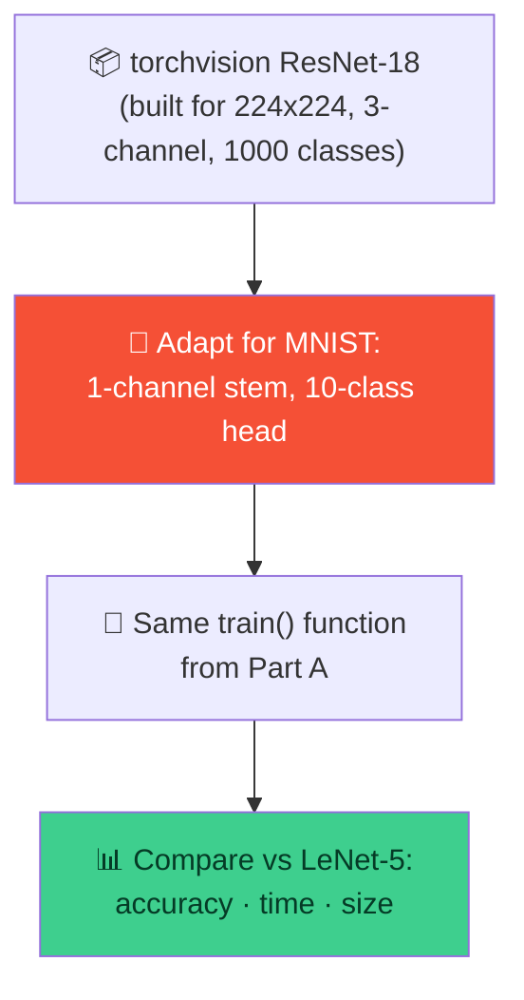

# 🏋️ Training LeNet & ResNet-18 on MNIST — Week 5 Practical

### *Practical 4, Part A & B: your first real trained models — same architectures you counted parameters for in Week 4, now actually learning from data*

> **What we're building today:** two real, trained image classifiers, using **PyTorch** for the first time in this course. Part A trains a from-scratch **LeNet-5** on MNIST — the exact architecture whose parameter count you hand-verified in Week 4 (`61,706`). Part B trains a **MNIST-adapted ResNet-18** on the same data, then puts the two head-to-head on **accuracy, training time, and model size**.
>
> Runs in **Google Colab** — but for the first time this course, you'll want a **GPU runtime** (Part B especially will be slow on CPU).

**Session plan (2 hours, back-to-back):**

| Time | Part | Focus |
|------|------|-------|
| 🕛 12:00 – 1:00 PM | **Practical 4A** | Train **LeNet-5** on MNIST |
| 🕐 1:00 – 2:00 PM | **Practical 4B** | Train **ResNet-18** on MNIST → compare accuracy, time, size vs. LeNet |

> 🧭 **Why this matters after Weeks 1–4:** you've manually loaded/preprocessed images, manually convolved them, and manually counted an architecture's parameters. Today those architectures **actually learn** — and you'll see directly whether "bigger model" translates to "better result" on a task as simple as MNIST.

---

## 🗺️ The Big Picture (Read This First)


| Tool | Job |
|------|-----|
| 🔥 **PyTorch** (`torch`) | Defines the model, runs the training loop, computes gradients automatically |
| 📦 **torchvision** | Downloads MNIST, provides the ResNet-18 architecture to adapt |
| 📊 **Matplotlib** | Visualizes sample predictions and comparison charts |

---

## 📋 What You'll Need (all free)

1. A **Google account** (for Colab) — `https://colab.research.google.com`
2. **A GPU runtime** — before writing any code:
   **Runtime → Change runtime type → Hardware accelerator → T4 GPU → Save**
   Do this now. Part B trains a real ResNet-18; on CPU it will still work, but far too slowly for a 1-hour session.

---

# 🕛 PRACTICAL 4A (12:00 – 1:00 PM)

## Train LeNet-5 on MNIST

### A.1 — Open a fresh Colab notebook (with GPU enabled)

Rename it `week5_practical4a.ipynb`. Double-check **Runtime → Change runtime type** shows a GPU selected.

```python
import torch
import torch.nn as nn
import torch.nn.functional as F
import torch.optim as optim
import torchvision
import torchvision.transforms as transforms
from torch.utils.data import DataLoader
import matplotlib.pyplot as plt
import time

device = torch.device("cuda" if torch.cuda.is_available() else "cpu")
print("Using device:", device)
```

**Expected output:** `Using device: cuda` — if you see `cpu` instead, go back and fix the runtime type before continuing.

### A.2 — Load MNIST, padded to LeNet-5's original 32×32 input

MNIST digits are `28×28`, but classic LeNet-5 was designed for `32×32` — pad by 2 pixels on every side.

```python
transform = transforms.Compose([
    transforms.Pad(2),                        # 28x28 -> 32x32
    transforms.ToTensor(),
    transforms.Normalize((0.1307,), (0.3081,))  # MNIST's known mean/std
])

train_dataset = torchvision.datasets.MNIST(root="./data", train=True,  download=True, transform=transform)
test_dataset  = torchvision.datasets.MNIST(root="./data", train=False, download=True, transform=transform)

train_loader = DataLoader(train_dataset, batch_size=128, shuffle=True)
test_loader  = DataLoader(test_dataset,  batch_size=256, shuffle=False)

print("Train samples:", len(train_dataset))
print("Test samples :", len(test_dataset))
print("Image shape  :", train_dataset[0][0].shape)   # should be [1, 32, 32]
```

**Expected output:**

```
Train samples: 60000
Test samples : 10000
Image shape  : torch.Size([1, 32, 32])
```

> 💡 `transforms.Normalize((0.1307,), (0.3081,))` uses MNIST's precomputed pixel mean and standard deviation — this is the "normalize" step from Week 1, just using dataset-specific statistics instead of a flat `/255`.

### A.3 — Define LeNet-5 — the exact architecture from Week 4

```python
class LeNet5(nn.Module):
    def __init__(self):
        super().__init__()
        self.conv1 = nn.Conv2d(1, 6, kernel_size=5)
        self.conv2 = nn.Conv2d(6, 16, kernel_size=5)
        self.pool  = nn.MaxPool2d(2, 2)
        self.fc1   = nn.Linear(16 * 5 * 5, 120)
        self.fc2   = nn.Linear(120, 84)
        self.fc3   = nn.Linear(84, 10)

    def forward(self, x):
        x = self.pool(F.relu(self.conv1(x)))   # 32x32 -> 28x28 -> 14x14
        x = self.pool(F.relu(self.conv2(x)))   # 14x14 -> 10x10 -> 5x5
        x = x.view(x.size(0), -1)               # flatten to (batch, 400)
        x = F.relu(self.fc1(x))
        x = F.relu(self.fc2(x))
        x = self.fc3(x)                          # raw logits, no softmax here
        return x

lenet = LeNet5().to(device)
print(lenet)
```

### A.4 — Confirm the parameter count matches Week 4

```python
def count_params(model):
    return sum(p.numel() for p in model.parameters())

print(f"LeNet-5 parameters: {count_params(lenet):,}")
```

**Expected output:**

```
LeNet-5 parameters: 61,706
```

> ✅ **This should match Week 4's hand-calculated total exactly.** If it doesn't, double-check the layer definitions above against Week 4's table before training — an architecture bug here will silently produce a working-but-wrong model.

### A.5 — Write reusable `train()` and `evaluate()` functions

Same pattern as Week 3's `convolve2d()`: write the machinery once, reuse it unchanged for the ResNet-18 model in Part B.

```python
def evaluate(model, loader):
    model.eval()
    correct = total = 0
    with torch.no_grad():
        for images, labels in loader:
            images, labels = images.to(device), labels.to(device)
            outputs = model(images)
            _, predicted = torch.max(outputs, 1)
            correct += (predicted == labels).sum().item()
            total += labels.size(0)
    return 100 * correct / total


def train(model, train_loader, test_loader, epochs=3, lr=0.001):
    criterion = nn.CrossEntropyLoss()
    optimizer = optim.Adam(model.parameters(), lr=lr)
    epoch_times = []

    for epoch in range(epochs):
        model.train()
        start = time.time()
        running_loss = 0.0

        for images, labels in train_loader:
            images, labels = images.to(device), labels.to(device)
            optimizer.zero_grad()
            outputs = model(images)
            loss = criterion(outputs, labels)
            loss.backward()
            optimizer.step()
            running_loss += loss.item()

        epoch_time = time.time() - start
        epoch_times.append(epoch_time)
        avg_loss = running_loss / len(train_loader)
        print(f"Epoch {epoch+1}/{epochs} — loss: {avg_loss:.4f} — time: {epoch_time:.1f}s")

    test_acc = evaluate(model, test_loader)
    return {"epoch_times": epoch_times, "test_accuracy": test_acc}
```

### A.6 — Train LeNet-5

```python
lenet_results = train(lenet, train_loader, test_loader, epochs=3)
print("\nFinal test accuracy:", f"{lenet_results['test_accuracy']:.2f}%")
```

**Expected output (your exact numbers will vary — this is the ballpark on a T4 GPU):**

```
Epoch 1/3 — loss: 0.2xxx — time: ~10-15s
Epoch 2/3 — loss: 0.0xxx — time: ~10-15s
Epoch 3/3 — loss: 0.0xxx — time: ~10-15s

Final test accuracy: ~98-99%
```

> 🎯 LeNet-5 — a ~61K-parameter model designed in the 1990s — should comfortably clear **98% accuracy** on MNIST in just 3 epochs. Keep that number in mind for Part B.

### A.7 — Check the model's file size

```python
torch.save(lenet.state_dict(), "lenet.pth")

import os
lenet_size_mb = os.path.getsize("lenet.pth") / (1024 ** 2)
print(f"LeNet-5 file size: {lenet_size_mb:.2f} MB")
```

### A.8 — Visualize a few predictions

```python
model_out = lenet.eval()
images, labels = next(iter(test_loader))
images, labels = images.to(device), labels.to(device)

with torch.no_grad():
    outputs = lenet(images)
    _, predicted = torch.max(outputs, 1)

fig, axes = plt.subplots(1, 6, figsize=(12, 3))
for i in range(6):
    img = images[i].cpu().squeeze()
    axes[i].imshow(img, cmap="gray")
    color = "green" if predicted[i] == labels[i] else "red"
    axes[i].set_title(f"Pred: {predicted[i].item()}\nTrue: {labels[i].item()}", color=color)
    axes[i].axis("off")

plt.tight_layout()
plt.show()
```

---

## 🛠️ Troubleshooting — Practical 4A

| Symptom | Likely cause | Fix |
|---------|-------------|-----|
| `Using device: cpu` | GPU runtime wasn't selected | Runtime → Change runtime type → GPU, then re-run all cells |
| Parameter count isn't `61,706` | A layer's `in`/`out` channels or `kernel_size` don't match A.3 | Compare each `nn.Conv2d`/`nn.Linear` line against the Week 4 table |
| Training loss becomes `nan` | Learning rate too high, or forgot `optimizer.zero_grad()` | Use the `train()` function exactly as written — both are handled there |
| `RuntimeError: size mismatch` in `fc1` | Flatten size doesn't match `16*5*5` | Print `x.shape` right before the `x.view(...)` line — confirm it's `(batch, 16, 5, 5)` |
| Very slow even on GPU | Forgot to move `images`/`labels` to `device` inside the loop | Both `train()` and `evaluate()` already do `.to(device)` — check you're using them, not custom loop code |

---

## 🧰 Quick Reference Card — Practical 4A

```python
device = torch.device("cuda" if torch.cuda.is_available() else "cpu")

class LeNet5(nn.Module):
    # conv1(1->6,5x5) -> pool -> conv2(6->16,5x5) -> pool -> fc1(400->120) -> fc2(120->84) -> fc3(84->10)
    ...

def train(model, train_loader, test_loader, epochs=3, lr=0.001):
    # standard PyTorch loop: zero_grad -> forward -> loss -> backward -> step
    ...

def evaluate(model, loader):
    # no_grad, argmax over logits, compare to labels
    ...
```

| Concept | One-liner |
|---------|-----------|
| **`.to(device)`** | Moves a model or tensor onto the GPU — forgetting it anywhere causes slow or mismatched-device errors |
| **`optimizer.zero_grad()`** | Clears old gradients before computing new ones — skip it and gradients accumulate incorrectly |
| **`model.train()` / `model.eval()`** | Switches layers like dropout/batchnorm between training and inference behavior |
| **`torch.no_grad()`** | Disables gradient tracking during evaluation — faster, uses less memory |
| **Param count match** | A working architecture should reproduce the exact count you derived by hand in Week 4 |

---

# 🕐 PRACTICAL 4B (1:00 – 2:00 PM)

## Train ResNet-18 on MNIST — compare accuracy, training time, model size

**Goal:** adapt `torchvision`'s ResNet-18 for MNIST, train it with the **same `train()`/`evaluate()` functions** from Part A, and build a head-to-head comparison against LeNet-5.



### B.1 — Continue in the same notebook, or start fresh

If starting a new notebook, re-run A.1–A.2 first (device setup + the `train_loader`/`test_loader` from Part A) — we're deliberately reusing the exact same padded `32×32` data pipeline so the comparison is fair.

### B.2 — Load ResNet-18 and adapt it for MNIST

`torchvision`'s ResNet-18 assumes `224×224`, 3-channel input and 1000 output classes — none of which match MNIST. Three changes fix that:

```python
import torchvision.models as models

resnet = models.resnet18(weights=None, num_classes=10)

# 1. MNIST is grayscale (1 channel), and our images are small (32x32) —
#    the original 7x7 stride-2 stem was designed for 224x224 photos and
#    would shrink a 32x32 input too aggressively. Swap in a gentler stem:
resnet.conv1 = nn.Conv2d(1, 64, kernel_size=3, stride=1, padding=1, bias=False)

# 2. Skip the aggressive early max-pool for the same reason
resnet.maxpool = nn.Identity()

resnet = resnet.to(device)
print(f"ResNet-18 (adapted) parameters: {count_params(resnet):,}")
```

**Expected output:**

```
ResNet-18 (adapted) parameters: ~11,168,010
```

> 🔑 Compare that to LeNet-5's `61,706` from Part A — this ResNet-18 has roughly **180× more parameters**, even after we removed its original 1000-class ImageNet head. `num_classes=10` also shrinks the final FC layer to almost nothing (`512→10` instead of `512→1000`), so nearly all of those 11M+ parameters live in the convolutional stages.

### B.3 — Train it with the exact same function from Part A

```python
resnet_results = train(resnet, train_loader, test_loader, epochs=3)
print("\nFinal test accuracy:", f"{resnet_results['test_accuracy']:.2f}%")
```

**Expected output (ballpark on a T4 GPU — will vary by run):**

```
Epoch 1/3 — loss: 0.0xxx — time: ~40-90s
Epoch 2/3 — loss: 0.0xxx — time: ~40-90s
Epoch 3/3 — loss: 0.0xxx — time: ~40-90s

Final test accuracy: ~99%+
```

> 💡 Notice each epoch takes **several times longer** than LeNet's did, even though both trained on the identical dataset for the identical number of epochs — that gap is pure architecture cost, not data.

### B.4 — Check ResNet-18's file size

```python
torch.save(resnet.state_dict(), "resnet18.pth")
resnet_size_mb = os.path.getsize("resnet18.pth") / (1024 ** 2)
print(f"ResNet-18 file size: {resnet_size_mb:.2f} MB")
```

### B.5 — Build the head-to-head comparison

```python
comparison = {
    "Model": ["LeNet-5", "ResNet-18"],
    "Parameters": [count_params(lenet), count_params(resnet)],
    "File size (MB)": [lenet_size_mb, resnet_size_mb],
    "Avg epoch time (s)": [
        sum(lenet_results["epoch_times"]) / len(lenet_results["epoch_times"]),
        sum(resnet_results["epoch_times"]) / len(resnet_results["epoch_times"]),
    ],
    "Test accuracy (%)": [lenet_results["test_accuracy"], resnet_results["test_accuracy"]],
}

for i in range(2):
    print(f"\n{comparison['Model'][i]}")
    print(f"  Parameters       : {comparison['Parameters'][i]:,}")
    print(f"  File size (MB)   : {comparison['File size (MB)'][i]:.2f}")
    print(f"  Avg epoch time(s): {comparison['Avg epoch time (s)'][i]:.1f}")
    print(f"  Test accuracy (%) : {comparison['Test accuracy (%)'][i]:.2f}")
```

### B.6 — Visualize the comparison

```python
fig, axes = plt.subplots(1, 3, figsize=(15, 4))

metrics = [
    ("Parameters", comparison["Parameters"], "log"),
    ("Avg epoch time (s)", comparison["Avg epoch time (s)"], "linear"),
    ("Test accuracy (%)", comparison["Test accuracy (%)"], "linear"),
]

for ax, (title, values, scale) in zip(axes, metrics):
    ax.bar(comparison["Model"], values, color=["#028090", "#F55036"])
    ax.set_title(title)
    if scale == "log":
        ax.set_yscale("log")
    for i, v in enumerate(values):
        ax.text(i, v, f"{v:,.1f}" if title != "Parameters" else f"{v:,}",
                 ha="center", va="bottom", fontsize=9)

plt.tight_layout()
plt.show()
```

### B.7 — The question this whole practical is building toward

```python
acc_gain = comparison["Test accuracy (%)"][1] - comparison["Test accuracy (%)"][0]
param_ratio = comparison["Parameters"][1] / comparison["Parameters"][0]
time_ratio = comparison["Avg epoch time (s)"][1] / comparison["Avg epoch time (s)"][0]

print(f"ResNet-18 has {param_ratio:.0f}x more parameters than LeNet-5")
print(f"ResNet-18 trains {time_ratio:.1f}x slower per epoch")
print(f"ResNet-18's accuracy gain over LeNet-5: {acc_gain:+.2f} percentage points")
```

> 🎓 **Read your own numbers here, not the ones printed above** — but the pattern that shows up almost every time on MNIST: a ~180× larger, much slower-to-train model buys you a **fraction of a percentage point** of accuracy over LeNet-5, because MNIST is an easy enough task that a small 1990s architecture is already close to the ceiling. This is the practical, hands-on version of a lesson every ML engineer eventually learns: **match model capacity to task difficulty** — bigger isn't automatically better, it's a trade you make deliberately.

---

## 🛠️ Troubleshooting — Practical 4B

| Symptom | Likely cause | Fix |
|---------|-------------|-----|
| `RuntimeError: Given groups=1, weight of size...` on the first batch | `resnet.conv1` wasn't replaced before training, still expects 3 channels | Re-run B.2 — `resnet.conv1` must be redefined before `.to(device)` and training |
| Training is extremely slow, even on GPU | Still on CPU runtime, or `train_loader`/`test_loader` weren't reused from Part A correctly | Confirm `device` prints `cuda`; confirm `next(iter(train_loader))[0].shape` is `[batch, 1, 32, 32]` |
| ResNet-18 accuracy is *lower* than LeNet-5's | Can happen with too few epochs for a deeper net to converge, or a learning rate that's too high for this model | Try `epochs=5` or `lr=0.0005` for ResNet-18 specifically and compare again |
| Parameter count doesn't match `~11,168,010` | `num_classes=10` not passed to `resnet18(...)`, or `conv1`/`maxpool` weren't both replaced | Re-check both lines in B.2 — the FC head and the stem both need to change |
| Out-of-memory error on GPU | Batch size too large for the assigned GPU | Lower `batch_size` in the `DataLoader` (e.g. from 128 to 64) and re-run |

---

## 🚀 Extend It (Optional, if you finish early)

1. **Try more epochs on ResNet-18 only** — does its accuracy pull further ahead of LeNet-5 with `epochs=10`, or does the gap stay small?
2. **Try LeNet-5 with more epochs instead** — does a tiny model catch up to (or match) ResNet-18's accuracy just by training longer?
3. **Swap the optimizer** — try `optim.SGD(model.parameters(), lr=0.01, momentum=0.9)` instead of Adam for one of the two models and compare convergence speed.
4. **Time just the forward pass** — measure inference time per image for both models (`model.eval()`, loop over a few batches with `torch.no_grad()`, time it) — this is often a more real-world-relevant number than training time.

---

## ✅ What You Learned Today

- 🔥 Trained your **first real models in PyTorch**, using the exact LeNet-5 architecture you hand-verified in Week 4
- 🧮 Confirmed a trained model's parameter count (`61,706`) **exactly matches** a purely mathematical, paper-based prediction from three weeks ago
- 🔧 Learned to **adapt a pretrained-architecture class** (ResNet-18) for a dataset it wasn't originally designed for — new stem, new classification head
- 🔁 Reused **one `train()`/`evaluate()` pair of functions** across two completely different architectures, unchanged
- ⚖️ Measured and compared **accuracy, training time, and model size** head-to-head, and saw directly that more parameters didn't mean a proportionally better result on an easy task
- 🎓 Took away the core lesson: **model capacity should match task difficulty** — a decision you'll now make deliberately in every future project, not by default

---

## 🧰 Quick Reference Card — Full Session

```python
device = torch.device("cuda" if torch.cuda.is_available() else "cpu")

# ── LeNet-5 (Part A) ──
lenet = LeNet5().to(device)                 # ~61,706 params

# ── ResNet-18 adapted for MNIST (Part B) ──
resnet = models.resnet18(weights=None, num_classes=10)
resnet.conv1 = nn.Conv2d(1, 64, kernel_size=3, stride=1, padding=1, bias=False)
resnet.maxpool = nn.Identity()
resnet = resnet.to(device)                  # ~11,168,010 params

# ── SAME functions for both ──
results = train(model, train_loader, test_loader, epochs=3)
acc = evaluate(model, test_loader)

# ── Compare ──
count_params(model)                          # parameter count
os.path.getsize("model.pth") / (1024**2)     # file size in MB
```

| Concept | One-liner |
|---------|-----------|
| **Adapting a pretrained architecture** | Swap the stem for your input format, swap the head for your number of classes |
| **`nn.Identity()`** | A "do-nothing" layer — useful for removing a stage without restructuring the rest of the model |
| **Fair comparison** | Same data, same epochs, same train/eval functions — only the model changes |
| **Bigger model ≠ better result** | Extra capacity only helps if the task is hard enough to need it |
| **What to report** | Always compare accuracy **alongside** training time and model size — not accuracy alone |
