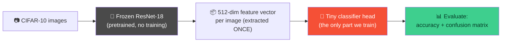
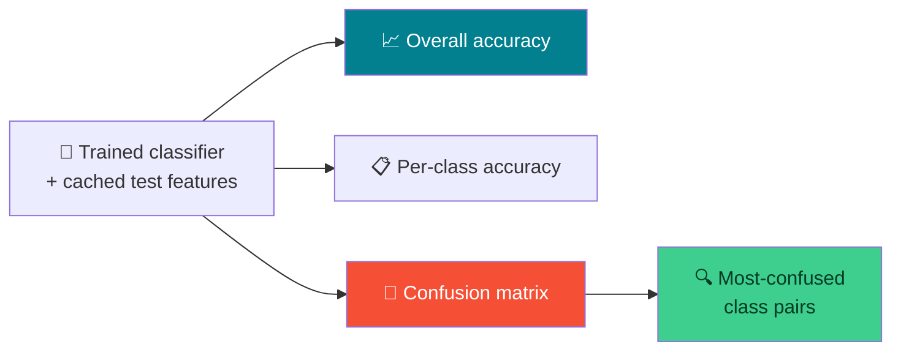

# 🧠 Transfer Learning & Evaluation — Week 6 Practical

### *Practical 5, Part A & B: use a pretrained backbone as a fixed feature extractor, train a tiny classifier on top, then evaluate it properly — not just with accuracy*

> **What we're building today:** your first **transfer learning** pipeline. Instead of training a whole CNN from scratch (Week 5), you'll take a **ResNet-18 pretrained on ImageNet**, freeze it completely, and train only a small classifier head on top for **CIFAR-10**. Part B then evaluates that classifier properly — not just with one accuracy number, but with per-class accuracy and a full **confusion matrix**.
>
> Runs in **Google Colab**. Keep your **GPU runtime** enabled (Runtime → Change runtime type → T4 GPU) — today's one-time feature extraction step benefits from it.

**Session plan (2 hours, back-to-back):**

| Time | Part | Focus |
|------|------|-------|
| 🕛 12:00 – 1:00 PM | **Practical 5A** | Pretrained backbone as feature extractor → train a classifier on CIFAR-10 |
| 🕐 1:00 – 2:00 PM | **Practical 5B** | Evaluate the classifier: accuracy, per-class breakdown, confusion matrix |

> 🧭 **Why this is a big shift from Week 5:** last week you trained every parameter of LeNet-5 and ResNet-18 from random initialization. Today, ~11 million of ResNet-18's parameters **never update at all** — they stay exactly as ImageNet training left them. You're only training a few thousand new parameters on top. This is how most real-world computer vision projects actually start.

---

## 🗺️ The Big Picture (Read This First)



| Piece | Job | Analogy |
|-------|-----|---------|
| 🧊 **Frozen backbone** | Converts any image into a 512-number summary — never updates | An expert who already knows how to *see*, just not your specific categories |
| 🎯 **Classifier head** | A single `Linear(512, 10)` layer — the only trainable part | The only thing you actually teach today |
| 📦 **Cached features** | Since the backbone never changes, its output for a given image never changes either | Why bother re-describing the same photo every epoch? Describe it once, reuse the description |

> 🔑 **The efficiency trick of the day:** because the backbone is frozen, running an image through it produces the *same* 512-number vector no matter which epoch you're on. So instead of forwarding every image through the full ResNet-18 every epoch, we do it **once**, save the results, and train the tiny classifier head on those saved vectors — turning a slow CNN training loop into a training loop over plain numbers.

---

## 📋 What You'll Need (all free)

1. A **Google account** (for Colab) — `https://colab.research.google.com`
2. **GPU runtime enabled** — Runtime → Change runtime type → T4 GPU → Save. The one-time feature-extraction pass in Part A is much faster on GPU.

---

# 🕛 PRACTICAL 5A (12:00 – 1:00 PM)

## Pretrained backbone as feature extractor; train classifier on CIFAR-10

### A.1 — Open a fresh Colab notebook

Rename it `week6_practical5a.ipynb`.

```python
import torch
import torch.nn as nn
import torch.optim as optim
import torchvision
from torchvision.models import resnet18, ResNet18_Weights
from torch.utils.data import DataLoader, TensorDataset
import matplotlib.pyplot as plt
import numpy as np
import time

device = torch.device("cuda" if torch.cuda.is_available() else "cpu")
print("Using device:", device)
```

### A.2 — Load a pretrained ResNet-18 and freeze it completely

```python
weights = ResNet18_Weights.DEFAULT   # ImageNet-pretrained weights
backbone = resnet18(weights=weights)

# Freeze every parameter — none of these will be updated by training
for param in backbone.parameters():
    param.requires_grad = False

# Remove the original 1000-class ImageNet head — we just want the
# 512-number feature vector that comes right before it
backbone.fc = nn.Identity()

backbone = backbone.to(device).eval()

print("A few of the 1000 ImageNet classes this backbone already knows:")
print(weights.meta["categories"][:5])
```

> 🔑 **`nn.Identity()`** — same trick from Week 5's ResNet-18 stem swap — is a "do nothing, just pass the input through" layer. Here it deletes the final classification step entirely, leaving the 512-dimensional feature vector that used to feed into it.

### A.3 — Load CIFAR-10 using the exact preprocessing the pretrained weights expect

Every `torchvision` pretrained-weights object knows its own required preprocessing (resize, crop, normalization) — use it directly instead of guessing.

```python
preprocess = weights.transforms()
print(preprocess)

train_dataset = torchvision.datasets.CIFAR10(root="./data", train=True,  download=True, transform=preprocess)
test_dataset  = torchvision.datasets.CIFAR10(root="./data", train=False, download=True, transform=preprocess)

class_names = train_dataset.classes
print("\nClasses:", class_names)
print("Train samples:", len(train_dataset), "| Test samples:", len(test_dataset))

train_loader = DataLoader(train_dataset, batch_size=128, shuffle=False)
test_loader  = DataLoader(test_dataset,  batch_size=128, shuffle=False)
```

**Expected output:**

```
Classes: ['airplane', 'automobile', 'bird', 'cat', 'deer', 'dog', 'frog', 'horse', 'ship', 'truck']
Train samples: 50000 | Test samples: 10000
```

> 💡 **`shuffle=False` here is deliberate** — we're about to extract features in a fixed order and need the labels to line up with them afterward. Shuffling happens later, when we train the classifier head on the cached features.
>
> ⏱️ **Running short on time?** Uncomment a subset for today's demo, and use the full test set only for evaluation in Part B:
> ```python
> # from torch.utils.data import Subset
> # train_dataset = Subset(train_dataset, range(10000))  # first 10k images only
> ```

### A.4 — Extract features once (the efficiency trick, in code)

```python
def extract_features(loader, backbone):
    features_list, labels_list = [], []
    with torch.no_grad():
        for images, labels in loader:
            images = images.to(device)
            feats = backbone(images)          # (batch, 512)
            features_list.append(feats.cpu())
            labels_list.append(labels)
    return torch.cat(features_list), torch.cat(labels_list)

start = time.time()
train_features, train_labels = extract_features(train_loader, backbone)
test_features,  test_labels  = extract_features(test_loader,  backbone)
print(f"Feature extraction took {time.time() - start:.1f}s")

print("Train features shape:", train_features.shape)   # (N, 512)
print("Test features shape :", test_features.shape)
```

**Expected output:**

```
Feature extraction took ~60-150s (varies by GPU/dataset size)
Train features shape: torch.Size([50000, 512])
Test features shape : torch.Size([10000, 512])
```

> 🎯 Every one of those 50,000 training images has now been reduced to **512 numbers** — a compact summary of everything the pretrained backbone "noticed" about it. This is the only expensive step in today's pipeline, and it happens exactly once.

### A.5 — Wrap the cached features in their own fast DataLoader

```python
train_feat_loader = DataLoader(TensorDataset(train_features, train_labels), batch_size=256, shuffle=True)
test_feat_loader  = DataLoader(TensorDataset(test_features,  test_labels),  batch_size=256, shuffle=False)
```

### A.6 — Define the classifier head — the only part we'll actually train

```python
classifier = nn.Linear(512, 10).to(device)

total_params = sum(p.numel() for p in backbone.parameters()) + sum(p.numel() for p in classifier.parameters())
trainable_params = sum(p.numel() for p in classifier.parameters())

print(f"Total parameters (backbone + head): {total_params:,}")
print(f"Trainable parameters (head only)  : {trainable_params:,}")
print(f"Percentage trainable: {100 * trainable_params / total_params:.3f}%")
```

**Expected output:**

```
Total parameters (backbone + head): ~11,181,642
Trainable parameters (head only)  : 5,130
Percentage trainable: ~0.046%
```

> 🔑 **You're training well under 0.1% of the network's total parameters** — yet leveraging everything the other 99.95% already learned from 1.4 million ImageNet photos. That's the entire value proposition of transfer learning in one printout.

### A.7 — Train the classifier head on the cached features

Same `train`/`evaluate` pattern from Week 5 — but now operating on plain 512-number vectors instead of images, so each epoch is extremely fast.

```python
def evaluate_head(model, loader):
    model.eval()
    correct = total = 0
    with torch.no_grad():
        for feats, labels in loader:
            feats, labels = feats.to(device), labels.to(device)
            outputs = model(feats)
            _, predicted = torch.max(outputs, 1)
            correct += (predicted == labels).sum().item()
            total += labels.size(0)
    return 100 * correct / total


def train_head(model, train_loader, test_loader, epochs=15, lr=0.001):
    criterion = nn.CrossEntropyLoss()
    optimizer = optim.Adam(model.parameters(), lr=lr)

    for epoch in range(epochs):
        model.train()
        running_loss = 0.0
        for feats, labels in train_loader:
            feats, labels = feats.to(device), labels.to(device)
            optimizer.zero_grad()
            outputs = model(feats)
            loss = criterion(outputs, labels)
            loss.backward()
            optimizer.step()
            running_loss += loss.item()

        if (epoch + 1) % 3 == 0 or epoch == 0:
            avg_loss = running_loss / len(train_loader)
            print(f"Epoch {epoch+1}/{epochs} — loss: {avg_loss:.4f}")

    return evaluate_head(model, test_loader)


start = time.time()
test_accuracy = train_head(classifier, train_feat_loader, test_feat_loader, epochs=15)
print(f"\nTraining took {time.time() - start:.1f}s")
print(f"Final test accuracy: {test_accuracy:.2f}%")
```

**Expected output:**

```
Epoch 1/15 — loss: ...
Epoch 3/15 — loss: ...
...
Training took ~5-15s   (this is the payoff of caching — 15 epochs over cached features is nearly instant)
Final test accuracy: ~75-82%
```

> 🎯 **Compare that training time to Week 5's ResNet-18 run.** Fifteen epochs finishing in seconds, not minutes — because none of those epochs ever touch the actual images or the 11-million-parameter backbone again after the one-time extraction in A.4.

### A.8 — Save the trained head (and the cached features, for Part B)

```python
torch.save(classifier.state_dict(), "cifar10_head.pth")
torch.save({"test_features": test_features, "test_labels": test_labels}, "test_features_cache.pt")
print("Saved classifier and cached test features for Part B.")
```

---

## 🛠️ Troubleshooting — Practical 5A

| Symptom | Likely cause | Fix |
|---------|-------------|-----|
| Feature extraction is very slow | Running on CPU, or didn't reduce dataset size | Confirm `device` is `cuda`; use the optional `Subset` snippet in A.3 if still too slow |
| `RuntimeError: size mismatch` when training the head | `classifier` defined with wrong input size | Must be `nn.Linear(512, 10)` — 512 comes from ResNet-18's feature size after `fc = nn.Identity()` |
| Accuracy stuck near 10% (random guessing) | Forgot `backbone.fc = nn.Identity()`, so features are actually 1000-dim ImageNet logits, not 512-dim features | Re-run A.2 exactly as written before extracting features again |
| Training loss doesn't decrease at all | `requires_grad=False` accidentally applied to the classifier head too | Only loop over `backbone.parameters()` for freezing — `classifier` must stay trainable |
| Out-of-memory during extraction | Batch size too large, or not using `torch.no_grad()` | `extract_features` already wraps everything in `torch.no_grad()` — lower `batch_size` if still an issue |

---

## 🧰 Quick Reference Card — Practical 5A

```python
weights = ResNet18_Weights.DEFAULT
backbone = resnet18(weights=weights)
for p in backbone.parameters():
    p.requires_grad = False
backbone.fc = nn.Identity()          # -> outputs 512-dim features instead of 1000-class logits

preprocess = weights.transforms()     # use the pretrained model's own expected preprocessing

# extract once, cache, train a tiny head on the cache
features, labels = extract_features(loader, backbone)
classifier = nn.Linear(512, 10)
```

| Concept | One-liner |
|---------|-----------|
| **`requires_grad = False`** | Freezes a parameter — gradients still flow through it, but it's never updated |
| **`nn.Identity()`** | Removes a layer's effect entirely — here, deletes the original classification head |
| **`weights.transforms()`** | The exact preprocessing pipeline the pretrained model expects — no guessing |
| **Feature caching** | Frozen backbone → same output every time → extract once, train on the cache many times |
| **Trainable vs. total params** | Transfer learning can mean training a tiny fraction of a network's parameters |

---

# 🕐 PRACTICAL 5B (1:00 – 2:00 PM)

## Evaluate classifier accuracy, confusion matrix

**Goal:** go beyond a single accuracy number. Which classes does the model actually confuse with each other, and why does that matter more than the headline accuracy figure?



### B.1 — Continue in the same notebook, or reload from Part A

If starting fresh, re-run A.1–A.2 (backbone setup), then reload what Part A saved:

```python
classifier = nn.Linear(512, 10).to(device)
classifier.load_state_dict(torch.load("cifar10_head.pth"))

cache = torch.load("test_features_cache.pt")
test_features, test_labels = cache["test_features"], cache["test_labels"]

class_names = ['airplane', 'automobile', 'bird', 'cat', 'deer', 'dog', 'frog', 'horse', 'ship', 'truck']
```

### B.2 — Collect every prediction on the test set

```python
classifier.eval()
all_preds, all_labels = [], []

with torch.no_grad():
    for i in range(0, len(test_features), 256):
        feats = test_features[i:i+256].to(device)
        labels = test_labels[i:i+256]
        outputs = classifier(feats)
        _, predicted = torch.max(outputs, 1)
        all_preds.append(predicted.cpu())
        all_labels.append(labels)

all_preds = torch.cat(all_preds).numpy()
all_labels = torch.cat(all_labels).numpy()

overall_accuracy = 100 * (all_preds == all_labels).mean()
print(f"Overall test accuracy: {overall_accuracy:.2f}%")
```

### B.3 — Per-class accuracy — where does the model actually struggle?

```python
print(f"{'Class':<12}{'Accuracy':>10}{'Count':>10}")
for class_idx, class_name in enumerate(class_names):
    mask = all_labels == class_idx
    class_acc = 100 * (all_preds[mask] == all_labels[mask]).mean()
    print(f"{class_name:<12}{class_acc:>9.1f}%{mask.sum():>10}")
```

**Expected pattern (exact numbers will vary):** classes with very distinct shapes/colors (`airplane`, `ship`, `truck`) usually score highest; visually similar animal classes (`cat` vs `dog`, `deer` vs `horse`) usually score lowest — a good discussion point before even building the confusion matrix.

### B.4 — Build the confusion matrix — manually first, then the standard shortcut

**Manually**, so the mechanics are transparent:

```python
def compute_confusion_matrix(true_labels, pred_labels, num_classes):
    matrix = np.zeros((num_classes, num_classes), dtype=int)
    for t, p in zip(true_labels, pred_labels):
        matrix[t][p] += 1
    return matrix

cm = compute_confusion_matrix(all_labels, all_preds, num_classes=10)
print("Confusion matrix shape:", cm.shape)
print("Row = true class, Column = predicted class")
```

**The standard shortcut** — worth knowing for future projects:

```python
from sklearn.metrics import confusion_matrix
cm_sklearn = confusion_matrix(all_labels, all_preds)

print("Manual and sklearn versions match:", np.array_equal(cm, cm_sklearn))
```

> ✅ **`True` confirms your manual version is correct** — from here on, feel free to use `sklearn.metrics.confusion_matrix` directly in future work; today's manual version was to make sure you know exactly what it's counting.

### B.5 — Visualize the confusion matrix as a heatmap

```python
fig, ax = plt.subplots(figsize=(8, 7))
im = ax.imshow(cm, cmap="Blues")

ax.set_xticks(range(10))
ax.set_yticks(range(10))
ax.set_xticklabels(class_names, rotation=45, ha="right")
ax.set_yticklabels(class_names)
ax.set_xlabel("Predicted label")
ax.set_ylabel("True label")
ax.set_title("CIFAR-10 Confusion Matrix")

# Annotate each cell with its count
for i in range(10):
    for j in range(10):
        color = "white" if cm[i, j] > cm.max() / 2 else "black"
        ax.text(j, i, cm[i, j], ha="center", va="center", color=color, fontsize=8)

plt.colorbar(im)
plt.tight_layout()
plt.show()
```

> 🔑 **Reading this matrix:** the diagonal (top-left to bottom-right) is every correct prediction — the brighter and more concentrated that diagonal, the better the model. Bright squares **off** the diagonal are systematic confusions, not random noise.

### B.6 — Find the most-confused class pairs automatically

```python
cm_no_diagonal = cm.copy()
np.fill_diagonal(cm_no_diagonal, 0)   # zero out correct predictions, leave only mistakes

top_confusions = []
for i in range(10):
    for j in range(10):
        if i != j and cm_no_diagonal[i, j] > 0:
            top_confusions.append((cm_no_diagonal[i, j], class_names[i], class_names[j]))

top_confusions.sort(reverse=True)

print("Top 5 most-confused class pairs (true -> predicted):")
for count, true_class, pred_class in top_confusions[:5]:
    print(f"  {true_class:<12} -> {pred_class:<12} ({count} times)")
```

### B.7 — Visualize actual misclassified images

The cached features can't be displayed as images — reload the raw test images (unnormalized) so misclassified examples are visually meaningful.

```python
display_dataset = torchvision.datasets.CIFAR10(root="./data", train=False, download=True,
                                                  transform=torchvision.transforms.ToTensor())

misclassified_idx = np.where(all_preds != all_labels)[0]
sample_idx = np.random.choice(misclassified_idx, size=6, replace=False)

fig, axes = plt.subplots(1, 6, figsize=(14, 3))
for ax, idx in zip(axes, sample_idx):
    img, true_label = display_dataset[idx]
    ax.imshow(img.permute(1, 2, 0))   # CHW -> HWC for matplotlib
    ax.set_title(f"True: {class_names[true_label]}\nPred: {class_names[all_preds[idx]]}", fontsize=9)
    ax.axis("off")

plt.tight_layout()
plt.show()
```

> 💡 `display_dataset` reuses the **same test set, in the same unshuffled order** as `test_loader` in Part A — so index `idx` here refers to the same image as index `idx` in `all_preds`/`all_labels`.

---

## 🛠️ Troubleshooting — Practical 5B

| Symptom | Likely cause | Fix |
|---------|-------------|-----|
| Manual and sklearn confusion matrices don't match | Manual `compute_confusion_matrix` has `true`/`predicted` swapped | Row index should be `true_labels[i]`, column index `pred_labels[i]` — check the order in `matrix[t][p] += 1` |
| Misclassified images look mismatched from their labels | `display_dataset` was shuffled, or built with a different transform order than `test_loader` | Confirm `download=True, train=False` and no `shuffle=True` anywhere in the display pipeline |
| Per-class accuracy shows `0%` for a class with `0` count | A `Subset` from A.3 accidentally excluded that class entirely | Only apply `Subset` to the **training** set for speed — always evaluate on the full, unmodified test set |
| Confusion matrix heatmap looks all one color | `cmap` scale dominated by the diagonal's large correct-prediction counts | This is expected — that's why B.6 zeroes out the diagonal to isolate the *mistakes* specifically |
| `FileNotFoundError` loading `cifar10_head.pth` | Running B.1 in a fresh notebook without Part A's files present | Re-run all of Practical 5A first in the same runtime, or upload the saved files manually |

---

## 🚀 Extend It (Optional, if you finish early)

1. **Compute precision, recall, and F1 per class** — try `sklearn.metrics.classification_report(all_labels, all_preds, target_names=class_names)` and compare to the raw per-class accuracy from B.3.
2. **Unfreeze the last ResNet block and fine-tune** — set `requires_grad=True` only for `backbone.layer4`, rebuild the training loop to forward through images (not cached features, since the backbone now changes), and see whether accuracy improves over the frozen-feature baseline.
3. **Try a different pretrained backbone** — swap in `resnet34` or `mobilenet_v2` from `torchvision.models`, repeat the feature-extraction pipeline, and compare final accuracy and extraction time.
4. **Try a custom dataset** — if you have your own labeled image folders, replace the CIFAR-10 loading step with `torchvision.datasets.ImageFolder(root="your_folder", transform=preprocess)` and rerun the same pipeline unchanged.

---

## ✅ What You Learned Today

- 🧊 Used a **frozen pretrained backbone** as a fixed feature extractor — no gradients flow into it, ever
- 📦 Learned the **feature-caching trick**: extract once, train the head on cached vectors many times, for a dramatic speedup over Week 5's full training loops
- 🎯 Trained a classifier using **under 0.1% of the total network's parameters**, while still benefiting from everything the backbone learned from ImageNet
- 📈 Went beyond a single accuracy number: computed **per-class accuracy** and built a full **confusion matrix**, both manually and with `sklearn`
- 🔍 Identified **systematic misclassifications** (not just random errors) by isolating the confusion matrix's off-diagonal entries
- 🖼️ Connected numeric predictions back to **real misclassified images**, tying the whole evaluation back to something visually inspectable

> 🎓 This two-part practical is the shape of a huge share of real-world computer vision work: start from a pretrained backbone, adapt only a small head to your task, and evaluate with more than one number. Accuracy tells you *if* the model is good — a confusion matrix tells you *how* it's failing, which is usually the more useful question.

---

## 🧰 Quick Reference Card — Full Session

```python
# ── FREEZE + FEATURE EXTRACTION (Part A) ──
weights = ResNet18_Weights.DEFAULT
backbone = resnet18(weights=weights)
for p in backbone.parameters():
    p.requires_grad = False
backbone.fc = nn.Identity()

features, labels = extract_features(loader, backbone)   # do this ONCE

classifier = nn.Linear(512, 10)   # the only trainable part

# ── EVALUATION (Part B) ──
from sklearn.metrics import confusion_matrix, classification_report
cm = confusion_matrix(true_labels, pred_labels)
print(classification_report(true_labels, pred_labels, target_names=class_names))
```

| Concept | One-liner |
|---------|-----------|
| **Feature extraction (transfer learning)** | Freeze the backbone, train only a new head on top |
| **Feature caching** | Frozen backbone's output never changes → compute once, reuse every epoch |
| **Confusion matrix** | Rows = true class, columns = predicted class; diagonal = correct |
| **Per-class accuracy** | Reveals problems a single overall accuracy number hides |
| **Most-confused pairs** | Zero the diagonal, then find the largest remaining off-diagonal values |
