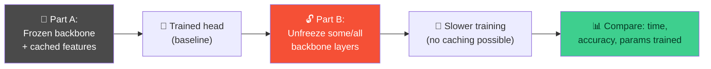
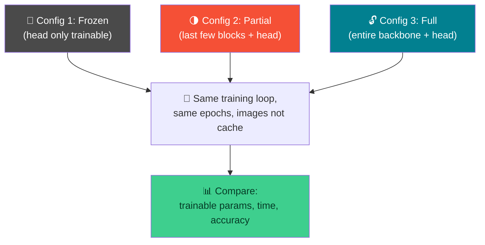

# 🐱🐶 Fine-Tuning MobileNet on Cats vs. Dogs — Week 7 Practical

### *Practical 6, Part A & B: start from a frozen backbone like Week 6, then deliberately break the speed trick by unfreezing layers — and measure exactly what that costs and buys you*

> **What we're building today:** a **Cats vs. Dogs** classifier using **MobileNetV2**, a pretrained architecture specifically designed to be small and fast (unlike ResNet-18's design goal of raw accuracy). Part A repeats Week 6's frozen-backbone technique on this new architecture and dataset. Part B does the thing Week 6 didn't: **unfreezes** backbone layers and re-trains end-to-end, so you can directly compare **training time and accuracy** across frozen vs. partially unfrozen vs. fully unfrozen.
>
> Runs in **Google Colab**. Keep your **GPU runtime** enabled (Runtime → Change runtime type → T4 GPU).

**Session plan (2 hours, back-to-back):**

| Time | Part | Focus |
|------|------|-------|
| 🕛 12:00 – 1:00 PM | **Practical 6A** | Frozen-backbone MobileNetV2 on Cats vs. Dogs |
| 🕐 1:00 – 2:00 PM | **Practical 6B** | Unfreeze layers → compare training time / accuracy across configurations |

> 🧭 **A quick terminology note:** "fine-tuning" is often used loosely to mean the *whole* two-stage process — train a new head on a frozen backbone first (Part A), then unfreeze and continue training (Part B) at a lower learning rate. Today's two parts are exactly those two stages.

---

## 🗺️ The Big Picture (Read This First)



| Piece | Job |
|-------|-----|
| 📱 **MobileNetV2** | A pretrained backbone designed for efficiency — far fewer parameters than ResNet-18 |
| 🧊 **Frozen stage (Part A)** | Same feature-caching trick as Week 6 — fast, but the backbone never adapts to cats/dogs specifically |
| 🔓 **Unfrozen stage (Part B)** | Backbone weights start changing → caching breaks → every epoch costs more, but the backbone can now specialize |

> 🔑 **Why this comparison matters:** once *any* backbone layer is trainable, its output for a given image is no longer fixed — Week 6's "extract once, train many times" trick stops working entirely. Part B measures exactly what that costs you in wall-clock time, and whether it was worth it in accuracy.

---

## 📋 What You'll Need (all free)

1. A **Google account** (for Colab) — `https://colab.research.google.com`
2. **GPU runtime enabled** — Runtime → Change runtime type → T4 GPU → Save. Essential for Part B especially.

---

# 🕛 PRACTICAL 6A (12:00 – 1:00 PM)

## Fine-tune MobileNet on Cats vs. Dogs (frozen backbone)

### A.1 — Open a fresh Colab notebook

Rename it `week7_practical6a.ipynb`.

```python
import torch
import torch.nn as nn
import torch.optim as optim
import torchvision
from torchvision.models import mobilenet_v2, MobileNet_V2_Weights, resnet18
from torch.utils.data import DataLoader, TensorDataset
import matplotlib.pyplot as plt
import numpy as np
import time

device = torch.device("cuda" if torch.cuda.is_available() else "cpu")
print("Using device:", device)
```

### A.2 — Load pretrained MobileNetV2 and compare its size to ResNet-18

```python
weights = MobileNet_V2_Weights.DEFAULT
backbone = mobilenet_v2(weights=weights)

resnet_for_comparison = resnet18(weights=None)   # random init is fine — we only need the count

def count_params(model):
    return sum(p.numel() for p in model.parameters())

print(f"ResNet-18 parameters   : {count_params(resnet_for_comparison):,}")
print(f"MobileNetV2 parameters : {count_params(backbone):,}")
```

**Expected output:**

```
ResNet-18 parameters   : ~11,689,512
MobileNetV2 parameters : ~3,504,872
```

> 🔑 **MobileNetV2 has about a third of ResNet-18's parameters**, despite being a comparably deep, modern architecture. The trick is **depthwise separable convolutions** — instead of one `3×3` kernel that mixes and combines all input channels at once, MobileNet splits that into two cheaper steps: one filter *per channel* (no mixing), then a `1×1` conv to mix channels afterward. Quick illustration using Week 4's formula:

```python
def conv_params(kernel_size, in_channels, out_channels):
    kh, kw = kernel_size
    return (kh * kw * in_channels + 1) * out_channels

# A standard 3x3 conv, 32 -> 64 channels
standard = conv_params((3,3), 32, 64)

# The same job, done as depthwise (one 3x3 filter per input channel, no bias)
# + pointwise (1x1 conv to mix channels)
depthwise = 3 * 3 * 32                       # one filter per channel, no cross-channel mixing
pointwise = conv_params((1,1), 32, 64)
separable_total = depthwise + pointwise

print(f"Standard 3x3 conv (32->64)         : {standard:,} params")
print(f"Depthwise separable equivalent     : {separable_total:,} params")
print(f"Reduction: {100 * (1 - separable_total/standard):.1f}%")
```

**Expected output:**

```
Standard 3x3 conv (32->64)         : 18,496 params
Depthwise separable equivalent     : 2,336 params
Reduction: ~87%
```

### A.3 — Freeze MobileNetV2 completely and strip its classifier head

```python
for param in backbone.parameters():
    param.requires_grad = False

backbone.classifier = nn.Identity()   # removes Dropout + Linear(1280, 1000)
backbone = backbone.to(device).eval()

print("MobileNetV2 feature size:", backbone(torch.randn(1, 3, 224, 224).to(device)).shape)
```

**Expected output:**

```
MobileNetV2 feature size: torch.Size([1, 1280])
```

> 💡 MobileNetV2 outputs a **1280-dimensional** feature vector, not ResNet-18's 512 — different architectures, different feature sizes. Keep this number in mind for A.6.

### A.4 — Load Cats vs. Dogs — the Oxford-IIIT Pet dataset's binary labels

Instead of a separate download, `torchvision`'s built-in Oxford-IIIT Pet dataset can be loaded with a **binary** cat/dog label instead of its usual 37-breed label.

```python
preprocess = weights.transforms()

train_dataset = torchvision.datasets.OxfordIIITPet(
    root="./data", split="trainval", target_types="binary-category",
    download=True, transform=preprocess
)
test_dataset = torchvision.datasets.OxfordIIITPet(
    root="./data", split="test", target_types="binary-category",
    download=True, transform=preprocess
)

print("Train samples:", len(train_dataset), "| Test samples:", len(test_dataset))

train_loader = DataLoader(train_dataset, batch_size=64, shuffle=False)
test_loader  = DataLoader(test_dataset,  batch_size=64, shuffle=False)
```

**Verify the label mapping before trusting it — don't assume:**

```python
raw_dataset = torchvision.datasets.OxfordIIITPet(root="./data", split="trainval", target_types="binary-category")

fig, axes = plt.subplots(1, 4, figsize=(10, 3))
for ax, idx in zip(axes, [0, 1, 2, 3]):
    img, label = raw_dataset[idx]
    ax.imshow(img)
    ax.set_title(f"Label: {label}")
    ax.axis("off")
plt.tight_layout()
plt.show()
```

> ⚠️ **Look at the printed labels against the actual images** before assuming which number means "Cat" and which means "Dog" — confirm it visually, then set `class_names` accordingly:

```python
class_names = ["Cat", "Dog"]   # confirm this order matches what you just saw above
```

### A.5 — Extract features once, then train a classifier head — same pattern as Week 6

```python
def extract_features(loader, backbone):
    features_list, labels_list = [], []
    with torch.no_grad():
        for images, labels in loader:
            images = images.to(device)
            feats = backbone(images)
            features_list.append(feats.cpu())
            labels_list.append(labels)
    return torch.cat(features_list), torch.cat(labels_list)

start = time.time()
train_features, train_labels = extract_features(train_loader, backbone)
test_features,  test_labels  = extract_features(test_loader,  backbone)
print(f"Feature extraction took {time.time() - start:.1f}s")
print("Train features shape:", train_features.shape)   # (N, 1280)
```

### A.6 — Train the classifier head

```python
train_feat_loader = DataLoader(TensorDataset(train_features, train_labels), batch_size=64, shuffle=True)
test_feat_loader  = DataLoader(TensorDataset(test_features,  test_labels),  batch_size=64, shuffle=False)

classifier = nn.Linear(1280, 2).to(device)   # note: 1280, not 512 — MobileNetV2's feature size

def evaluate_head(model, loader):
    model.eval()
    correct = total = 0
    with torch.no_grad():
        for feats, labels in loader:
            feats, labels = feats.to(device), labels.to(device)
            outputs = model(feats)
            _, predicted = torch.max(outputs, 1)
            correct += (predicted == labels).sum().item()
            total += labels.size(0)
    return 100 * correct / total

def train_head(model, train_loader, test_loader, epochs=15, lr=0.001):
    criterion = nn.CrossEntropyLoss()
    optimizer = optim.Adam(model.parameters(), lr=lr)
    for epoch in range(epochs):
        model.train()
        running_loss = 0.0
        for feats, labels in train_loader:
            feats, labels = feats.to(device), labels.to(device)
            optimizer.zero_grad()
            outputs = model(feats)
            loss = criterion(outputs, labels)
            loss.backward()
            optimizer.step()
            running_loss += loss.item()
        if (epoch + 1) % 3 == 0 or epoch == 0:
            print(f"Epoch {epoch+1}/{epochs} — loss: {running_loss/len(train_loader):.4f}")
    return evaluate_head(model, test_loader)

start = time.time()
frozen_accuracy = train_head(classifier, train_feat_loader, test_feat_loader, epochs=15)
frozen_time = time.time() - start
print(f"\nFrozen-backbone training took {frozen_time:.1f}s")
print(f"Frozen-backbone test accuracy: {frozen_accuracy:.2f}%")
```

**Expected output:**

```
Frozen-backbone training took ~5-15s
Frozen-backbone test accuracy: ~93-97%
```

> 🎯 **High accuracy shouldn't be surprising here** — ImageNet (which MobileNetV2 was pretrained on) already contains numerous actual cat and dog breeds. A frozen backbone that already "understands" cats and dogs reasonably well going in is exactly why transfer learning works so well for this particular task.

### A.7 — Save results as today's baseline for Part B

```python
baseline_results = {
    "config": "Frozen backbone",
    "trainable_params": sum(p.numel() for p in classifier.parameters()),
    "accuracy": frozen_accuracy,
    "epoch_time_estimate": frozen_time / 15,   # rough per-epoch time on cached features
}
print(baseline_results)
```

> ⚠️ **Keep in mind for Part B:** that per-epoch time is artificially fast because it's training on *cached* features, skipping the backbone's forward pass entirely. Part B will measure epoch time the "normal" way — through images, every epoch — so the comparison there is apples-to-apples across all three configurations, but not directly comparable to this number.

---

## 🛠️ Troubleshooting — Practical 6A

| Symptom | Likely cause | Fix |
|---------|-------------|-----|
| Labels in A.4's image check don't obviously match "Cat"/"Dog" | Normal — some breeds are ambiguous-looking from certain crops | Check a few more indices; the label should still be consistent (e.g. always `0` for the same species) |
| `backbone(...)` shape isn't `[1, 1280]` | `backbone.classifier = nn.Identity()` wasn't applied, or applied after moving to device incorrectly | Re-run A.3 exactly in order |
| Dataset download seems stuck | Oxford-IIIT Pet is a few hundred MB — first download can take a minute or two | Let it finish once; `download=True` will skip re-downloading on future runs in the same session |
| Feature extraction shape is `(N, 1280)` but classifier expects `512` | Reused Week 6's `nn.Linear(512, ...)` instead of `nn.Linear(1280, 2)` | MobileNetV2's feature size is 1280 — always check `backbone`'s output shape before defining the head |
| Accuracy stuck near 50% (random guessing on a binary task) | `backbone.classifier` wasn't replaced, so features are still 1000-way ImageNet logits, not 1280-dim features | Re-run A.3 before re-extracting features |

---

## 🧰 Quick Reference Card — Practical 6A

```python
weights = MobileNet_V2_Weights.DEFAULT
backbone = mobilenet_v2(weights=weights)
for p in backbone.parameters():
    p.requires_grad = False
backbone.classifier = nn.Identity()          # -> 1280-dim features

train_dataset = torchvision.datasets.OxfordIIITPet(
    root="./data", split="trainval", target_types="binary-category", download=True, transform=preprocess)

classifier = nn.Linear(1280, 2)              # MobileNetV2's feature size, not ResNet's 512
```

| Concept | One-liner |
|---------|-----------|
| **Depthwise separable convolution** | Splits a standard conv into per-channel filtering + a cheap 1×1 channel-mixing step |
| **`binary-category` target** | Oxford-IIIT Pet's built-in cat/dog label — always verify the 0/1 mapping visually |
| **MobileNetV2 feature size** | 1280-dim, not 512 like ResNet-18 — check `backbone(sample).shape` for any new architecture |
| **Why accuracy is already high** | ImageNet pretraining already saw real cats and dogs — this task suits a frozen backbone unusually well |

---

# 🕐 PRACTICAL 6B (1:00 – 2:00 PM)

## Unfreeze layers, compare training time/accuracy effects

**Goal:** train three versions of the same model — **frozen**, **partially unfrozen**, and **fully unfrozen** — under a fair, consistent training loop, and compare what unfreezing actually costs and buys you.



### B.1 — Why caching breaks the moment you unfreeze anything

In Part A, the backbone's output for a given image was **fixed** — extract once, reuse forever. The instant any backbone parameter has `requires_grad=True`, that's no longer true: its weights change after every optimizer step, so its output for the *same* image is different next epoch. There's no shortcut left — every epoch has to forward every image through the (partially or fully) trainable backbone again.

### B.2 — Rebuild image-level DataLoaders (not feature loaders)

```python
train_loader = DataLoader(train_dataset, batch_size=32, shuffle=True)
test_loader  = DataLoader(test_dataset,  batch_size=32, shuffle=False)
```

> 💡 Smaller batch size than Part A (`32` vs `64`) — now that gradients flow through some or all of MobileNetV2's convolutional layers, each batch uses more GPU memory.

### B.3 — A helper to build each configuration from fresh pretrained weights

```python
def build_model(unfreeze_from=None):
    """unfreeze_from=None -> fully frozen backbone (head only trains)
       unfreeze_from=N     -> unfreeze backbone.features[N:] onward
       unfreeze_from=0     -> unfreeze the entire backbone"""
    model = mobilenet_v2(weights=MobileNet_V2_Weights.DEFAULT)
    model.classifier = nn.Sequential(nn.Dropout(0.2), nn.Linear(1280, 2))

    for param in model.features.parameters():
        param.requires_grad = False   # start fully frozen

    if unfreeze_from is not None:
        for layer in model.features[unfreeze_from:]:
            for param in layer.parameters():
                param.requires_grad = True

    for param in model.classifier.parameters():
        param.requires_grad = True    # the head always trains

    return model.to(device)

num_feature_blocks = len(mobilenet_v2(weights=None).features)
print("MobileNetV2 has", num_feature_blocks, "top-level feature blocks")
```

### B.4 — Define the three configurations

```python
configs = {
    "Frozen":             build_model(unfreeze_from=None),
    "Partial (last 4)":   build_model(unfreeze_from=num_feature_blocks - 4),
    "Full (everything)":  build_model(unfreeze_from=0),
}

for name, model in configs.items():
    trainable = sum(p.numel() for p in model.parameters() if p.requires_grad)
    total = sum(p.numel() for p in model.parameters())
    print(f"{name:<20} trainable: {trainable:>10,} / {total:,} total ({100*trainable/total:.1f}%)")
```

**Expected output:**

```
Frozen               trainable:      2,562 / ~3,507,434 total ( 0.1%)
Partial (last 4)     trainable:  ~various / ~3,507,434 total ( ~%)
Full (everything)    trainable:  3,507,434 / ~3,507,434 total (100.0%)
```

### B.5 — One training loop, fair across all three

```python
def train_finetune(model, train_loader, test_loader, epochs=3, lr=0.001):
    criterion = nn.CrossEntropyLoss()
    # Only pass parameters that actually require gradients to the optimizer
    trainable_params = [p for p in model.parameters() if p.requires_grad]
    optimizer = optim.Adam(trainable_params, lr=lr)

    epoch_times = []
    for epoch in range(epochs):
        model.train()
        start = time.time()
        running_loss = 0.0
        for images, labels in train_loader:
            images, labels = images.to(device), labels.to(device)
            optimizer.zero_grad()
            outputs = model(images)
            loss = criterion(outputs, labels)
            loss.backward()
            optimizer.step()
            running_loss += loss.item()
        epoch_time = time.time() - start
        epoch_times.append(epoch_time)
        print(f"  Epoch {epoch+1}/{epochs} — loss: {running_loss/len(train_loader):.4f} — time: {epoch_time:.1f}s")

    model.eval()
    correct = total = 0
    with torch.no_grad():
        for images, labels in test_loader:
            images, labels = images.to(device), labels.to(device)
            outputs = model(images)
            _, predicted = torch.max(outputs, 1)
            correct += (predicted == labels).sum().item()
            total += labels.size(0)
    accuracy = 100 * correct / total

    return {"epoch_times": epoch_times, "accuracy": accuracy}
```

> 🔑 **`optimizer = optim.Adam(trainable_params, lr=lr)`** — only parameters with `requires_grad=True` are passed in. This is what makes freezing actually work: PyTorch computes gradients for every parameter during `.backward()` regardless, but the optimizer only *updates* the ones it was given.

### B.6 — Run all three configurations

```python
results = {}

for name, model in configs.items():
    print(f"\n=== Training: {name} ===")
    lr = 0.0001 if name == "Full (everything)" else 0.001   # smaller LR when touching pretrained weights broadly
    results[name] = train_finetune(model, train_loader, test_loader, epochs=3, lr=lr)
    print(f"{name} — test accuracy: {results[name]['accuracy']:.2f}%")
```

> 💡 **Why a smaller learning rate for "Full"?** With every pretrained weight now trainable, a large learning rate can quickly wreck the useful features ImageNet training already found — a smaller step size lets the whole network adapt more gently. This is a standard fine-tuning practice, not just a today-only workaround.

**Expected pattern (your exact numbers will vary by run):**

```
Frozen              — avg epoch time: fastest  — accuracy: similar to Part A's baseline
Partial (last 4)    — avg epoch time: slower   — accuracy: same, better, or occasionally worse
Full (everything)   — avg epoch time: slowest  — accuracy: same, better, or occasionally worse — and most prone to overfitting on ~3,680 training images
```

### B.7 — Build the comparison

```python
names = list(results.keys())
avg_times = [sum(results[n]["epoch_times"]) / len(results[n]["epoch_times"]) for n in names]
accuracies = [results[n]["accuracy"] for n in names]
trainable_counts = [sum(p.numel() for p in configs[n].parameters() if p.requires_grad) for n in names]

fig, axes = plt.subplots(1, 3, figsize=(15, 4))

axes[0].bar(names, trainable_counts, color=["#4A4A4A", "#F55036", "#028090"])
axes[0].set_title("Trainable parameters")
axes[0].set_yscale("log")
axes[0].tick_params(axis='x', rotation=15)

axes[1].bar(names, avg_times, color=["#4A4A4A", "#F55036", "#028090"])
axes[1].set_title("Avg epoch time (s)")
axes[1].tick_params(axis='x', rotation=15)

axes[2].bar(names, accuracies, color=["#4A4A4A", "#F55036", "#028090"])
axes[2].set_title("Test accuracy (%)")
axes[2].set_ylim(min(accuracies) - 5, 100)
axes[2].tick_params(axis='x', rotation=15)

plt.tight_layout()
plt.show()

print(f"\n{'Config':<20}{'Trainable params':>18}{'Avg epoch (s)':>16}{'Accuracy (%)':>14}")
for n in names:
    tc = sum(p.numel() for p in configs[n].parameters() if p.requires_grad)
    at = sum(results[n]["epoch_times"]) / len(results[n]["epoch_times"])
    print(f"{n:<20}{tc:>18,}{at:>16.1f}{results[n]['accuracy']:>14.2f}")
```

### B.8 — Interpret your own numbers

Answer these using **your actual results**, not an assumed pattern:

- Did unfreezing more layers meaningfully **increase** accuracy, or was the frozen baseline already close to the ceiling?
- How much **slower** was each epoch as more layers became trainable — linearly worse, or did most of the cost come from unfreezing *any* layers at all?
- If "Full" scored *lower* than "Frozen" or "Partial" — that's a real and common outcome on a small dataset (~3,680 training images) with an aggressively updated pretrained network — that's **overfitting**, not a bug.

> 🎓 **The likely finding on this particular task:** because ImageNet already saw real cats and dogs during pretraining, the frozen backbone from Part A was probably already close to its ceiling — meaning unfreezing layers here mostly cost you *time*, not much extra accuracy. That won't be true for every task; a domain far from ImageNet's photos (medical scans, satellite imagery, hand-drawn sketches) is exactly where unfreezing tends to pay off much more.

---

## 🛠️ Troubleshooting — Practical 6B

| Symptom | Likely cause | Fix |
|---------|-------------|-----|
| `Full (everything)` accuracy collapses badly | Learning rate too high for updating pretrained weights broadly | Lower it further (e.g., `1e-5`), or train for fewer epochs |
| Out-of-memory error only on `Full (everything)` | Full backpropagation through the whole backbone uses much more GPU memory than a frozen one | Lower `batch_size` in B.2 (e.g., to `16`) |
| `Partial` config's trainable param count looks wrong | Off-by-one in `unfreeze_from` slicing, or accidentally reused a modified `backbone` from Part A | Rebuild from `build_model()` fresh — don't reuse Part A's already-modified `backbone` object |
| All three configs give nearly identical accuracy | Genuinely possible on this task (see B.8) — not necessarily an error | Try `epochs=6` instead of `3` to see if a gap emerges with more training |
| Epoch times don't clearly increase from Frozen → Partial → Full | Forward pass cost dominates regardless of how many layers are trainable (forward always runs through the whole network) | Expected to some degree — the backward pass is what gets more expensive; the forward pass cost is roughly constant across all three |

---

## 🚀 Extend It (Optional, if you finish early)

1. **Try unfreezing just the last 1 block** instead of 4, and see how the time/accuracy trade-off shifts with a smaller "partial" slice.
2. **Plot loss curves for all three configs on one chart** — does "Full" converge faster per-epoch even if each epoch is slower in wall-clock time?
3. **Try a harder dataset** — if the Cats vs. Dogs task felt "too easy" for a frozen backbone, repeat this whole practical on `OxfordIIITPet` with `target_types="category"` (37 breeds instead of 2) — a much harder task where unfreezing is more likely to help.
4. **Time just inference** — after training, compare how long a forward pass takes for MobileNetV2 vs. a ResNet-18 of similar accuracy — this is often the number that matters most for real deployment.

---

## ✅ What You Learned Today

- 📱 Used **MobileNetV2**, a pretrained backbone designed for efficiency, and saw concretely (via depthwise separable convolutions) why it has ~3× fewer parameters than ResNet-18
- 🐱🐶 Applied Week 6's frozen-backbone + feature-caching technique to a new dataset and architecture, confirming the pattern transfers
- 🔓 Learned **why feature caching breaks** the moment any backbone parameter becomes trainable
- 🌡️ Compared **three real fine-tuning strategies** — frozen, partial, full — under one fair training loop
- ⚖️ Measured the actual **time cost** of unfreezing more of a network, not just the accuracy effect
- 🎓 Learned the practical rule of thumb: **fine-tune more aggressively when your task is far from the pretraining data; freeze more when it's close** — and that "close to ImageNet" (like cats and dogs) may mean a frozen backbone is already good enough

---

## 🧰 Quick Reference Card — Full Session

```python
# ── PART A: frozen backbone + caching ──
backbone.classifier = nn.Identity()
for p in backbone.parameters(): p.requires_grad = False
features, labels = extract_features(loader, backbone)   # cache once

# ── PART B: unfreezing ──
def build_model(unfreeze_from=None):
    model = mobilenet_v2(weights=MobileNet_V2_Weights.DEFAULT)
    model.classifier = nn.Sequential(nn.Dropout(0.2), nn.Linear(1280, 2))
    for p in model.features.parameters(): p.requires_grad = False
    if unfreeze_from is not None:
        for layer in model.features[unfreeze_from:]:
            for p in layer.parameters(): p.requires_grad = True
    for p in model.classifier.parameters(): p.requires_grad = True
    return model

optimizer = optim.Adam([p for p in model.parameters() if p.requires_grad], lr=lr)
```

| Concept | One-liner |
|---------|-----------|
| **Depthwise separable conv** | Per-channel filtering + 1×1 channel mixing — far fewer params than a standard conv |
| **Caching breaks on unfreezing** | Any trainable backbone weight makes its output change every epoch — no more "extract once" |
| **Fewer trainable params ≠ always worse** | If the pretrained backbone already suits your task, freezing can match or beat fine-tuning, for a fraction of the compute |
| **Lower LR for full fine-tuning** | Protects already-useful pretrained weights from being overwritten too aggressively |
| **Small dataset + full unfreeze = overfitting risk** | More trainable capacity on limited data can hurt test accuracy even as training loss keeps dropping |
