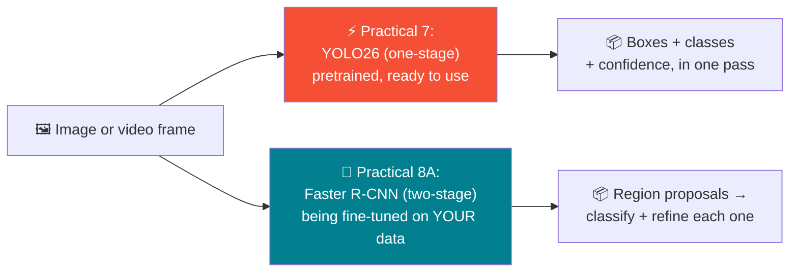
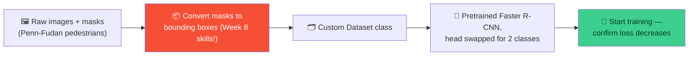

# 🎯 Real Object Detection — Week 9 Practical

### *Practical 7: pretrained YOLO on images and video. Practical 8, Part A: set up and start fine-tuning Faster R-CNN on a custom dataset.*

> **What we're doing today:** your first real object detectors. Practical 7 runs a **pretrained YOLO26** model — a one-stage detector built for speed — on images and video, and digs into what its confidence scores actually mean. Practical 8 Part A switches to **Faster R-CNN**, a two-stage detector built for accuracy, and gets it training on a **custom dataset** you build from raw images and masks — using the exact bounding-box format skills from Week 8. Training continues next week in Part B.
>
> Runs in **Google Colab**. Keep your **GPU runtime** enabled (Runtime → Change runtime type → T4 GPU).

**Session plan (2 hours, back-to-back):**

| Time | Part | Focus |
|------|------|-------|
| 🕛 12:00 – 1:00 PM | **Practical 7** | Pretrained YOLO on images/video — bounding boxes, confidence analysis |
| 🕐 1:00 – 2:00 PM | **Practical 8A** | Fine-tune Faster R-CNN on a custom dataset — setup + start training |

> 🧭 **Why both in one day:** YOLO (one-stage: predict boxes and classes in a single pass) and Faster R-CNN (two-stage: first propose regions, then classify/refine them) represent the two major families of detector design. Seeing both back to back — one pretrained and ready to use, one being fine-tuned from scratch on your own data — makes the trade-off between them concrete instead of theoretical.

---

## 🗺️ The Big Picture (Read This First)



| | Practical 7 (YOLO26) | Practical 8A (Faster R-CNN) |
|---|---|---|
| **Detector family** | One-stage | Two-stage |
| **Today's task** | Run pretrained, analyze output | Fine-tune on a custom dataset |
| **Dataset** | Pretrained on COCO (80 classes) already | Penn-Fudan pedestrians (you build the dataset class) |
| **What you'll see** | Inference is instant — the model already knows what to look for | Setup takes real work — but that work is exactly Week 8's bounding-box skills, applied |

---

## 📋 What You'll Need (all free)

1. A **Google account** (for Colab) — `https://colab.research.google.com`
2. **GPU runtime enabled** — Runtime → Change runtime type → T4 GPU → Save.

---

# 🕛 PRACTICAL 7 (12:00 – 1:00 PM)

## Pretrained YOLO on images/video, bounding boxes, confidence analysis

### 7.1 — Open a fresh Colab notebook and install Ultralytics

Rename it `week9_practical7.ipynb`.

```python
!pip install -q ultralytics

from ultralytics import YOLO
import matplotlib.pyplot as plt
import numpy as np
import cv2

import torch
device = "cuda" if torch.cuda.is_available() else "cpu"
print("Using device:", device)
```

### 7.2 — Load a pretrained YOLO model

```python
model = YOLO("yolo26n.pt")   # "n" = nano, the smallest/fastest variant — weights download automatically

print("Number of classes:", len(model.names))
print("A few classes:", list(model.names.values())[:10])
```

> 💡 This model was pretrained on **COCO**, a dataset with 80 everyday object categories — it already knows how to find all of them, with zero training from you. That's the appeal of a one-stage pretrained detector: instant, general-purpose usefulness.

### 7.3 — Run inference on a sample image

```python
results = model("https://ultralytics.com/images/bus.jpg")

annotated = results[0].plot()               # returns an annotated image array (BGR)
annotated_rgb = cv2.cvtColor(annotated, cv2.COLOR_BGR2RGB)

plt.figure(figsize=(10, 8))
plt.imshow(annotated_rgb)
plt.axis("off")
plt.title("YOLO26 detections")
plt.show()
```

### 7.4 — Inspect the raw detection data

```python
boxes = results[0].boxes

print(f"{'Class':<15}{'Confidence':>12}{'Box (xyxy)'}")
for box in boxes:
    class_id = int(box.cls[0])
    class_name = model.names[class_id]
    confidence = float(box.conf[0])
    xyxy = box.xyxy[0].tolist()
    print(f"{class_name:<15}{confidence:>12.3f}   {[round(v,1) for v in xyxy]}")
```

> 🔑 **`box.xyxy` is exactly the `[x1, y1, x2, y2]` format from Week 8.** Every skill you built there — computing area, IoU, format conversion — applies directly to real detector output. Nothing about the format changes once you're using a real model.

### 7.5 — Confidence analysis: what does the threshold actually control?

Every detection comes with a confidence score. Higher thresholds mean fewer, more certain detections; lower thresholds mean more detections, but more risk of false positives.

```python
for conf_threshold in [0.1, 0.25, 0.5, 0.75]:
    results_at_threshold = model("https://ultralytics.com/images/bus.jpg", conf=conf_threshold, verbose=False)
    num_detections = len(results_at_threshold[0].boxes)
    print(f"Confidence threshold {conf_threshold:.2f} -> {num_detections} detections kept")
```

### 7.6 — Visualize the confidence distribution

```python
results_low_thresh = model("https://ultralytics.com/images/bus.jpg", conf=0.05, verbose=False)
confidences = [float(box.conf[0]) for box in results_low_thresh[0].boxes]

plt.figure(figsize=(7, 4))
plt.hist(confidences, bins=15, color="#028090", edgecolor="white")
plt.axvline(0.5, color="red", linestyle="--", label="A typical default threshold (0.5)")
plt.xlabel("Confidence score")
plt.ylabel("Number of detections")
plt.title("Detection confidence distribution")
plt.legend()
plt.show()
```

> 🎯 **Read this histogram like a decision tool, not just a chart.** Everything to the *left* of your chosen threshold line gets discarded. Set the threshold too low and you keep noisy, low-confidence guesses; set it too high and you might discard real objects the model was only moderately sure about. There's no universally "correct" threshold — it depends on whether your application cares more about catching everything (favor recall, lower threshold) or avoiding false alarms (favor precision, higher threshold).

### 7.7 — Try a second image

```python
results2 = model("https://ultralytics.com/images/zidane.jpg")
annotated2 = cv2.cvtColor(results2[0].plot(), cv2.COLOR_BGR2RGB)

plt.figure(figsize=(10, 8))
plt.imshow(annotated2)
plt.axis("off")
plt.show()
```

> 🙋 **Prefer your own photo?** Upload one via the 📁 folder icon, then run `model("your_photo.jpg")` the same way.

### 7.8 — Run YOLO on video

Upload a short video clip (5–15 seconds) via the 📁 folder icon, then run detection on every frame automatically:

```python
results_video = model.predict(source="your_video.mp4", save=True, conf=0.4)
print("Annotated video saved to:", results_video[0].save_dir)
```

**Display the result inline:**

```python
from IPython.display import Video
import glob

output_path = glob.glob(f"{results_video[0].save_dir}/*.mp4")[0]
Video(output_path, embed=True, width=600)
```

> 💡 Under the hood, `model.predict(source="video.mp4", ...)` is doing exactly what you'd expect: reading the video frame by frame, running the same detection you did on single images on each one, drawing boxes, and re-encoding the result — all handled for you by one function call.

---

## 🛠️ Troubleshooting — Practical 7

| Symptom | Likely cause | Fix |
|---------|-------------|-----|
| `ModuleNotFoundError: No module named 'ultralytics'` | Install cell didn't run, or ran in a different runtime | Re-run `!pip install -q ultralytics` in this notebook's runtime |
| First inference call is slow | Model weights (`yolo26n.pt`) downloading for the first time | One-time cost — subsequent calls in the same session are fast |
| `annotated` image displays with wrong colors | Forgot `cv2.cvtColor(..., cv2.COLOR_BGR2RGB)` | `results[0].plot()` returns BGR (OpenCV convention) — always convert before `plt.imshow` |
| Video processing is very slow | Running on CPU, or video is long/high-resolution | Confirm GPU runtime; trim the clip to under 15 seconds for today's demo |
| No detections found on a valid image | Confidence threshold too high, or genuinely no COCO-class objects present | Lower `conf=` toward `0.1` and re-check; not every object belongs to one of COCO's 80 classes |

---

## 🧰 Quick Reference Card — Practical 7

```python
from ultralytics import YOLO
model = YOLO("yolo26n.pt")

results = model("image.jpg", conf=0.5)     # run inference
annotated = results[0].plot()               # BGR annotated image array
boxes = results[0].boxes                    # .xyxy, .conf, .cls per detection

model.predict(source="video.mp4", save=True)   # run + save an annotated video
```

| Concept | One-liner |
|---------|-----------|
| **One-stage detector** | Predicts boxes, classes, and confidence all in a single forward pass — fast |
| **Confidence score** | How certain the model is about a detection — filter with `conf=` |
| **`.xyxy` format** | Same `[x1,y1,x2,y2]` convention from Week 8 — your IoU/bbox code applies directly |
| **Threshold trade-off** | Lower threshold → more detections, more noise. Higher → fewer, more certain |

---

# 🕐 PRACTICAL 8A (1:00 – 2:00 PM)

## Fine-tune Faster R-CNN on a custom dataset — setup + start training

**Goal for today:** get a real, working training pipeline running on a custom dataset — dataset class, model adaptation, and a couple of training iterations to confirm the loss is decreasing. Full training and evaluation continue in **Part B, next week**.



### A.1 — Continue in the same notebook, or open a new one

Rename it `week9_practical8a.ipynb` if starting fresh.

```python
import os
import numpy as np
from PIL import Image
import torch
import torchvision
from torchvision.models.detection import fasterrcnn_resnet50_fpn, FasterRCNN_ResNet50_FPN_Weights
from torchvision.models.detection.faster_rcnn import FastRCNNPredictor
from torch.utils.data import DataLoader
import matplotlib.pyplot as plt

device = torch.device("cuda" if torch.cuda.is_available() else "cpu")
print("Using device:", device)
```

### A.2 — Download the custom dataset

The **Penn-Fudan Pedestrian dataset**: 170 photos, each with a matching mask image where every pedestrian is a differently-numbered blob.

```python
!wget -q https://www.cis.upenn.edu/~jshi/ped_html/PennFudanPed.zip
!unzip -q PennFudanPed.zip

print("Images:", len(os.listdir("PennFudanPed/PNGImages")))
print("Masks :", len(os.listdir("PennFudanPed/PedMasks")))
```

### A.3 — See what a mask actually contains

```python
img = Image.open("PennFudanPed/PNGImages/FudanPed00001.png").convert("RGB")
mask = Image.open("PennFudanPed/PedMasks/FudanPed00001_mask.png")

fig, axes = plt.subplots(1, 2, figsize=(10, 5))
axes[0].imshow(img)
axes[0].set_title("Original image")
axes[0].axis("off")
axes[1].imshow(mask)
axes[1].set_title("Mask (each pedestrian = different pixel value)")
axes[1].axis("off")
plt.show()

print("Unique values in mask:", np.unique(np.array(mask)))
```

### A.4 — Convert masks to bounding boxes — this is Week 8's skill, applied

For each non-zero value in the mask, find the smallest box that contains all pixels with that value. This directly produces boxes in the `[x1, y1, x2, y2]` format from Week 8.

```python
mask_array = np.array(mask)
obj_ids = np.unique(mask_array)[1:]           # drop 0 (background)
per_object_masks = mask_array == obj_ids[:, None, None]

boxes = []
for i in range(len(obj_ids)):
    pos = np.where(per_object_masks[i])       # (row_indices, col_indices) of this pedestrian's pixels
    xmin, xmax = pos[1].min(), pos[1].max()
    ymin, ymax = pos[0].min(), pos[0].max()
    boxes.append([xmin, ymin, xmax, ymax])

print("Boxes found:", boxes)
```

> 🔑 **This is exactly `box_area()`'s input format from Week 8** — `[x1, y1, x2, y2]`, top-left and bottom-right corners. Every dataset you'll ever fine-tune a detector on eventually needs boxes in some consistent format like this one — today you're deriving them from raw masks instead of being handed them pre-computed.

### A.5 — Build the full `Dataset` class

```python
class PennFudanDataset(torch.utils.data.Dataset):
    def __init__(self, root):
        self.root = root
        self.imgs = sorted(os.listdir(os.path.join(root, "PNGImages")))
        self.masks = sorted(os.listdir(os.path.join(root, "PedMasks")))

    def __getitem__(self, idx):
        img_path = os.path.join(self.root, "PNGImages", self.imgs[idx])
        mask_path = os.path.join(self.root, "PedMasks", self.masks[idx])

        img = Image.open(img_path).convert("RGB")
        mask = np.array(Image.open(mask_path))

        obj_ids = np.unique(mask)[1:]
        per_object_masks = mask == obj_ids[:, None, None]

        boxes = []
        for i in range(len(obj_ids)):
            pos = np.where(per_object_masks[i])
            xmin, xmax = pos[1].min(), pos[1].max()
            ymin, ymax = pos[0].min(), pos[0].max()
            boxes.append([xmin, ymin, xmax, ymax])

        boxes = torch.as_tensor(boxes, dtype=torch.float32)
        labels = torch.ones((len(obj_ids),), dtype=torch.int64)   # class 1 = pedestrian (0 is always background)
        area = (boxes[:, 3] - boxes[:, 1]) * (boxes[:, 2] - boxes[:, 0])
        iscrowd = torch.zeros((len(obj_ids),), dtype=torch.int64)

        target = {
            "boxes": boxes,
            "labels": labels,
            "image_id": torch.tensor([idx]),
            "area": area,
            "iscrowd": iscrowd,
        }

        img = torchvision.transforms.functional.to_tensor(img)
        return img, target

    def __len__(self):
        return len(self.imgs)


dataset = PennFudanDataset("PennFudanPed")
img, target = dataset[0]
print("Image shape:", img.shape)
print("Target keys:", target.keys())
print("Boxes:", target["boxes"])
print("Labels:", target["labels"])
```

> 🔑 **`labels` are always `1`, never `0`** — torchvision's detection models reserve class `0` for "background" automatically. With one real object category (pedestrian), `num_classes` for the model will be `2`: background + pedestrian.

### A.6 — Build DataLoaders with a custom `collate_fn`

Every image has a *different number* of pedestrians, so PyTorch can't stack targets into a normal batch tensor the usual way — a custom collate function keeps them as a list instead.

```python
def collate_fn(batch):
    return tuple(zip(*batch))

train_dataset = torch.utils.data.Subset(dataset, range(0, 150))
test_dataset  = torch.utils.data.Subset(dataset, range(150, len(dataset)))

train_loader = DataLoader(train_dataset, batch_size=2, shuffle=True, collate_fn=collate_fn)
test_loader  = DataLoader(test_dataset,  batch_size=2, shuffle=False, collate_fn=collate_fn)

print("Train images:", len(train_dataset), "| Test images:", len(test_dataset))
```

### A.7 — Load pretrained Faster R-CNN and swap its head for 2 classes

```python
num_classes = 2   # background + pedestrian

model = fasterrcnn_resnet50_fpn(weights=FasterRCNN_ResNet50_FPN_Weights.DEFAULT)

in_features = model.roi_heads.box_predictor.cls_score.in_features
model.roi_heads.box_predictor = FastRCNNPredictor(in_features, num_classes)

model = model.to(device)
print("Model ready — head replaced for", num_classes, "classes")
```

> 💡 Same pattern as Week 6/7's classifier-head swap — the pretrained backbone and region-proposal machinery stay intact; only the final classification/box-regression layer gets rebuilt for this task's number of classes.

### A.8 — Start training — and meet detection's different loss structure

Unlike classification (one loss number), a detection model in training mode returns a **dictionary of losses** — one for "is there an object here" (from the region-proposal stage), one for "which class is it," and one for "how accurate is the box," at both stages of the two-stage pipeline.

```python
params = [p for p in model.parameters() if p.requires_grad]
optimizer = torch.optim.SGD(params, lr=0.005, momentum=0.9, weight_decay=0.0005)

def train_one_epoch(model, optimizer, data_loader, device):
    model.train()
    total_loss = 0.0

    for images, targets in data_loader:
        images = [img.to(device) for img in images]
        targets = [{k: v.to(device) for k, v in t.items()} for t in targets]

        loss_dict = model(images, targets)      # returns a DICT of losses, not one number
        losses = sum(loss for loss in loss_dict.values())

        optimizer.zero_grad()
        losses.backward()
        optimizer.step()

        total_loss += losses.item()

    return total_loss / len(data_loader)


print("Starting training — just enough to confirm the pipeline works:")
for epoch in range(2):
    avg_loss = train_one_epoch(model, optimizer, train_loader, device)
    print(f"Epoch {epoch+1} — avg total loss: {avg_loss:.4f}")
```

> 🎯 **Falling loss across these two epochs is today's success criterion** — not a polished, converged model. That's Part B's job, with more epochs and a proper evaluation pass.

### A.9 — A quick peek: is the model finding pedestrians at all yet?

```python
model.eval()
img, target = test_dataset[0]

with torch.no_grad():
    prediction = model([img.to(device)])

print("Boxes predicted:", len(prediction[0]["boxes"]))
print("Top confidence :", prediction[0]["scores"].max().item() if len(prediction[0]["scores"]) > 0 else "none yet")
```

> 💡 After only two epochs, don't expect polished results — a handful of boxes with modest confidence is a completely normal, healthy sign that training is working. Part B picks up from here with more epochs and proper evaluation metrics.

### A.10 — Save a checkpoint for Part B

```python
torch.save(model.state_dict(), "fasterrcnn_pennfudan_checkpoint.pth")
print("Checkpoint saved — Part B continues training from this point.")
```

---

## 🛠️ Troubleshooting — Practical 8A

| Symptom | Likely cause | Fix |
|---------|-------------|-----|
| `RuntimeError` about mismatched box/image count | `collate_fn` missing from the `DataLoader` | Detection `DataLoader`s always need `collate_fn=collate_fn` — targets can't be stacked like normal tensors |
| `IndexError` on `obj_ids[:, None, None]` | An all-background mask (no pedestrians) slipped through | Penn-Fudan shouldn't have any — if it happens, print `np.unique(mask)` for that index to investigate |
| Loss is `nan` after the first batch | Learning rate too high, or a malformed box (e.g., `xmax <= xmin`) | Lower `lr`; also sanity-check a few boxes from A.4 by eye against the image |
| Training is very slow, even on GPU | `fasterrcnn_resnet50_fpn` is a heavier model — normal to be slower than Week 5–7's classifiers | Two epochs on 150 images should still complete reasonably — reduce `batch_size` if memory-bound, not epoch count |
| `model(images, targets)` errors about missing `targets` | Called during `model.eval()` instead of `model.train()` — train mode requires targets, eval mode doesn't accept them | Only pass `targets` when the model is in `.train()` mode (A.8); `.eval()` mode takes images only (A.9) |

---

## 🚀 Extend It (Optional, if you finish early)

1. **Visualize a training-set box overlay** — use `torchvision.utils.draw_bounding_boxes` on `dataset[0]` to draw the ground-truth boxes from A.4 directly on the image, confirming they line up with the actual pedestrians.
2. **Try a lighter backbone** — `torchvision.models.detection.fasterrcnn_mobilenet_v3_large_fpn` trains faster per epoch; compare its loss curve to the ResNet-50 backbone version over the same 2 epochs.
3. **Compute IoU between a prediction and ground truth** — using A.9's predicted boxes and A.4's ground-truth boxes for the same image, reuse Week 8's `iou()` function directly to measure how close the (still under-trained) model's guesses already are.
4. **Read ahead**: Part B next week will run many more epochs, evaluate with proper detection metrics, and visualize the fully trained model's predictions — think about what "good enough" should mean for a pedestrian detector before we get there.

---

## ✅ What You Learned Today

- ⚡ Ran a **pretrained one-stage detector (YOLO26)** on images and video with a single function call each
- 📊 Learned to read **confidence scores** as a tunable trade-off, not a fixed correctness signal
- 📦 Confirmed that real detector output uses the **exact `[x1,y1,x2,y2]` format** from Week 8 — nothing new to learn there
- 🗂️ Converted raw **segmentation masks into bounding boxes** by hand, directly applying last week's box-construction logic
- 🏗️ Built a **custom `Dataset` class** for object detection, including the `collate_fn` needed for variable-length targets
- 🎯 Adapted a **pretrained two-stage detector (Faster R-CNN)** for a new number of classes, and started training it — recognizing that detection models return a *dictionary* of losses, not one number
- 🌉 Connected the two detector families conceptually: one-stage (fast, single pass) vs. two-stage (propose-then-refine, today's fine-tuning target)

> 🎓 You now have hands-on experience with both major detector architectures in the same session — one ready-to-use out of the box, one you're actively teaching a new task. Part B next week finishes what Practical 8A started.

---

## 🧰 Quick Reference Card — Full Session

```python
# ── Practical 7: pretrained YOLO ──
from ultralytics import YOLO
model = YOLO("yolo26n.pt")
results = model("image.jpg", conf=0.5)
boxes = results[0].boxes   # .xyxy, .conf, .cls

# ── Practical 8A: Faster R-CNN setup ──
model = fasterrcnn_resnet50_fpn(weights=FasterRCNN_ResNet50_FPN_Weights.DEFAULT)
in_features = model.roi_heads.box_predictor.cls_score.in_features
model.roi_heads.box_predictor = FastRCNNPredictor(in_features, num_classes)

# Detection training loop: loss is a DICT, not one number
loss_dict = model(images, targets)
losses = sum(loss for loss in loss_dict.values())
```

| Concept | One-liner |
|---------|-----------|
| **One-stage vs. two-stage** | YOLO predicts everything in one pass; Faster R-CNN proposes regions first, then classifies/refines them |
| **Confidence threshold** | Lower = more detections, more noise. Higher = fewer, more certain |
| **Mask → box conversion** | `np.where(mask == id)` then take min/max row/col — produces `[x1,y1,x2,y2]` directly |
| **`collate_fn`** | Required whenever batch items (like detection targets) can't be stacked into a uniform tensor |
| **Detection loss** | A dictionary of multiple losses (classification, box regression, objectness) — sum them for backprop |
| **"Setup + start training"** | Today's bar is a working pipeline with decreasing loss — not a finished model |
